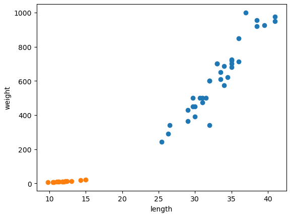
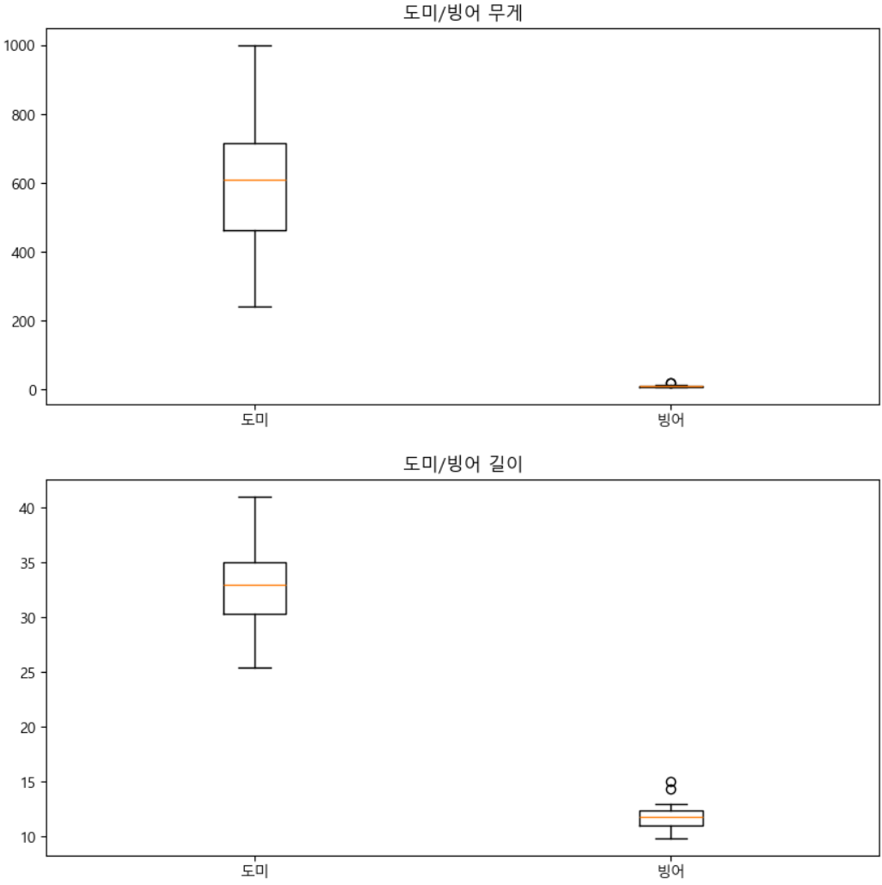

= 데이터 시각화

* 데이터를 이해하기 위해 그래프를 많이 사용함
* 데이터를 잘 이해할 수 있고 작업을 위한 힌트를 얻을 수 있음
* Jupyter Nodebook에서 Matplot library를 많이 사용함

---

각 데이터의 클래스를 이용히여 데이터의 특성들을 숫자로 보는 것 보다 그래프로 표현하면 데이터를 잘 이해할 수 있으며, 작업에 대한 힌트를 얻을 수도 있습니다.

생선 데이터의 무게, 길이를 boxplot으로 그려보면 데이터를 알 수 있습니다.

[source, python]
----
fig = plt.figure(figsize=(10,10))

ax1 = fig.add_subplot(2,1,1)
ax2 = fig.add_subplot(2,1,2)

ax1.boxplot(x=[df_bream.weight, df_smelt.weight], labels=['도미','빙어'])
ax1.set_title('도미/빙어 무게')
ax2.boxplot(x=[df_bream.length, df_smelt.length], labels=['도미','빙어'])
ax2.set_title('도미/빙어 길이')

plt.show()
----

도미 데이터와 빙어 데이터의 산점도 그래프를 아래와 같이 한 그래프에 쉽게 나타낼 수 있습니다. 산점도 그래프는 두 생선의 무게/길이 데이터를 한 눈에 알 수 있도록 합니다.

[source, python]
----
plt.scatter(bream_length, bream_weight)
plt.scatter(smelt_length, smelt_weight)
plt.xlabel("length")
plt.ylabel("weight")
plt.show()
----

