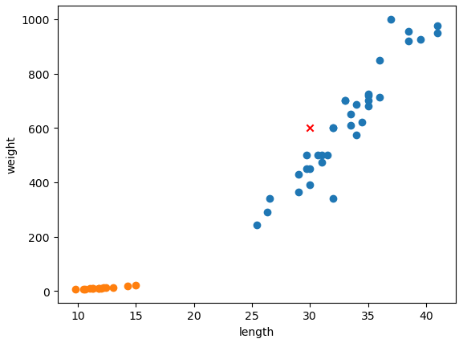

= 머신러닝

* Scikit Learn(사이킷런) 라이브러리 사용
* K-최근접 이웃 알고리즘(KNN - K-Nearest Neighbor Algirithm) 사용
* 길이와 무게를 하나의 데이터로 2차원 리스트로 데이터를 준비
* 학습(training) 데이터와 타겟(target) 데이터 준비

---

데이터가 준비되면, K-최근접 이웃 알고리즘(K-Nearest Neighbor Algorithm)을 사용하여 간단한 머신러닝을 구현할 수 있습니다. 머신러닝을 위해서는 원본 데이터에서 가공된 데이터를 구해야 합니다. 여기서는 도미 데이터의 길이와 빙어 데이터의 길이를 합친 하나의 2차원 리스트를 생성합니다.

[source, python]
----
# 도미와 빙어의 길이, 무게에 대한 하나의 데이터를 구함
length = bream_length + smelt_length
weight = bream_weight + smelt_weight

# 2차원 리스트 생성
fish_data = [[l,w] for l, w in zip(length, weight)]
----

데이터가 준비되었으면, 2차원 리스트로 생성된 데이터의 각 항목이 어떤 생선인지 구분하는 규칙을 지정해 주어야 합니다. 이 문제에서는 도미의 경우에는 1, 빙어의 경우에는 0으로 표시하는 규칙 데이터를 생성합니다. fish_data에는 도미 데이터 35개, 빙어 데이터 14개가 입력되어 있으므로, 아래 코드로 규칙 데이터를 생성할 수 있습니다. 이런 데이터를 target(대상)이라고 하며, 데이터 검증의 target이 됩니다.

[source, python]
----
fish_target = [1] * 35 + [0] * 14
----

데이터가 준비되었고, 알고리즘을 찾았다면 머신러닝을 수행할 수 있습니다.

Scikit Learning 라이브러리의 KNeightClassfier를 import 합니다.

[source, python]
----
from sklearn.neighbors import KNeighborsClassifier
----

KNeighborsClassifier 객체를 생성합니다.

[source, python]
----
kn = KNeighborsClassifier
----

KNeighborsClassifier 객체에 데이터와 타겟을 전달하여 학습을 수행할 수 있습니다. 이런 과정을 머신러닝에서는 `training(학습 또는 훈련)` 이라고 하며, Scikit Learn에서는 fit 메소드를 사용합니다. 

[source, python]
----
kn.fit(fish_data, fish_target)
----

이렇게 `훈련` - 학습 이라고도 부릅니다 - 된 객체를 `모델` 이라고 부르며, 이 모델은 정확도를 가집니다. score 메소드를 사용하여 정확도를 구할 수 있습니다.

[source, python]
----
kn.score(fish_data, fish_target)
----

이 작업에서 정확도는 1.0, 즉 100%로 계산됩니다. (이 경우 데이터와 타겟이 정확히 일치하니 당연한 결과입니다)

== 데이터에 대한 예측

K-최근접 이웃 알고리즘은 아주 간단한 알고리즘으로, 어떤 데이터에 대한 답을 구할 때 주위의 다른 데이터를 보고 다수를 차지하는 것을 정답으로 간주합니다. 주위의 데이터를 보고 현재 데이터를 판단합니다.

아래 데이터가 도미에 해당하는지 빙어에 해당하는지 판단합니다. 판단할 데이터는 길이 30cm, 무게 600g이며, 산점도 그래프 상에서 데이터의 위치는 아래와 같습니다.

데이터에 대한 예측은 predict 메소드로 수행할 수 있습니다. predict 메소드는 2차원 리스트를 필요로하므로, 하나의 데이터라도 2차원 리스트로 만들어 넘겨야 합니다.

[source, python]
----
kn.predict([[30, 600]])
----

결과는 아래와 같습니다.

----
array([1])
----

1은 도미를 뜻합니다.
