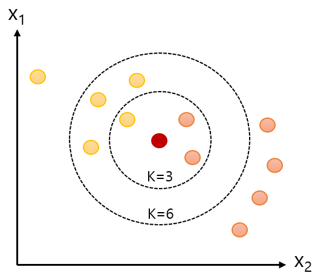

= K-최근접 이웃 알고리즘(K-Nesrest Neighbor Algorithm)

* 근접성을 사용하여 하나의 데이터 요소를 예측을 위해 학습되고 기억된 데이터 세트와 비교하는 알고리즘
* 직관적이고 간단한 알고리즘
* 지도 학습(Supervisied-learning)

---

K-최근접 이웃(K-Nearest Neighbor, KNN)은 지도 학습 알고리즘 중 하나입니다. 굉장히 직관적이고 간단합니다. 어떤 데이터가 주어지면 그 주변(이웃)의 데이터를 살펴본 뒤 더 많은 데이터가 포함되어 있는 범주로 분류하는 방식입니다.

////

https://www.elastic.co/kr/what-is/knn
https://ineed-coffee.github.io/posts/KNN/
https://bkshin.tistory.com/entry/%EB%A8%B8%EC%8B%A0%EB%9F%AC%EB%8B%9D-6-K-%EC%B5%9C%EA%B7%BC%EC%A0%91%EC%9D%B4%EC%9B%83KNN

////