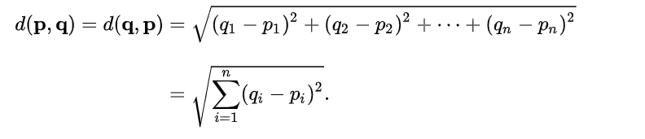
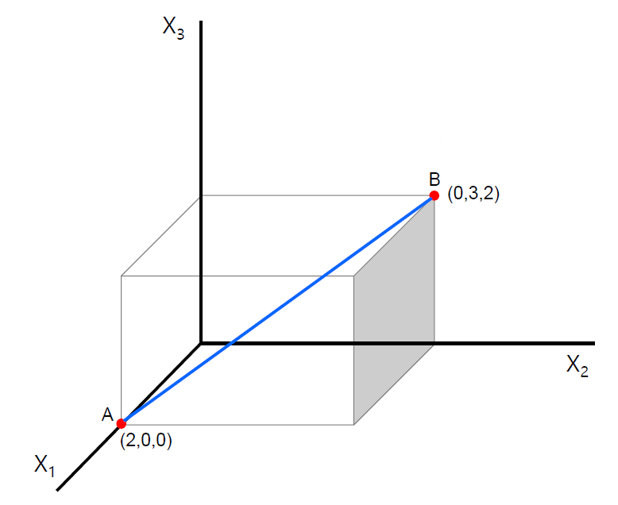
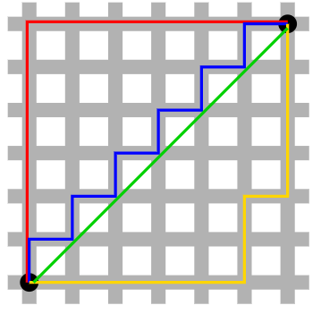
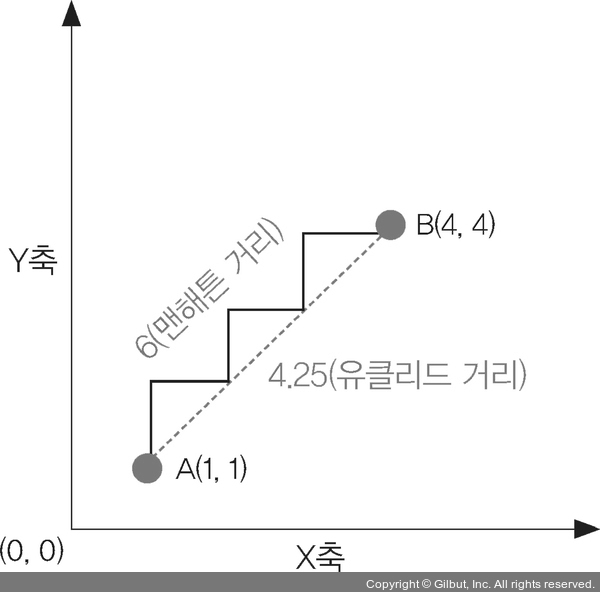

= K-최근접 이웃 알고리즘(K-Nesrest Neighbor Algorithm)

* 근접성을 사용하여 하나의 데이터 요소를 예측을 위해 학습되고 기억된 데이터 세트와 비교하는 알고리즘
* 직관적이고 간단한 알고리즘
* 지도 학습(Supervisied-learning)

image:../images/image01.png[]

---

K-최근접 이웃(K-Nearest Neighbor, KNN)은 지도 학습 알고리즘 중 하나입니다. 굉장히 직관적이고 간단합니다. 어떤 데이터가 주어지면 그 주변(이웃)의 데이터를 살펴본 뒤 더 많은 데이터가 포함되어 있는 범주로 분류하는 방식입니다.

그림에서 빨간색 점이 새 데이터로 주어졌을 때 이를 Class A로 분류할 지, Class B로 분류할 지를 판단하는 문제입니다. K값이 3일 때에는 주어진 데이터의 가장 가까운곳에 있는 3개의 데이터를 판단의 대상으로 삼습니다. 주어진 빨간색 점 주위에는 노란색 점(Class A) 1개와 주황색 점(Class B)가 2개가 있습니다. 따라서 K=3으로 주어지면 주어진 데이터는 B 클래스로 분류됩니다.

K 값이 6가 되면 노란색 점(Class A)이 4개, 주황색 점(Class B)이 2개가 됩니다. 이 경우에는 주어진 빨간색 점은 A 클래스로 분류됩니다. 따라서, K-최근접 이웃 알고리즘에서는 K값을 어떻게 정하냐에 따라 결과값이 바뀔 수 있습니다. K값이 너무 작아서도 안되고, 너무 커서도 안됩니다. K의 기본 값은 5로 설정되며, 기본적으로 주어진 데이터에서 가장 가까운 주변 5개의 데이터를 기반으로 분류합니다. 일반적으로 K는 홀수를 사용합니다. 짝수인 경우 동점이 나올 수 있기 떄문입니다.

== Lazy 모델

K 최근접 이웃 알고리즘의 특징은 학습이 따로 필요없다는 것입니다. 다른 모델들은 학습 데이터를 기반으로 모델을 만들고 테스트 데이터로 테스트하는 방식이지만, KNN은 학습이 따로 필요없이 학습 데이터를 저장하는 것으로 충분합니다. KNN은 새로운 데이터가 주어지면 데이터가 주어졌을 때 주변의 K 데이터를 보고 새로운 데이터를 분류하므로, 사전 모델링이 필요하지 않은 실시간 예측이 이루어집니다. 모델을 별도로 구축하지 않는다는 의미에서 게으른 모델(Lazy model)이라고 부릅니다. 따라서, 선형 회귀 등의 다른 예측 방법보다 빠릅니다.

== 거리 계산

K-최근접 이웃 알고리즘에서는 데이터의 데이터의 사이를 구해야 합니다. 거리를 구하는 방식은 두 가지가 있습니다.

1. 유클리드 거리(Euclidean Distance) +
일반적으로 점과 점사이의 거리를 구하는 방법입니다.
+

+
3차원에서 유클리드의 거리를 구하는 예시입니다.
+

+
2. 맨해튼 거리(Manhattan distance) +
점과 점 사이의 직선 거리가 아닌, X축, Y축을 따라간 거리를 의미합니다. 맨해튼 시내에는 빌딩이 많아 지점간 이동을 위해서는 격자모양의 길을 따라가야 한다고 해서 붙여진 이름입니다.
+

+
3. 유클리드 거리와 맨해튼 거리
+
유클리드 거리를 이용해 두 포인트 사이의 거리를 재는 것이 모든 문제를 해결하는 것은 아닙니다. 예를 들어, 지도상의 두 포인트 사이를 자가용이나 택시로 이동하는 거리는 유클리드 거리보다 더 깁니다. 이 경우에는 두 포인트 사이의 가장 긴 경로를 표현하는 맨해튼(Manhattan) 거리를 사용하는 것이 좋습니다. 
+

+ 
맨해튼 거리는 유클리드 거리보다 크거나 같습니다.
////
https://www.elastic.co/kr/what-is/knn
https://ineed-coffee.github.io/posts/KNN/
https://bkshin.tistory.com/entry/%EB%A8%B8%EC%8B%A0%EB%9F%AC%EB%8B%9D-6-K-%EC%B5%9C%EA%B7%BC%EC%A0%91%EC%9D%B4%EC%9B%83KNN

////