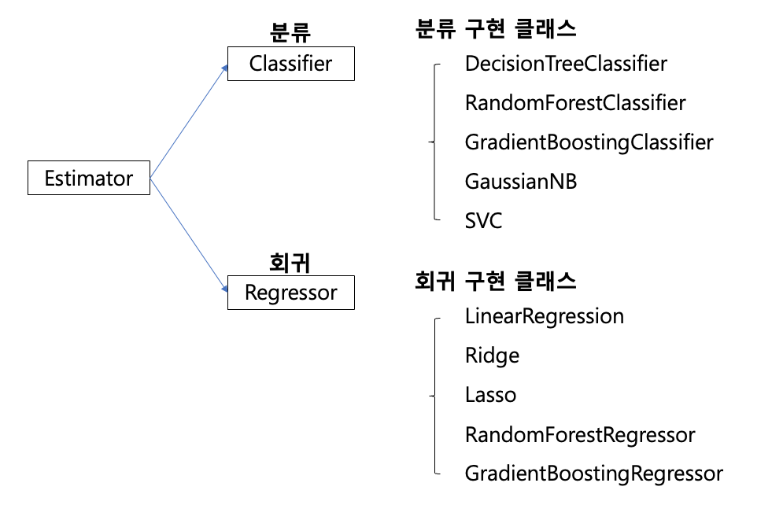

= Scikit Learn

* Python 기반에서 머신러닝 분석을 위해 사용할 수 있는 라이브러리
* 다양한 알고리즘과 개발을 위한 편리한 프레임워크, API 제공
* Numpy Scipy 기반 위에서 구축된 라이브러리로, 오랜 기간 실전에서 검증됨

---

Scikit-leran은 Python 기반에서 분석을 위해 사용할 수 있는 라이브러리입니다. 머신러닝을 위한 다양한 알고리즘과 개발을 위한 편리한 프레임워크, 그리고 API를 제공합니다. 주로 Numpy와 Scipy 기반위에서 구축된 라이브러리로, 오랜 기간 실전 환경에서 검증되었습니다.

Scikit Learn은 분류(Classification)과 회귀(Regression)의 다양한 알고리즘을 fit()과 predict() 함수로 간단하게 학습하여 예측할 수 있습니다.

분류 알고리즘은 Classifier, 회귀 알고리즘은 Regression으로 지칭하고 2개를 합쳐서 Estimator 클래스라고 부릅니다.

== 주요 모듈

[cols="1,2,3", options="header"]
|===
|분류|모듈명|설명
|예제 데이터|sklearn.datasets|사이킷런에 내장되어 예제로 제공하는 데이터 셋
|피처처리|sklearn. preprocessing|데이터 전처리에 필요한 다양한 가공 기능 제공(문자열을 숫자형 코드 값으로 인코딩, 정규화 스케일링등)
|피처처리|sklearn. feature_selection|알고리즘에 큰 영향을 미치는 피처를 우선순위대로 셀렉션 작업을 수행하는 다양한 기능 제공
|피처처리|sklearn. feature_extraction|텍스트 데이터나 이미지 데이터의 벡터화된 피처를 추출하는데 사용됨.
|피처처리 &차원 축소|sklearn. decomposition|차원 축소와 관련한 알고리즘을 지원하는 모듈. PCA,NMF,Truncated SVD 등을 통해 차원 축소 기능을 수행 가능.
|데이터 분리, 검증 & 파라미터튜닝|sklearn. model_selection|교차 검증을 위한 학습용/테스트용 분리. 그리드 서치로 최적 파라미터 추출 등의 API 제공
|평가|sklearn. metrics|분류, 회귀, 클러스터링, 페어와이즈에 대한 다양한 성능 측정 방법 제공. Accuracy, Precision, Recall, ROC-AUC, RMSE등 제공
|ML알고리즘|sklearn. ensemble|앙상블 알고리즘 제공 랜덤 포레스트, 에이다 부스트, 그래디언트 부스팅 등을 제공
|ML알고리즘|sklearn. linear_model|주로 선형 회귀, 릿지, 라쏘 , 및 로지스틱 회귀 등 회귀 관련 알고리즘을 지원. 또한 SGD관련 알고리즘도 제공
|ML알고리즘|sklearn. naive_bayes|나이브 베이즈 알고리즘 제공. 가우시안 NB 다항분포 NB 등
|ML알고리즘|sklearn. neighbors|최근점 이웃 알고리즘 제공. K-NN등
|ML알고리즘|sklearn. svm|서포트 벡터 머신 알고리즘 제공
|ML알고리즘|sklearn. tree|의사 결정 트리 알고리즘 제공
|ML알고리즘|sklearn. cluster|비지도 클러스터링 알고리즘 제공 유틸리티
|ML알고리즘|sklearn. pipeline|피처 처리 등의 변환과 ML 알고리즘 학습, 예측 등을 함께 묶어서 실행할 수 있는 유틸리티 제공
|===

== 내장된 예제 데이터셋

Scikit Learn은 분류 및 회귀 데이터 예제로 활용하기 위한 데이터 셋이 내장되어 있습니다.

[cols="1,2", options="header"]
|===
|API 명|설 명
|datasets. loda_boston()|회귀 용도이며, 미국 보스턴의 집 피처들과 가격에 대한 데이터 셋
|datasets. loda_breast_cancer()|분류 용도이며, 위스콘신 유방암 피처들과 악성/음성 레이블 데이터 셋
|datasets. load_diabetes()|회귀 용도이며, 당뇨 데이터 셋
|datasets. load_digits()|분류 용도이며, 0 ~ 9 까지의 숫자의 이미지 픽셀 데이터 셋
|datasets. load_iris()|분류 용도이며, 붓꽃에 대한 피처를 가진 데이터 셋
|===