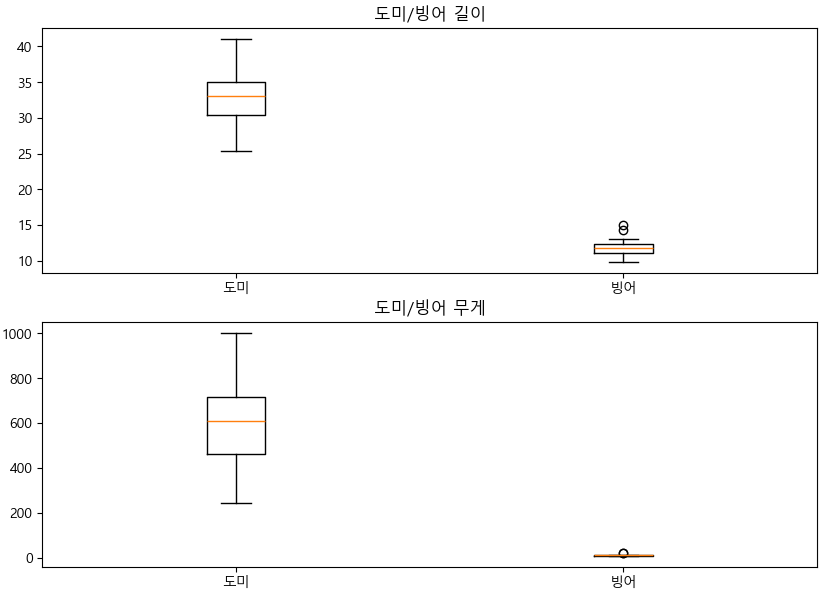
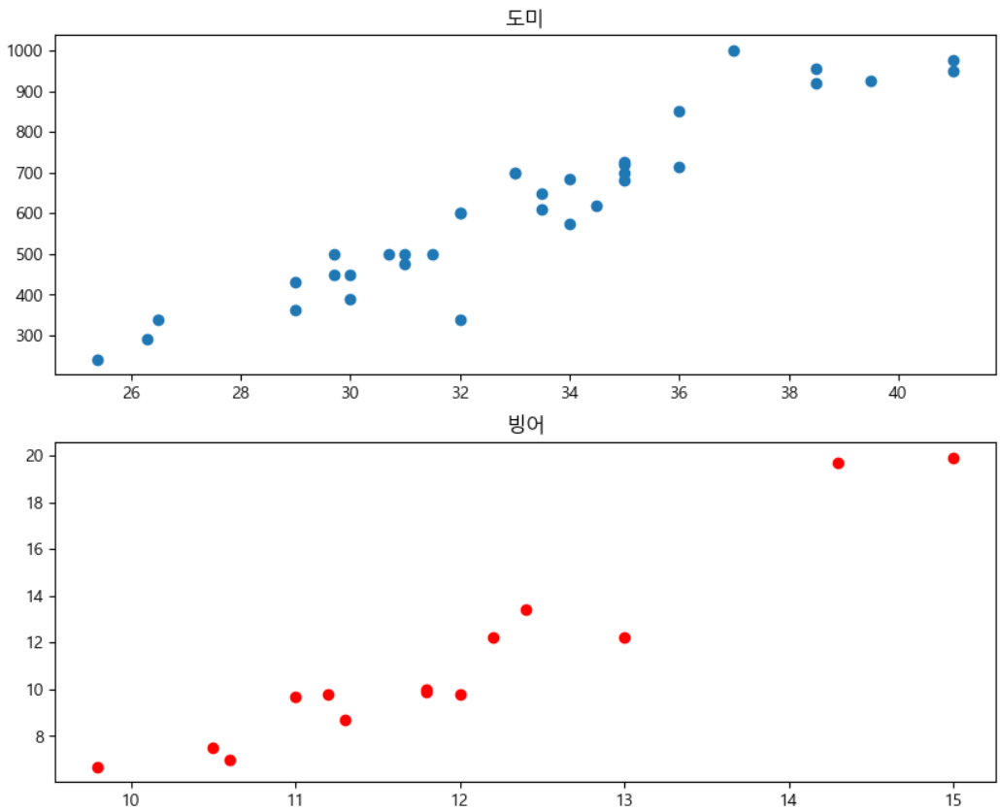

= Lab 1-1 간단한 머신 러닝

이 연습에서는 Kaggle에서 제공되는 데이터의 일부를 사용하여 KNN 알고리즘을 사용하는 간단한 머신러닝을 수행합니다. 아래 절차에 따릅니다.

== 실습 환경 준비

여기에서는 Visual Studio Code의 Jupyter Notebook을 사용하여 연습을 수행합니다. 이 연습을 위해서는 Anaconda가 설치되어 있어야 합니다. 아래 절차에 따릅니다.

1. Visual Studio Code를 실행합니다.
2. `파일` 메뉴에서 `폴더 열기` 를 클릭합니다.
3. 연습을 수행할 폴더를 선택하고 `확인` 버튼을 클릭합니다.
4. Visual Studio Code의 Explorer 에서 New Button을 클릭하여 새 파일을 만들고, 이름을 lab1-1.ipynb로 지정합니다.
5. 오른쪽 위의 Select Kernel 을 클릭하고 Anaconda Python 환경을 선택합니다.
6. + Code 버튼을 클릭하여 노트북을 시작합니다.
+

== 라이브러리 import

이 연습에서는 Pandas, Numpy, Matplotlib, SciketLearn 라이브러리를 사용합니다. 아래 절차에 따라 필요한 라이브러리를 import 합니다.

1. 생성한 Code 노트에 아래 코드를 입력합니다.
+
[source, python]
----
import pandas as pd
import numpy as np
import matplotlib.pyplot as plt
from sklearn.neighbors import KNeighborsClassifier

# 한글 처리
plt.rcParams['font.family'] ='Malgun Gothic'
plt.rcParams['axes.unicode_minus'] =False
----
+
2. Shift + Enter 를 클릭하여 작성한 코드를 실행합니다.

== 데이터 준비

여기에서는 머신 러닝 대상 데이터를 준비합니다. 데이터는 도미 데이터, 빙어 데이터이며, 데이터는 각 생선의 무게와 길이를 표시합니다. 데이터는 list 형태이며, 준비할 데이터는 아래와 같습니다.

도미(bream) 데이터:

[%header, cols=2, width=40%]
|===
|변수|데이터
|bream_length|float
|bream_weight|float
|===

빙어(smelt) 데이터:

[%header, cols=2, width=40%]
|===
|변수|데이터
|smelt_length|float
|smelt_weight|float
|===

아래 절차에 따릅니다.

1. Code 노트에서 아래 코드를 입력합니다.
+
[source, python]
----
bream_length = [25.4, 26.3, 26.5, 29.0, 29.0, 29.7, 29.7, 30.0, 30.0, 30.7, 31.0, 31.0, 
                31.5, 32.0, 32.0, 32.0, 33.0, 33.0, 33.5, 33.5, 34.0, 34.0, 34.5, 35.0, 
                35.0, 35.0, 35.0, 36.0, 36.0, 37.0, 38.5, 38.5, 39.5, 41.0, 41.0]
bream_weight = [242.0, 290.0, 340.0, 363.0, 430.0, 450.0, 500.0, 390.0, 450.0, 500.0, 475.0, 500.0, 
                500.0, 340.0, 600.0, 600.0, 700.0, 700.0, 610.0, 650.0, 575.0, 685.0, 620.0, 680.0, 
                700.0, 725.0, 720.0, 714.0, 850.0, 1000.0, 920.0, 955.0, 925.0, 975.0, 950.0]
----
+
2. Shift + Enter키를 눌러 코드를 실행합니다.
3. Code 노트에서 아래 코드를 입력하고, Shift + Enter 키를 눌러 코드를 실행합니다.
+
[source, python]
----
smelt_length = [9.8, 10.5, 10.6, 11.0, 11.2, 11.3, 11.8, 11.8, 12.0, 12.2, 12.4, 13.0, 14.3, 15.0]
smelt_weight = [6.7, 7.5, 7.0, 9.7, 9.8, 8.7, 10.0, 9.9, 9.8, 12.2, 13.4, 12.2, 19.7, 19.9]
----

== 기초 데이터 분석

이 연습에서는 준비된 데이터의 모양을 알아봅니다. 

=== 히스토그램

히스토그램을 이용하여 각 데이터의 분포를 알아봅니다. 히스토그램을 사용하면 각 데이터의 분포와 크기를 알 수 있습니다. 

데이터는 도미와 빙어의 특징을 길이와 무게로 표시합니다. 분석 대상 개체(데이터 집합)의 이런 특징을 특성(feature)라고 부릅니다. 아래 절차에 따릅니다.

1. Code 노트에서 아래 코드를 입력합니다.
+
[source, python]
----
fig = plt.figure(figsize=(10,10))

ax1 = fig.add_subplot(2,2,1)
ax2 = fig.add_subplot(2,2,2)
ax3 = fig.add_subplot(2,2,3)
ax4 = fig.add_subplot(2,2,4)

ax1.hist(bream_weight,bins=10,edgecolor='black')
ax1.set_title('도미 무게')
ax2.hist(bream_length,bins=10,edgecolor='black')
ax2.set_title('도미 길이')
ax3.hist(smelt_weight,bins=10,edgecolor='black')
ax3.set_title('빙어 무게')
ax4.hist(smelt_length,bins=10,edgecolor='black')
ax4.set_title('빙어 길이')
----
+
2. Shift + Enter키를 눌러 코드를 실행하여, 데이터의 분포를 확인합니다.
+

=== Boxplot

박스-수염 도포를 사용하면 데이터의 분포도를 한 눈에 알 수 있습니다. 

도미와 빙어의 무게/길이 별로 두 종류의 데이터 분포를 쉽게 알 수 있도록 작성할 수 있습니다. 아래 절차에 따릅니다.

1. Code 노트에서 아래 코드를 입력합니다.
+
[source, python]
----
fig = plt.figure(figsize=(10,10))

ax1 = fig.add_subplot(2,1,1)
ax2 = fig.add_subplot(2,1,2)

ax1.boxplot(x=[bream_weight, smelt_weight], labels=['도미','빙어'])
ax1.set_title('도미/빙어 무게')
ax2.boxplot(x=[bream_length, smelt_length], labels=['도미','빙어'])
ax2.set_title('도미/빙어 길이')

plt.show()
----
+
2. Shift + Enter키를 눌러 코드를 실행하여, 데이터의 분포를 확인합니다.
+

== 산포도

예제 데이터와 같이 x, y 좌표로 표현될 수 있는 데이터의 분포를 가장 잘 알 수 있는 차트가 산포도입니다. 

도미/빙어 데이터의 산포도를 각각, 그리고 한 차트에 표시할 수 있습니다. 아래 절차에 따릅니다.

1. Code 노트에서 아래 코드를 입력합니다.
+
[source, python]
----
fig = plt.figure(figsize=(10,10))

ax1 = fig.add_subplot(2,1,1)
ax2 = fig.add_subplot(2,1,2)

ax1.boxplot(x=[bream_weight, smelt_weight], labels=['도미','빙어'])
ax1.set_title('도미/빙어 무게')
ax2.boxplot(x=[bream_length, smelt_length], labels=['도미','빙어'])
ax2.set_title('도미/빙어 길이')

plt.show()
----
+
2. Shift + Enter키를 눌러 코드를 실행하여, 데이터의 분포를 확인합니다.
+

+
3. Code 노트에서 아래 코드를 입력합니다.
+
[source, python]
----
fig = plt.figure(figsize=(10,5))

plt.scatter(x=bream_length,y=bream_weight)
plt.scatter(x=smelt_length,y=smelt_weight)
plt.xlabel('length')
plt.ylabel('weight')

plt.show()
----

== 머신 러닝 데이터 준비

이 연습에서는 가장 간단하고 이해하기 쉬운 K-Nearest Neighbors(K-최근접 이웃) 알고리즘을 사용하여 도미-빙어 데이터를 분류합니다. 학습을 위해 도미와 빙어 데이터를 하나로 합친 후, 합친 데이터를 기준으로 도미, 빙어를 구분하는 Label을 만들고 학습합니다. 아래 절차에 따릅니다.

1. Code 노트에 아래 코드를 입력하고 실행합니다. +
아래 코드는 도미, 빙어의 길이와 도미, 빙어의 무게를 합쳐서 하나의 길이, 무게 데이터로 만듭니다.
+
[source, python]
----
length = bream_length + smelt_length
weight = bream_weight + smelt_weight
----
+
2. 머신 러닝을 위해 Scikit-learn 패키지를 사용합니다. Scikit-learn 패키지는 데이터의 각 특성을 2차원 배열로 만들어야 합니다. Code 코드에 아래 코드를 입력하고 실행하여 2차원 배열을 생성합니다.
+
[source, python]
----
fish_data = [[l,w] for l, w in zip(length, weight)]
----
+
3. 타켓 데이터(Label)를 만듭니다. +
위에서 생성한 2차원 배열인 fish_data 중 앞의 35개는 도미, 뒤의 14개는 빙어 데이터이므로 도미는 1, 빙어는 0인 데이터를 각각 35개, 14개 생성합니다.
+
[source, python]
----
fish_target = [1] * 35 + [0] * 14
----

== Scikit learn K-Nearest Neighbors 모델 생성 후 훈련

Scikit Learn 패키지에서 K-Nearest Neighbors 알고리즘의 구현 클래스인 KNeighorsClassifier 객체를 생성하고, 훈련합니다. 아래 절차에 따릅니다.

1. KNeighborsClassifier 클래스 객체를 생성합니다.
머신 러닝 알고리즘을 구현한 프로그램일 모델(model)이라고 부릅니다. 프로그램이 아니더라도 알고리즘을 구체화 한 것을 모델이라고 합니다.
+
[source, python]
----
kn = KNeighborsClassifier()
----
+
2. kn 객체에 데이터와 타겟 데이터를 사용하여 도미를 찾기 위한 기준을 학습시킵니다. +
이런 과정을 머신 러닝에서는 훈련(training)이라고 합니다. 머신 러닝 라이브러리에서는 fit() 메소드를 사용하여 훈련을 수행합니다.
+
[source, python]
----
kn.fit(fish_data, fish_target)
----
+
3. score() 메소드를 사용하여 훈련 결과를 평가합니다.
+
[source, python]
----
kn.score(fish_data, fish_target)
----

== 새 데이터로 분류

새 데이터를 추가하여 생성한 모델로 분류를 시도합니다. 새 데이터는 길이가 30, 무게가 600입니다. 데이터를 산점도 그래프에 표시하면 아래와 같습니다.

[source, python]
----
plt.scatter(bream_length, bream_weight)
plt.scatter(smelt_length, smelt_weight)
plt.scatter(30, 600, marker="x", color="red")
plt.xlabel("length")
plt.ylabel("weight")

plt.show()
----

predict 메소드를 사용하여 예측을 수행할 수 있습니다. 

1. Code 노트에 아래 코드를 입력하고 실행합니다.
+
----
kn.predict([[30, 600]])
----
2. 길이 12, 무게 120 데이터를 사용하여 사용하여 다시 예측합니다.
+
[source, python]
----
kn.predict([[12,120]])
----
+
3. 길이 12, 무게 120 데이터의 위치는 아래와 같습니다.
+

== K값 확장

K-Nearest Neighbor 알고리즘은 특별히 훈련되는 것이 없이 fit() 메소드에 전달한 데이터를 모두 저장하고 있다가 새로운 데이터가 등장하면 가장 가까운 데이터를 참고하여 생선을 구분합니다. KNeighborClassifier 클래스는 기본적으로 5대의 데이터를 참조하여 많은 수의 데이터로 값을 예측합니다. K 값은 변경할 수 있습니다. 아래 절차에 따릅니다.

1. KNeigborsClssifier 객체를 생성하면서 n_neighbors 파라미터에 49를 전달합니다. +
데이터 근처의 49개 데이터를 대상으로 하여 많은 값을 예측값으로 산출합니다.
+
[source, python]
----
kn49 = KNeighborsClassifier(n_neighbors=49)
----
+
2. 생성한 kn49 모델을 기반으로 훈련을 수행합니다.
+
[source, python]
----
kn49.fit(fish_data, fish_target)
----
+
3. 모델의 정확도를 확인합니다.
+
----
kn49.score(fish_data, fish_target)
----
+
4. 길이 30, 무게 600 데이터로 예측을 수행합니다.
+
----
kn.predict([[30, 600]])
----
+
5. 길이 12, 무게 120의 데이터로 예측을 수행합니다.
+
----
kn.predict([[12, 120]])
----

연습이 종료되었습니다.