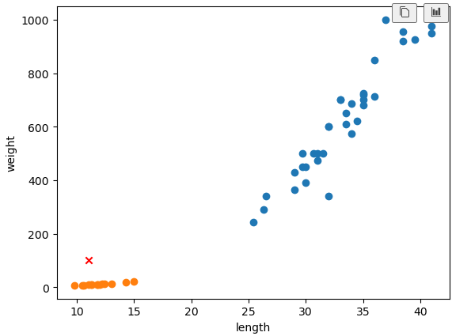

= Revisited

* K-최근접 이웃 알고리즘은 데이터를 모두 가지고 있음
* 실제 훈련이 일어나지 않음
* 새로운 데이터에 대해 예측할 때는 가까운 직선거리의 데이터를 조회
* 데이터가 아주 많은 경우 사용하기 어려움
* 메모리가 많이 필요하고, 거리 계산에 많은 시간이 소요

---

K-최근접 이웃 알고리즘은 매우 간단하며, 어떤 데이터에 대해 답을 구할 때 다른 주위의 데이터를 보고 다수를 차지하는 것을 정답으로 사용합니다. 산포도 차트에서 아래와 같은 데이터가 있을 때,

학습하지 않고도 데이터가 빙어에 해당함을 알 수 있습니다. 

[source, python]
----
kn.predict([[11, 100]])
----

----
array([0])
----

K-최근접 이웃 알고리즘을 위해 준비할 데이터는 데이터를 모두 가지고 있는것이 전부입니다. 새로운 데이터에 대해 예측할 때는 가장 가까운 직선 거리에 어떤 데이터가 있는지를 살피기만 하면 됩니다. 단점은 K-최근접 알고리즘의 특성상 아주 많은 데이터를 사용하기 어렵습니다. 데이터가 크기 때문에 메모리가 많이 필요하고 직선거리를 계산하는데도 많은 리소스가 요구됩니다.

실제로 K-최근접 이웃 알고리즘은 훈련되는것이 없습니다. 데이터를 모두 저장하고 있다가 새 데이터에 대해 가장 가까운 데이터를 참고하여 분류하는 것이 전부입니다.

K-최근접 이웃 알고리즘에서는 K값을 지정할 수 있습니다. Sciket Learn의 KNeighborsClassifier 객체를 생성할 때 n_neighbors 매개변수를 지정하여 변경할 수 있습니다. 만약, 이 예제에서 K값을 49로 지정한다면, 근접한 데이터 49개를 대상으로 데이터를 분류합니다. 

이 경우, 도미 데이터가 다수이므로 어떤 데이터이든 도미로 분류합니다.

[source, python]
----
kn49 = KNeighborsClassifier(n_neighbors=49)

kn49.fit(fish_data, fish_target)
kn49.score(fish_data, fish_target)

kn49.predict([[11, 100]])
----

----
array([1])
----
