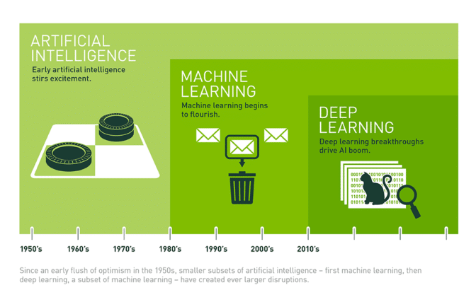

= AI (Artificial Intelligence)

* 사람의 입력이 필요했던 복잡한 작업을 자동으로 수행하는 응용 프로그램의 포괄적 용어
* 데이터 입력을 수신하고 결론을 내리거나 결론을 바탕으로 동작을 수행할 수 있는 시스템
* 머신 러닝, 딥 러닝등 AI의 하위 분야를 지칭할 때도 AI라는 용어를 범용적으로 지칭
* 학습이 완료된 AI 모델은 미래를 예측하거나 이전에는 관찰되지 않은 데이터를 바탕으로 작동할 수 있음

---

AI는 사람의 입력이 필요했던 복잡한 작업을 자동으로 수행하는 애플리케이션들을 포괄적으로 지칭하는 용어가 되었습니다. 온라인에서 고객과 소통하거나, 체스를 두는 것과 같은 작업들일 수 있습니다. 또한 머신러닝(ML) 및 딥 러닝과 같은 AI의 하위 분야를 지칭할 때에도 AI라는 용어를 범용적으로 사용하기도 합니다.

그러나 AI와 하위 분야 간에는 분명한 차이점이 있습니다. 예를 들어, 머신러닝은 사용하는 데이터를 기반으로 성능을 학습하거나 개선하는 시스템을 구축하는 데 중점을 둡니다. 모든 머신러닝이 AI이지만 모든 AI가 머신러닝은 아닙니다.

AI의 가치를 극대화하고자 많은 기업들이 산하의 데이터 과학 팀에 큰 투자를 하고 있습니다. 데이터 과학을 활용하면 통계, 컴퓨터 과학, 비즈니스 지식을 결합한 다양한 데이터 소스로부터 가치있는 데이터를 추출할 수 있습니다.

AI 기술은 한때 인력이 필요했던 프로세스 또는 작업을 자동화하여 기업의 성능과 생산성을 향상시키고 있습니다. AI는 또한 인간이 할 수 없는 규모의 데이터를 이해할 수 있습니다. 이러한 기능은 상당한 비즈니스 이점을 가져다 줄 수 있습니다. 예를 들면 Netflix는 머신러닝 기반의 개인화 기술을 활용하여 2017년 고객 기반을 25% 이상 증가시켰습니다.

대부분의 기업은 데이터 과학을 우선 순위로 삼고 여기에 많은 투자를 하고 있습니다. AI에 대한 2021년 McKinsey 조사 결과에 따르면, 적어도 하나 이상의 사업부에 AI 기술을 적용했다고 응답한 기업 수는 전년도 대비 50%에서 56%로 증가했습니다. 또한 총 수익 중 최소 5% 이상이 AI를 활용한 결과일 수 있다고 응답한 기업 수는 전년도 대비 22%에서 27%로 증가했습니다.

AI는 거의 모든 사업부, 비즈니스, 산업에 가치를 더해 줄 수 있습니다. AI의 범용적인, 또는 산업별로 특수한 적용 사례는 다음과 같습니다.

* 거래 및 인구 통계 데이터를 사용하여 특정 고객이 기업과 맺는 관계의 전 과정에서 지출할 총액을 예측(고객 생애 가치 예측)
* 고객 행동 및 선호도에 따라 가격 최적화
* 이미지 인식을 사용하여 암 징후에 대한 X선 이미지 분석

Harvard Business Review에 따르면, 기업들은 주로 다음과 같은 목적으로 AI를 이용하고 있습니다.

* 보안 침입 탐지 및 저지(44%)
* 사용자의 기술 문제 해결(41%)
* 생산 관리 작업 감소(34%)
* 승인된 공급업체 사용시 내부 규정 준수 측정(34%)

////
https://www.hpe.com/kr/ko/what-is/ai-models.html
https://www.oracle.com/kr/artificial-intelligence/what-is-ai/
////