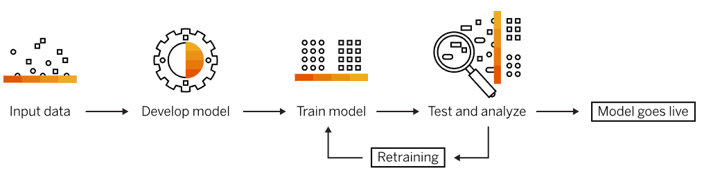

= Machine Learning (머신 러닝)

* 사용하는 데이터를 기반으로 학습 또는 성능 향상을 지원하는 시스템을 구축하는 데 초점을 맞추는 인공 지능(AI)의 하위 집합
* "A computer program is said to learn from experience E with respect to some class of tasks T and performance measure P, its performce at tasks in T, as measured by P, improves with experience E" +
어떤 컴퓨터 프로그램이 T라는 작업을 수행한다. 이 프로그램의 성능을 P라는 척도로 평가했을 때 경험 E를 통해 성능이 개선된다면 이 프로그램은 학습을 한다고 말할 수 있다
* "Programming computers to optimize a performance criterion using example data or experience" + 
사례 데이터, 즉 과거 경험을 이용하여 성능 기준을 최적화하도록 프로그래밍하는 작업
* "Computational methods using experience to improve performance or to make accurate predictions" +
성능을 개선하거나 정확하게 예측하기 위해 경험을 이용하는 계산학 방법들

---

> 인지과학에서 설명하고 하는 인간의 인지적 능력 현상은 튜링 머신을 모델로 하는 계산주의(Computationalism)과 뇌의 뉴런을 모델로 하는 연결주의(Connectionism)으로 나누어짐

* 1950년 Bayes 정리를 기초로 확률기반의 분류기가 연구됨
* 1957년 Frank Rosenblatt가 Perceptron 개념 발표
* 1981년 P.J. Werbos가 Multilayer Perceptron을 Back Propagation으로 계산하는 방법을 발표
* 1986년 R. Quinlan이 머신러닝의 주류가 된 Decision Tree라는 알고리즘을 발표
* 1995년에 Vapnik와 Cortes는 머신러닝 역사에서 한 획을 그은 Support Vector Machine(이하 SVM)을 발표
* 1997년에 Leo Breiman은 Gradient Boosting이란 개념을 제안
* 1995년 Tin Kam Ho가 일반적인 방법의 Random Decision Forests라는 개념을 최초로 발표

---

머신 러닝은 컴퓨터를 인간처럼 학습시킴으로서 컴퓨터가 새로운 규칙을 생성할 수 있지 않을까 하는 시도에서 시작되어 컴퓨터가 스스로 학습할 수 있도록 도와주는 알고리즘이나 기술을 개발하는 분야를 말합니다.

일반적으로 머신러닝이란 알고리즘을 이용하여 데이터를 분석하고, 분석 결과를 스스로 학습한 후, 이를 기반으로 어떠한 판단이나 예측을 하는 것을 의미합니다. 따라서 머신러닝에서는 양질의 데이터가 매우 중요한 역할을 하며, 양질의 데이터를 많이 보유할수록 보다 높은 성능을 이끌어낼 수 있게 됩니다. 이러한 양질의 데이터를 얻기위해 데이터 분석 과정중에 데이터 정제 과정을 거칩니다.

머신 러닝은 2000년대에 들어서 시작된 인공지능을 구현하는 방법중의 하나로 빅데이터를 스스로 분석하고, 그 내용을 바탕으로 결론을 도출하는 기술입니다. 기술 향상으로 컴퓨터 시스템이 꾸준히 발전하면서 시스템을 개발, 운영하는 과정에서 수많은 데이터들이 쌓이기 시작했고, 인공지능 개발자들은 그 속에서 데이터로 사람이 하는 수준의 간단한 지능을 구현할 방법을 고민하게 되었고, 데이터에 사람이 생각하는 정답(Label)을 매겨서 계산하고, 사람의 생각과 차이간 나는 오류를 줄여가는 방법으로 수정하고, 이러한 과정을 반복함으로써 사람의 생각과 유사하게 만들 수 있을 것이라는 방법을 생각했습니다. 

이러한 과정을 학습이라고 부르고, 학습 결과로 얻어진 지능을 실제 응용에 적용하는 기술을 머신 러닝이라고 부릅니다.

머신 러닝은 다양한 알고리즘 기법을 사용하는 여러 유형의 머신 러닝 모델로 구성됩니다. 데이터의 특성과 원하는 결과에 따라 지도, 비지도, 준지도, 강화 등 네 가지 학습 모델 중 하나를 적용할 수 있습니다. 사용 중인 데이터 세트와 원하는 결과에 따라 각 모델 내에서 하나 이상의 알고리즘 기법을 적용할 수 있습니다. 머신 러닝 알고리즘은 기본적으로 사물 분류, 패턴 발견, 결과 예측, 정보 기반 의사결정 등을 수행하도록 설계됩니다. 알고리즘은 한 번에 하나씩 사용할 수도 있고 복잡하고 더욱 예측 불가능한 데이터가 포함된 경우에는 정확도를 최대한 높이기 위해 여러 가지를 결합할 수도 있습니다.

//// 
https://modulabs.co.kr/blog/machine-learning/
https://www.sap.com/korea/products/artificial-intelligence/what-is-machine-learning.html
https://nlp.jbnu.ac.kr/AICBNU2019/slides/aijbnu_deeplearning_basics.pdf
////