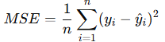
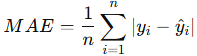
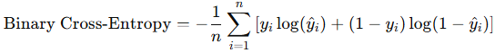

= 손실 함수(Loss Function)

손실 함수(Loss Function)는 머신러닝과 딥러닝 모델에서 모델이 얼마나 잘 예측했는지를 측정하는 지표입니다. 손실 함수의 값은 모델이 예측한 출력과 실제 값(타겟 값) 사이의 차이를 나타냅니다. 손실함수는 모델 학습의 방향을 결정하며, 손실 함수의 값을 최소화하는 것이 모델 학습의 목표입니다.

== 손실함수의 역할

1. 오류 측정 +
모델의 예측이 실제 값과 얼마나 다른지 정량적으로 나타냅니다.
2. 최적화의 기준 +
손실 함수를 최소화하기 위해 모델의 가중치와 파라미터를 조정합니다.
3. 성능 평가 +
손실 함수를 통해 모델이 얼마나 잘 학습하고 있는지 확인할 수 있습니다.

== 손실 함수 유형

손실 함수는 문제의 유형에 따라 다르게 선택됩니다.

1. 회귀 문제

* 평균 제곱 오차 (Mean Squared Error, MSE)
+

+
예측값(hat 𝑦~𝑖~)과 실제 값(𝑦~𝑖~)의 차이를 제곱한 후 평균을 취합니다. 큰 오차에 더 민감합니다.
+
* 평균 절대 오차 (Mean Absolute Error, MAE)
+

+
절대값을 사용하여 오차를 계산하므로 이상치에 덜 민감합니다.
+
2. 분류 문제

* 교차 엔트로피 손실 (Cross-Entropy Loss) +
이진 분류나 다중 클래스 분류에서 주로 사용됩니다.
+

+
확률 예측값과 실제 값의 차이를 로그로 계산하여 학습을 진행합니다.
+
* 카테고리컬 크로스 엔트로피 (Categorical Cross-Entropy) +
다중 클래스 분류 문제에서 소프트맥스 활성화 함수와 함께 사용됩니다.

3. 특별한 상황에서 사용되는 손실함수
* Huber Loss +
MSE와 MAE의 장점을 결합하여 이상치에 덜 민감한 손실함수.
* KL Divergence +
두 확률 분포 간의 차이를 측정.
* Hinge Loss +
서포트 벡터 머신(SVM)에서 사용.

== 손실 함수와 비용 함수

손실함수는 하나의 데이터 샘플에 대한 오차를 계산한 값이고, 비용함수(Cost Function)는 전체 데이터셋에 대해 손실함수의 평균이나 합으로 정의됩니다.

== 손실 함수 선택 시 고려사항

* 문제 유형(회귀, 분류 등)에 맞는 손실함수를 선합니다.
* 이상치에 민감도가 중요한 경우 MSE 대신 MAE나 Huber Loss 사용합니다.
* 다중 클래스 분류 문제에서는 Cross-Entropy Loss를 사용하는 것이 일반적입니다.