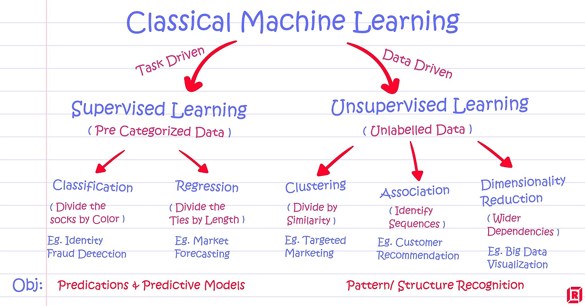
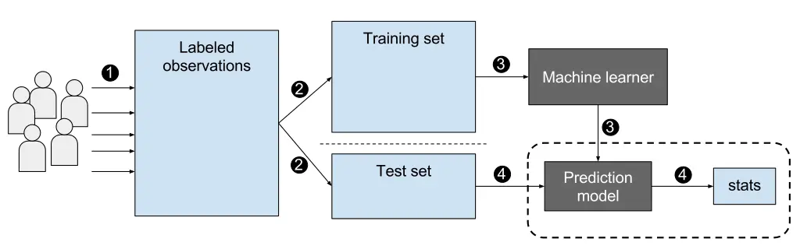
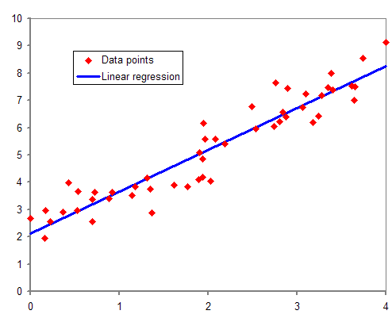
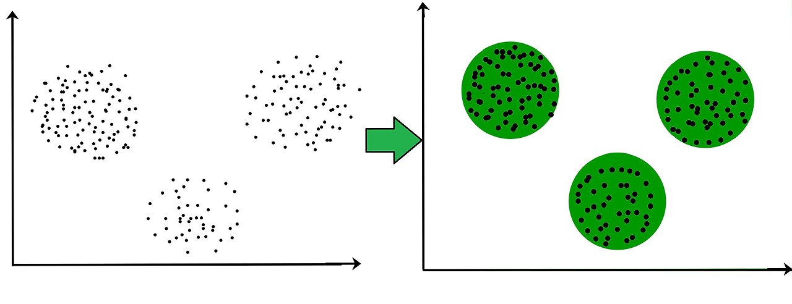

= 지도 학습과 비지도 학습

* 머신 러닝은 크게 2가지의 기본 원리로 구성됨
** 지도 학습(Supervisied learning)
*** 정답(label)이 있는 데이터들을 학습
*** 데이터 하나하나에 정답을 표기(annotate)
** 비지도 학습(Unsupervisied learning)
*** 정답이 없이 데이터를 학습
*** 사람의 개입 없이 데이터를 스스로 패턴 또는 데이터간의 유사도를 학습

---

머신 러닝 기술을 거시적인 측면에서 바라보면 크게 2가지의 기본적인 원리로 압축됩니다. 하나는 지도학습(Supervised Learning)이고, 다른 하나는 비지도학습(Unsupervised Learning)입니다.

 +
https://medium.com/@dkatzman_3920/supervised-vs-unsupervised-learning-and-use-cases-for-each-8b9cc3ebd301

모든 기계학습 알고리즘은 학습습 데이터(training set)를 기반으로 기계가 스스로 지식을 학습합니다. 지도학습과 비지도학습은 이런 점을 공통적으로 지니고 있지만, 핵심적인 차이는 학습하는 데이터의 구성이 서로 다르다는 점입니다.

== 지도 학습(Supervisied learning)

지도학습의 알고리즘들은 정답이 있는 데이터(label)들을 학습합니다. 그리고 이런 정답들은 사람들이 직접 데이터 하나하나에 표기(annotate)합니다. 예를 들어, 사진 분류(image classification)의 문제 중 하나인 "개, 고양이 사진 분류"를 지도 학습을 통해 해결하고자 하는 상황을 고려해봅시다. 먼저, 지도 학습 속의 알고리즘의 학습습(train)을 위해서는 굉장히 많은 개와 고양이 사진들이 필요합니다. 그리고 각 사진들이 개인지 고양이인지를 라벨(label)을 해줘야합니다(위 그림의 1번과정; labeled observations). 이렇게 label된 데이터 묶음을 training set과 test set으로 나눠줍니다.

 
기계는 주어진 학습습 데이터(training set) 속 사진(개 혹은 고양이)을 통과시켜 이것이 개인지 고양이인지를 예측합니다. 지도학습의 학습습은 이런 예측값(prediction)과 이미 만들어둔 정답(label)이 같아지도록 합니다. 즉, 기계의 예측(prediction)들이 우리가 의도하는 정답(label)이 되도록 지도(supervise)하는 것입니다.

또 다른 대표적인 예시는 회귀(Regression) 모델입니다. 주어진 데이터(X)를 기반으로 정답(Y)를 잘 맞추는(fit)하는 함수(function; 하기 그림의 파란선)을 찾는 문제입니다. 이것 역시도 지도학습에 속합니다. 회귀 알고리즘은 이것의 예측값($\tilde{Y}$)과 정답(Y)사이의 차이(거리)를 작게하여 알고리즘을 학습합니다.

== 비지도 학습(Unsupervisied learning)

비지도학습의 알고리즘들은 정답(label) 없이 데이터를 학습합니다. 이것의 목적은 인간의 개입이 없는 데이터를 스스로 학습하여 그 속의 패턴(pattern) 또는 각 데이터 간의 유사도(similarity)를 학습합니다.

대표적인 기술들은 clustering, association, dimensionality reduction이 있습니다. Clustering은 정해진 분류 없이 기계가 스스로 데이터들을 보고 학습하며, 비슷한 특징의 데이터들끼리 군집화 시키는 기술입니다. Association은 데이터 간의 관계(relationship) 혹은 패턴(pattern)을 학습합니다. Dimensionality reduction은 굉장히 차원이 높은 데이터의 학습을 조금 더 효율적이게 하기 위해 사용되는 기술입니다. 고차원의 데이터를 저차원의 데이터로 만드는 것이 이것의 목표입니다. 위의 그림은 사진의 패턴 및 특징을 비지도학습을 통해 얻은 것들입니다. 사진 속의 눈의 위치, 모서리의 위치, 얼굴의 다양한 각도 등의 특징을 스스로 학습한 것을 확인할 수 있습니다.

지도학습과 비지도학습의 차이와 사용되는 예시(case)를 잘 이해하는 것은 굉장히 중요합니다. 기계학습 모델을 만들 때, 풀어야하는 문제가 어디에 해당되는지를 잘 파악해서 어떻게 데이터를 구성해야하고 어떻게 알고리즘을 구성할지 굉장히 중요합니다. 이런 통찰력이 기반되었을 때, 여러분의 기계학습 알고리즘 개발 능력은 더욱 상승됩니다. 그리고 이 2가지 기술을 안다면 산업 속에서 다양한 회사 및 연구소들이 적어도 이 2가지 중 어디에 속한 기술들을 주로 사용하는지를 쉽게 파악할 수 있습니다.