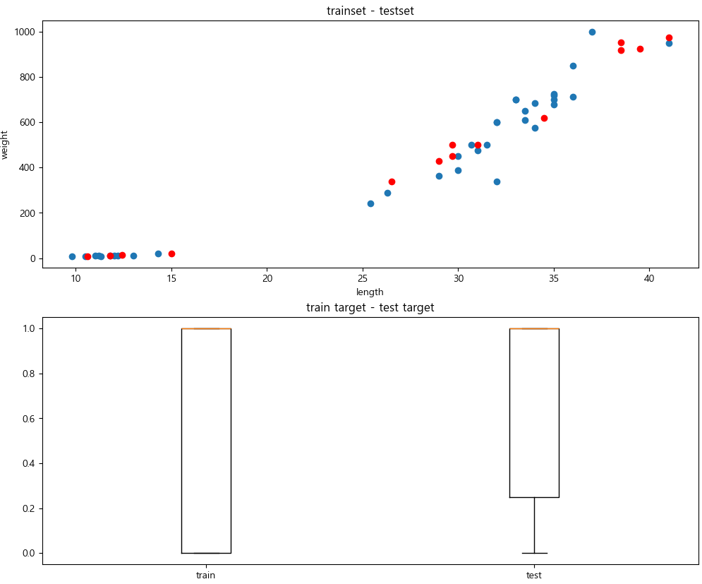

= Lab 3-2 지도 학습 머신 러닝 프로그램 수정

Lab 3-1에서는 샘플링 편향으로 인해 훈련 결과가 왜곡되었습니다. 이 연습에서는 샘플링 편향을 줄여 편협되지 않은 훈련 세트와 테스트 세트를 만들어 모델을 학습합니다.

== 실습 환경 준비

여기에서는 Visual Studio Code의 Jupyter Notebook을 사용하여 연습을 수행합니다. 이 연습의 수행 환경은 Lab 1-1에서와 같습니다.

1. Visual Studio Code를 실행합니다.
2. 파일 메뉴에서 폴더 열기 를 클릭합니다.
3. 연습을 수행할 폴더를 선택하고 확인 버튼을 클릭합니다.
4. Visual Studio Code의 Explorer 에서 New Button을 클릭하여 새 파일을 만들고, 이름을 lab1-1.ipynb로 지정합니다.
5. 오른쪽 위의 Select Kernel 을 클릭하고 Anaconda Python 환경을 선택합니다.
6. + Code 버튼을 클릭하여 노트북을 시작합니다. 노트북의 이름을 lab3-1.ipynb로 지정합니다.

== 라이브러리 import

이 연습에서는 Pandas, Numpy, Matplotlib, SciketLearn 라이브러리를 사용합니다. 아래 절차에 따라 필요한 라이브러리를 import 합니다.

1. 생성한 Code 노트에 아래 코드를 입력합니다.
+
[source, python]
----
import pandas as pd
import numpy as np
import matplotlib.pyplot as plt
from sklearn.neighbors import KNeighborsClassifier

# 한글 처리
plt.rcParams['font.family'] ='Malgun Gothic'
plt.rcParams['axes.unicode_minus'] =False
----
+
2. Shift + Enter 를 클릭하여 작성한 코드를 실행합니다.

== 데이터 준비

사용되는 데이터는 Lab 3-1에서 준비한, 도미와 빙어 데이터를 합친 데이터와 같습니다.

1. 아래 코드를 복사하여 Jupyter Notebook으로 붙여 넣고 실행합니다.
+
[source, python]
----
# 0-34 인덱스 까지는 도미, 나머지 14개는 빙어
fish_length = [25.4, 26.3, 26.5, 29.0, 29.0, 29.7, 29.7, 30.0, 30.0, 30.7, 31.0, 31.0,
                31.5, 32.0, 32.0, 32.0, 33.0, 33.0, 33.5, 33.5, 34.0, 34.0, 34.5, 35.0,
                35.0, 35.0, 35.0, 36.0, 36.0, 37.0, 38.5, 38.5, 39.5, 41.0, 41.0, 9.8,
                10.5, 10.6, 11.0, 11.2, 11.3, 11.8, 11.8, 12.0, 12.2, 12.4, 13.0, 14.3, 15.0]
fish_weight = [242.0, 290.0, 340.0, 363.0, 430.0, 450.0, 500.0, 390.0, 450.0, 500.0, 475.0, 500.0,
                500.0, 340.0, 600.0, 600.0, 700.0, 700.0, 610.0, 650.0, 575.0, 685.0, 620.0, 680.0,
                700.0, 725.0, 720.0, 714.0, 850.0, 1000.0, 920.0, 955.0, 925.0, 975.0, 950.0, 6.7,
                7.5, 7.0, 9.7, 9.8, 8.7, 10.0, 9.9, 9.8, 12.2, 13.4, 12.2, 19.7, 19.9]
----
+
2. 아래 코드를 실행하여 훈련 데이터와 타겟 데이터를 생성합니다.
+
[source, python]
----
fish_data = [[l, w] for l, w in zip(fish_length, fish_weight)]
fish_target = [1] * 35 + [0] * 14
----

== Numpy 배열을 사용하여 편향이 제거된 데이터 생성

여기에서는 Numpy 배열과 함수를 사용하여 샘플링 편향이 제거된 데이터를 생성합니다. 아래 절차에 따릅니다.

1. 아래 코드를 실행하여 원본 데이터를 Numpy 배열로 변환합니다.
+
[source, python]
----
input_array = np.array(fish_data)
target_array = np.array(fish_target)
----
+
2. 아래 코드를 실행하여 난수 배열을 생성합니다.
+
[source, python]
----
np.random.seed(50)
index = np.arange(49)
np.random.shuffle(index)
----
+
3. 아래 코드를 실행하여 생성된 난수 배열을 확인합니다.
+
[source, python]
----
print(index)
----
+
결과는 아래와 유사한, 값이 섞여있는 배열이 반환됩니다.
+
----
[13 45 47 44 17 27 26 25 31 19 12  4 34  8  3  6 40 41 46 15  9 16 24 33 30  0 43 32  5 29 11 36  1 21  2 37 35 23 39 10 22 18 48 20  7 42 14 28 38]
----
+
4. 아래 코드를 실행하여 생성한 난수 배열을 사용하여 훈련 세트와 테스트 세트, label을 생성합니다.
+
[source, python]
----
train_input = input_array[index[:35]]
target_input = target_array[index[:35]]

test_input = input_array[index[35:]]
test_target = target_array[index[35:]]
----
+
5. 아래 코드를 실행하여 생성된 데이터를 확인합니다.
+
[source, python]
----
columns = ['length', 'weight']
df_train_input = pd.DataFrame(train_input, columns=columns)
df_test_input = pd.DataFrame(test_input, columns=columns)

fig = plt.figure(figsize=(12,10))

# add_subplot(행수, 열수, 인덱스)
ax1 = fig.add_subplot(2,1,1)
ax1.set_title('trainset - testset')
ax2 = fig.add_subplot(2,1,2)
ax2.set_title('train target - test target')

ax1.scatter(x=df_train_input.length, y=df_train_input.weight)
ax1.scatter(x=df_test_input.length, y=df_test_input.weight, color='red')
ax1.set_xlabel('length')
ax1.set_ylabel('weight')
ax2.boxplot(x=[target_input, test_target], tick_labels=['train','test'])
----
+

== 모델 생성, 훈련 및 평가

여기에서는 Scikit Learn 패키지를 머신 러닝 모델을 생성합니다. Scikit Learn 패키지에서 K-Nearest Neighbors 알고리즘의 구현 클래스인 KNeighorsClassifier 객체를 생성하고, 훈련합니다. 아래 절차에 따릅니다.

1. KNeighborsClassifier 클래스 객체를 생성합니다. 
+
[source, python]
----
kn = KNeighborsClassifier()
----
+
2. 훈련 데이터를 사용하여 생성한 모델의 fit() 메소드를 호출하여 훈련을 수행합니다.
+
[source, python]
----
kn.fit(train_input, target_input)
----
+
3. 테스트 데이터를 사용하여 훈련이 끝난 모델의 score() 메소드를 호출하여 평가를 수행합니다.
+
[source, python]
----
kn.score(test_input, test_target)
----

== 새 데이터로 평가

평가 결과에 따라, 훈련과 테스트 데이터를 확인합니다. 아래 절차에 따릅니다.

1. 아래 코드를 실행하여 무게가 30, 길이가 600인 데이터를 판정합니다.
+
[source, python]
----
kn.predict([[30,600]])
----
+
도미로 평가합니다.
+
----
array([1])
----
+
2. 아래 코드를 실행하여 무게가 15, 길이가 19.9인 데이터를 판정합니다.
+
[source, python]
----
kn.predict([[15,19.9]])
----
+
빙어로 평가합니다.
+
----
array([0])
----

== 문제점

길이가 25, 무게가 150인 클래스는 도미로 분류되는게 맞습니다.

[source, python]
----
columns = ['length', 'weight']
df_train_input = pd.DataFrame(train_input, columns=columns)
df_test_input = pd.DataFrame(test_input, columns=columns)

plt.scatter(x=df_train_input.length, y=df_train_input.weight)
plt.scatter(25, 150, marker="x", color="red")
plt.xlabel("length")
plt.ylabel("weight")

plt.show()
----

하지만, 빙어로 평가됩니다.

[source, python]
----
kn.predict([[25,150]])
----

----
array([0])
----