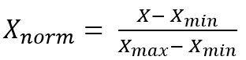
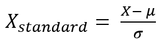
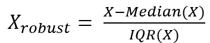

= 정규화

**데이터 정규화(Data Normalization)**는 데이터를 특정 범위로 변환하거나, 데이터의 분포를 일정한 형태로 조정하는 과정입니다. 이는 주로 데이터의 스케일 차이가 모델 학습에 영향을 미칠 수 있기 때문에, 각 변수들이 동일한 범위나 분포를 갖도록 변환하는 것입니다. 정규화는 머신러닝 모델의 성능을 높이고, 학습 속도를 개선하며, 특정 알고리즘에서의 정확도를 높이는 데 중요한 역할을 합니다.

정규화의 주요 목적은 모델이 한 변수의 스케일에 의존하지 않도록 하고, 다양한 변수들이 동일한 중요도를 갖게 만드는 것입니다. 특히, 거리 기반 알고리즘이나 경사 하강법을 사용하는 모델에서는 정규화가 매우 중요합니다.

1. 정규화의 필요성
* 모델 학습에 영향: 다양한 스케일을 가진 변수를 그대로 모델에 넣을 경우, 모델은 스케일이 큰 변수에 더 민감하게 반응할 수 있습니다. 
* 경사 하강법(Gradient Descent): 경사 하강법을 사용하는 모델에서는 각 특성이 비슷한 범위를 가지지 않으면, 최적화가 잘 이루어지지 않거나 수렴 속도가 느려질 수 있습니다.
* 거리 기반 알고리즘: K-최근접 이웃(KNN), K-평균 클러스터링, 서포트 벡터 머신(SVM)과 같은 거리 기반 알고리즘은 특성들의 크기에 민감하기 때문에, 정규화가 필요합니다.
2. 정규화 방법
여러 가지 정규화 기법이 있으며, 각각의 방법은 데이터의 분포나 분석 목적에 따라 다르게 선택됩니다. 주요 기법은 다음과 같습니다.
a. 최소-최대 정규화 (Min-Max Normalization) +
최소-최대 정규화는 데이터를 0과 1 사이의 범위로 변환하는 방법입니다. 모든 값들이 동일한 범위 내에 위치하도록 변환되므로, 여러 변수를 같은 스케일로 맞추는 데 유용합니다.
+

+ 
𝑋~min~ : 해당 변수의 최소값, 
𝑋~max~ : 해당 변수의 최대값
+
* 장점: 간단하고 직관적입니다. 모델이 특정 값의 범위에 영향을 받지 않게 해 줍니다.
* 단점: 이상치(Outliers)에 민감합니다. 이상치가 있으면 변환된 값이 0과 1 사이에 집중되지 않게 되며, 다른 값들이 압축될 수 있습니다.
* 적용 시기: 대부분의 모델에서 사용됩니다. 특히, 신경망 모델, KNN, SVM 등에서 유용합니다.
+
b. Z-점수 정규화 (Z-score Normalization 또는 Standardization) +
Z-점수 정규화는 데이터를 평균 0, 표준편차 1을 갖도록 변환하는 방법입니다. 이 방법은 데이터가 정규분포를 따른다고 가정할 때, 특히 효과적입니다.
+

+
μ는 평균, σ는 표준편차
+
* 장점: 이상치에 덜 민감합니다. 또한, 데이터가 정규분포를 따를 경우, 모델의 성능이 개선될 수 있습니다.
* 단점: 데이터가 정규분포를 따르지 않는 경우, 변환 후에도 이상치에 대한 민감도가 있을 수 있습니다.
* 적용 시기: 데이터가 정규 분포를 따르거나, 데이터의 분포가 특정한 형태일 때 유용합니다. 선형 회귀, 로지스틱 회귀, SVM, 신경망 등에서 사용됩니다.
+
c. 로버스트 스케일링 (Robust Scaling) +
로버스트 스케일링은 이상치에 덜 민감하게 데이터를 변환하는 방법입니다. 중앙값과 사분위수 범위(IQR)를 사용하여 데이터를 변환합니다.
+

+
Median(𝑋) 중앙값, IQR(𝑋) 사분위수 범위(75th percentile - 25th percentile)

* 장점: 이상치에 영향을 받지 않으며, 다른 정규화 기법보다 데이터의 중앙값을 기준으로 변환되므로 더 안정적입니다.
* 단점: 데이터가 정규 분포를 따르지 않으면 효과적이지 않을 수 있습니다.
* 적용 시기: 이상치가 많은 데이터에서 유용합니다. 예를 들어, 많은 이상치가 포함된 데이터셋에서는 로버스트 스케일링이 더 적합할 수 있습니다.
+
d. 로깅(Log Transformation) +
로그 변환은 데이터가 비정규분포를 따르거나, 분포가 왜곡되어 있을 때 유용한 기법입니다. 로그 변환을 통해 데이터의 분포를 정규에 가깝게 만들 수 있습니다.
+
𝑋~log~ = (𝑋)
+
X는 데이터 값, 로그는 자연 로그를 사용할 수도 있고, 로그의 밑을 10으로 선택할 수도 있습니다.
+
* 장점: 데이터의 왜곡을 줄여줄 수 있으며, 특히 왼쪽에 치우친 분포(비대칭적 분포)를 다룰 때 유용합니다.
* 단점: 로그 변환은 0이나 음수 값에 대해 적용할 수 없으므로, 데이터가 음수나 0을 포함할 경우 별도의 처리가 필요합니다.
* 적용 시기: 데이터가 비대칭적이거나, 값이 매우 큰 범위를 가질 때 적합합니다. 예를 들어, 경제 데이터나 인구 통계 데이터 등에서 자주 사용됩니다.

3. 정규화 방법 선택 기준 +
정규화 방법을 선택할 때는 다음과 같은 기준을 고려해야 합니다:
* 데이터 분포: 데이터가 정규분포를 따른다면 Z-점수 정규화가 좋습니다. 비정규분포라면 로그 변환이나 로버스트 스케일링이 적합할 수 있습니다.
* 이상치: 이상치가 많이 포함된 데이터라면, 로버스트 스케일링을 사용하는 것이 유리합니다. 반면, 이상치가 없는 경우에는 Min-Max 정규화나 Z-점수 정규화가 더 간단하고 효과적일 수 있습니다.
* 모델의 요구 사항: 머신러닝 알고리즘에 따라 요구하는 데이터의 스케일이 다를 수 있습니다. 예를 들어, 거리 기반 알고리즘에서는 Min-Max 정규화가 필요하며, 선형 회귀 모델에서는 Z-점수 정규화가 많이 사용됩니다.

데이터 정규화는 머신러닝 모델의 학습 효율성을 높이고, 결과의 정확성을 개선하는 중요한 과정입니다. 정규화 방법을 적절히 선택하여 사용함으로써, 모델이 다양한 특성 간의 스케일 차이로 인해 왜곡되지 않도록 할 수 있습니다.

//// 
https://42-snoopy.tistory.com/entry/ML-%EB%8D%B0%EC%9D%B4%ED%84%B0-%EC%A0%84%EC%B2%98%EB%A6%AC-20-%EC%8A%A4%EC%BC%80%EC%9D%BC%EB%A7%81
////