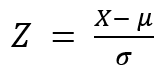

= 이상치 처리

**이상치 처리 (Outlier Handling)**는 데이터 분석과 모델링에서 매우 중요한 단계로, 이상치는 모델 성능에 부정적인 영향을 미칠 수 있기 때문에 적절히 처리해야 합니다. 이상치는 다른 데이터 포인트들과 현저히 다른 값을 가진 데이터 포인트를 의미하며, 이들이 분석에 포함되면 결과를 왜곡하거나 모델의 예측 정확도를 떨어뜨릴 수 있습니다.

이상치는 다양한 원인으로 발생할 수 있으며, 이를 처리하는 방법에는 여러 가지가 있습니다. 이상치 처리 방법을 적절히 선택하는 것은 데이터의 특성, 분석 목표, 그리고 사용하려는 모델에 따라 달라질 수 있습니다.

1. 이상치의 정의
이상치는 일반적으로 데이터의 분포에서 다른 데이터 포인트들과 현저하게 다른 값을 가지는 포인트입니다. 이상치를 정의하는 방법은 여러 가지가 있지만, 가장 일반적인 방법은 통계적인 기준을 사용하는 것입니다.
+
이상치의 특성
* 극단적 값: 전체 데이터 분포에서 매우 떨어져 있는 값들.
* 데이터 오류: 입력 오류나 측정 장비의 오류 등으로 발생할 수 있습니다.
* 희귀한 사건: 통계적으로 드물지만 실제로 중요한 정보일 수 있습니다.

2. 이상치 탐지 방법
이상치를 탐지하는 방법은 크게 통계적 방법, 머신러닝 기반 방법, 시각화 방법으로 나눌 수 있습니다.
a. 통계적 방법
* Z-점수 (Z-Score): 각 데이터 포인트가 평균으로부터 얼마나 떨어져 있는지를 측정하는 방법입니다. Z-점수가 일정 기준 이상인 데이터를 이상치로 간주합니다.
+
 
+
𝑋는 데이터 값, 𝜇는 평균, 𝜎는 표준편차입니다. 일반적으로 Z-점수가 3보다 크거나 -3보다 작은 값은 이상치로 간주됩니다.
+
* IQR (Interquartile Range, 사분위수 범위): 데이터의 중앙 50%가 분포하는 범위를 기준으로 이상치를 탐지합니다. IQR은 1사분위수(Q1)와 3사분위수(Q3)의 차이로 계산되며, 이를 기반으로 이상치를 정의합니다.
+
IQR = 𝑄3 − 𝑄1
+
* 이상치는 다음 조건을 만족하는 데이터를 의미합니다
** 𝑋 < 𝑄1 − 1.5 × IQR
** 𝑋 > 𝑄3 + 1.5 × IQR
* IQR 방법은 특히 비대칭 분포나 이상치가 많이 존재하는 데이터에서 효과적입니다.
+
b. 머신러닝 기반 방법
* Isolation Forest +
이 방법은 데이터셋 내에서 이상치를 분리하는 방식으로 작동합니다. 주로 비지도 학습에서 사용되며, 데이터의 분포를 학습하여 이상치를 탐지합니다.
* LOF (Local Outlier Factor) +
이 알고리즘은 데이터의 밀도를 기반으로 이상치를 탐지합니다. 데이터 포인트가 주변의 밀도보다 현저히 낮다면 이상치로 간주됩니다.
* DBSCAN (Density-Based Spatial Clustering of Applications with Noise) +
밀도 기반 군집화 방법으로, 군집에 속하지 않거나 밀도가 낮은 영역에 있는 포인트를 이상치로 탐지할 수 있습니다.
c. 시각화 방법
* 박스 플롯(Box Plot) +
박스 플롯은 사분위수를 기준으로 데이터의 분포를 시각화하며, 이상치를 쉽게 식별할 수 있습니다. 상자 외부에 위치한 점들이 이상치로 간주됩니다.
산점도(Scatter Plot) +
두 변수 간의 관계를 시각화하여 극단적인 값을 가진 점을 쉽게 식별할 수 있습니다.
3. 이상치 처리 방법 +
이상치를 처리하는 방법은 데이터의 특성과 분석 목적에 따라 달라집니다. 일반적으로 이상치를 처리하는 방법은 삭제, 대체, 변환 등이 있습니다.
a. 이상치 삭제 (Outlier Removal) +
이상치를 데이터에서 완전히 제거하는 방법입니다. 이 방법은 간단하지만, 이상치가 중요한 정보를 포함할 수 있는 경우에는 불리할 수 있습니다.
* 장점: 모델이 이상치의 영향을 받지 않도록 하여 분석이 더 정확할 수 있습니다.
* 단점: 데이터 손실이 발생할 수 있으며, 이상치가 실제로 중요한 데이터일 경우 중요한 정보를 놓칠 수 있습니다.
b. 이상치 대체 (Outlier Imputation) +
이상치를 삭제하는 대신, 적절한 값으로 대체하는 방법입니다. 대체값으로는 평균값, 중앙값, 최빈값 등이 사용될 수 있습니다.
* 장점: 이상치를 삭제하지 않고도 분석을 진행할 수 있으며, 데이터 손실을 줄일 수 있습니다.
* 단점: 이상치를 임의로 대체하면, 그 대체된 값이 실제 데이터의 특성을 반영하지 못할 수 있습니다.
c. 이상치 변환 (Outlier Transformation) +
이상치를 단순히 삭제하거나 대체하는 대신, 데이터를 변환하여 이상치의 영향을 줄이는 방법입니다. 변환 기법으로는 로그 변환, 제곱근 변환, Box-Cox 변환 등이 있습니다.
* 장점: 이상치를 완전히 제거하지 않고도 데이터의 분포를 더 적절하게 조정할 수 있습니다.
* 단점: 변환이 데이터에 대해 적합하지 않을 수 있으며, 변환 후에도 여전히 이상치가 존재할 수 있습니다.
d. 이상치 재조정 (Outlier Clipping)
이상치를 특정 범위로 잘라서 범위 내의 적절한 값으로 변환하는 방법입니다. 예를 들어, 이상치를 상한선과 하한선으로 제한하여 그 범위 내의 값으로 재조정합니다.
* 장점: 이상치의 영향을 줄이면서 데이터의 분포를 유지할 수 있습니다.
* 단점: 실제로 중요한 이상치를 잘못 처리할 수 있습니다.
4. 이상치 처리 방법 선택 기준 +
이상치 처리 방법을 선택할 때는 다음과 같은 기준을 고려해야 합니다:
* 이상치의 원인: 이상치가 측정 오류로 발생한 것이라면 삭제하는 것이 바람직할 수 있습니다. 반면, 희귀한 사건이나 중요한 데이터라면, 이상치를 그대로 두거나 변환하여 처리하는 것이 적합할 수 있습니다.
* 데이터의 특성: 데이터가 정규분포를 따른다면 Z-점수 방식으로 이상치를 탐지하는 것이 유용합니다. 비정규 분포나 비대칭 분포에서는 IQR 방식이 더 적합할 수 있습니다.
* 모델의 특성: 거리 기반 알고리즘(KNN, K-means 등)은 이상치에 민감하므로, 이상치가 많을 경우 이를 제거하거나 처리하는 것이 중요합니다. 반면, 트리 기반 모델(랜덤 포레스트, XGBoost 등)은 이상치에 비교적 덜 민감합니다.

이상치 처리 방법은 분석 목적, 데이터의 특성, 사용하려는 알고리즘에 따라 달라집니다. 이상치를 완전히 제거하거나 변환하여 처리함으로써 모델의 성능을 향상시킬 수 있지만, 데이터의 특성에 따라 이상치가 중요한 정보를 담고 있을 수 있으므로 신중한 처리가 필요합니다.