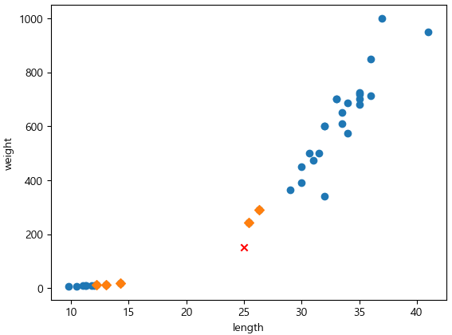
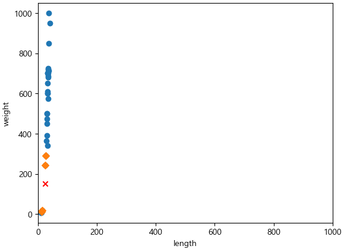

= Lab 3-4 데이터 전처리

이 연습에서는 Lab 3-3의 문제를 확인하고 데이터 전처리를 통해 문제를 해결하기 위한 방법을 학습합니다.

== Lab 3-3의 문제점 확인

=== 실습 환경 준비

1. Visual Studio Code를 실행합니다.
2. 파일 메뉴에서 폴더 열기 를 클릭합니다.
3. 이전에 수행한 lab3-2.ipynb 파일이 있는 폴더를 엽니다.

=== 문제점 분석

여기에서는 모델에서 사용하여 거리와 인덱스를 추출하여 문제를 확인합니다. 아래 절차에 따릅니다.

1. 아래 코드를 실행하여 모델에서 주어진 데이터에 대한 거리와 인덱스를 추출합니다.
+
[source, python]
----
distance, indexes = kn.kneighbors([[25,150]])
----
+
K-Nearest Neighbor는 주변의 샘플 중에서 다수인 클래스를 예측으로 사용합니다. Scikit Learn의 KNeighborsClassifier 클래스는 주어진 샘플에서 가장 가까운 데이터를 찾는 kneighbors() 메소드를 제공합니다. 이 메소드는 K 값으로 주어진 개수의 주변 데이터 까지의 거리와 데이터의 인덱스를 return 합니다. 
+
2. 아래 코드를 실행하여 주어진 데이터에서 가장 가까운 K값 개수에 해당하는 데이터(5개)의 위치를 시각적으로 확인합니다.
+
[source, python]
----
plt.scatter(train_input[:,0], train_input[:,1])
plt.scatter(25, 150, marker='x', color='red')
plt.scatter(train_input[indexes,0], train_input[indexes,1],marker='D')
plt.xlabel('length')
plt.ylabel('weight')
----
+

+
3. 아래 코드를 실행하여 가까운 5개의 데이터를 확인합니다.
+
[source, python]
----
print(train_input[indexes])
----
+
----
[[[ 25.4 242. ]
  [ 14.3  19.7]
  [ 13.   12.2]
  [ 12.2  12.2]
  [ 26.3 290. ]]]
----
+
4. 아래 코드를 실행하여 가까운 5개 데이터의 target 데이터를 확인합니다.
+
[source, python]
----
print(target_input[indexes])
----
+
----
[[1 0 0 0 1]]
----
+
가까운 5개의 데이터 중 빙어 데이타가 많은 것을 알 수 있습니다.
+
5. 아래 코드를 실행하여 가까운 5개 데이터의 거리를 확인합니다.
+
[source, python]
----
print(distance)
----
+
----
[[ 92.00086956 130.73859415 138.32150953 138.39320793 140.00603558]]
----
+
6. 아래 코드를 실행해서 x 축 거리를 1000으로 하여 다시 시각화 하여 가까운 5개 데이터의 거리를 확인합니다.
+
[source, python]
----
plt.scatter(train_input[:,0], train_input[:,1])
plt.scatter(25, 150, marker='x', color='red')
plt.scatter(train_input[indexes,0], train_input[indexes,1],marker='D')
plt.xlim((0, 1000))
plt.xlabel('length')
plt.ylabel('weight')
plt.show()
----
+

== 데이터 전처리

여기에서는 표준 스코어(Standard Score)를 사용한 데이터 전처리를 수행하여 예측의 왜곡을 수정합니다. 

데이터를 표현하는 기준이 다르면 특히 거리기반 알고리즘에서 올바른 예측에 어려움을 겪습니다. 거리기반 알고리즘은 샘플 데이터 간의 거리에 영향을 많이 받으므로 특성 값을 일정한 기준으로 맞춰주어야 합니다. 이런 작업들을 데이터 전처리(Data Preprocessing)이라고 합니다.

많이 사용하는 전처리 방법중의 하나는 Z-Score라고도 부르는 표준 점수입니다. 표준 점수는 각 특성의 값이 평균에서 표준 편차의 몇 배만큼 떨어져 있는지를 나타냅니다. 이를 통해 실제 특성값의 크기와 상관없이 동일한 조건으로 비교할 수 있습니다.

=== 실습 환경 준비

여기에서는 Visual Studio Code의 Jupyter Notebook을 사용하여 연습을 수행합니다. 이 연습의 수행 환경은 Lab 1-1에서와 같습니다.

1. Visual Studio Code를 실행합니다.
2. 파일 메뉴에서 폴더 열기 를 클릭합니다.
3. 연습을 수행할 폴더를 선택하고 확인 버튼을 클릭합니다.
4. Visual Studio Code의 Explorer 에서 New Button을 클릭하여 새 파일을 만들고, 이름을 lab3-3.ipynb로 지정합니다.
5. 오른쪽 위의 Select Kernel 을 클릭하고 Anaconda Python 환경을 선택합니다.
6. + Code 버튼을 클릭하여 노트북을 시작합니다.

=== 라이브러리