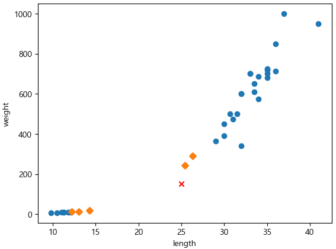
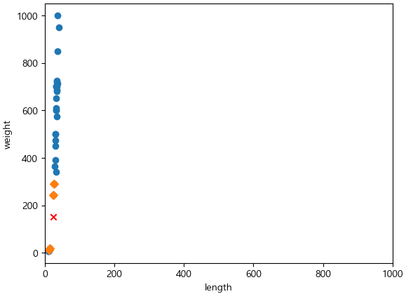
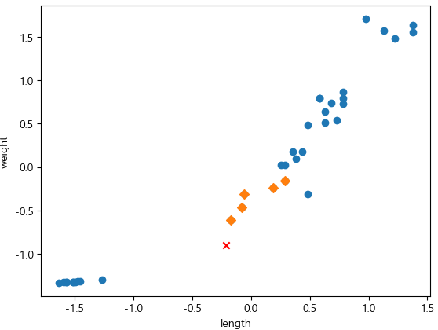

= Lab 3-4 데이터 전처리

이 연습에서는 Lab 3-3의 문제를 확인하고 데이터 전처리를 통해 문제를 해결하기 위한 방법을 학습합니다.

== 연습 1: Lab 3-3의 문제점 확인

=== 실습 환경 준비

1. Visual Studio Code를 실행합니다.
2. 파일 메뉴에서 폴더 열기 를 클릭합니다.
3. 이전에 수행한 lab3-3.ipynb 파일이 있는 폴더를 엽니다.

=== 문제점 분석

여기에서는 모델에서 거리와 인덱스를 추출하여 문제를 확인합니다. 아래 절차에 따릅니다.

1. 아래 코드를 실행하여 모델에서 주어진 데이터에 대한 거리와 인덱스를 추출합니다.
+
[source, python]
----
distance, indexes = kn.kneighbors([[25,150]])
----
+
K-Nearest Neighbor는 주변의 샘플 중에서 다수인 클래스를 예측으로 사용합니다. Scikit Learn의 KNeighborsClassifier 클래스는 주어진 샘플에서 가장 가까운 데이터를 찾는 kneighbors() 메소드를 제공합니다. 이 메소드는 K 값으로 주어진 개수의 주변 데이터 까지의 거리와 데이터의 인덱스를 return 합니다. 
+
2. 아래 코드를 실행하여 주어진 데이터에서 가장 가까운 K값 개수에 해당하는 데이터(5개)의 위치를 시각적으로 확인합니다.
+
[source, python]
----
plt.scatter(train_input[:,0], train_input[:,1])
plt.scatter(25, 150, marker='x', color='red')
plt.scatter(train_input[indexes,0], train_input[indexes,1],marker='D')
plt.xlabel('length')
plt.ylabel('weight')
----
+

+
3. 아래 코드를 실행하여 가까운 5개의 데이터를 확인합니다.
+
[source, python]
----
print(train_input[indexes])
----
+
----
[[[ 25.4 242. ]
  [ 14.3  19.7]
  [ 13.   12.2]
  [ 12.2  12.2]
  [ 26.3 290. ]]]
----
+
4. 아래 코드를 실행하여 가까운 5개 데이터의 target 데이터를 확인합니다.
+
[source, python]
----
print(target_input[indexes])
----
+
----
[[1 0 0 0 1]]
----
+
가까운 5개의 데이터 중 빙어 데이타가 많은 것을 알 수 있습니다.
+
5. 아래 코드를 실행하여 가까운 5개 데이터의 거리를 확인합니다.
+
[source, python]
----
print(distance)
----
+
----
[[ 92.00086956 130.73859415 138.32150953 138.39320793 140.00603558]]
----
+
6. 아래 코드를 실행해서 x 축 거리를 1000으로 하여 다시 시각화 하여 가까운 5개 데이터의 거리를 확인합니다.
+
[source, python]
----
plt.scatter(train_input[:,0], train_input[:,1])
plt.scatter(25, 150, marker='x', color='red')
plt.scatter(train_input[indexes,0], train_input[indexes,1],marker='D')
plt.xlim((0, 1000))
plt.xlabel('length')
plt.ylabel('weight')
plt.show()
----
+

== 연습 2: 데이터 전처리

여기에서는 표준 스코어(Standard Score)를 사용한 데이터 전처리를 수행하여 예측의 왜곡을 수정합니다. 

데이터를 표현하는 기준이 다르면 특히 거리기반 알고리즘에서 올바른 예측에 어려움을 겪습니다. 거리기반 알고리즘은 샘플 데이터 간의 거리에 영향을 많이 받으므로 특성 값을 일정한 기준으로 맞춰주어야 합니다. 이런 작업들을 데이터 전처리(Data Preprocessing)이라고 합니다.

많이 사용하는 전처리 방법중의 하나는 Z-Score라고도 부르는 표준 점수입니다. 표준 점수는 각 특성의 값이 평균에서 표준 편차의 몇 배만큼 떨어져 있는지를 나타냅니다. 이를 통해 실제 특성값의 크기와 상관없이 동일한 조건으로 비교할 수 있습니다.

=== 실습 환경 준비

여기에서는 Visual Studio Code의 Jupyter Notebook을 사용하여 연습을 수행합니다. 이 연습의 수행 환경은 Lab 1-1에서와 같습니다.

1. Visual Studio Code를 실행합니다.
2. 파일 메뉴에서 폴더 열기 를 클릭합니다.
3. 연습을 수행할 폴더를 선택하고 확인 버튼을 클릭합니다.
4. Visual Studio Code의 Explorer 에서 New Button을 클릭하여 새 파일을 만들고, 이름을 lab3-4.ipynb로 지정합니다.
5. 오른쪽 위의 Select Kernel 을 클릭하고 Anaconda Python 환경을 선택합니다.
6. + Code 버튼을 클릭하여 노트북을 시작합니다.

=== 라이브러리 import

이 연습에서는 Pandas, Numpy, Matplotlib, SciketLearn 라이브러리를 사용합니다. 아래 절차에 따라 필요한 라이브러리를 import 합니다.

1. 생성한 Code 노트에 아래 코드를 입력합니다.
+
[source, python]
----
import pandas as pd
import numpy as np
import matplotlib.pyplot as plt
from sklearn.neighbors import KNeighborsClassifier
from sklearn.model_selection import train_test_split

# 한글 처리
plt.rcParams['font.family'] ='Malgun Gothic'
plt.rcParams['axes.unicode_minus'] = False
----
+
2. Shift + Enter 를 클릭하여 작성한 코드를 실행합니다.

=== 데이터 준비 및 모델 생성, 학습, 가까운 데이터 찾기

사용되는 데이터는 Lab 3-3에서 준비한 데이터와 같습니다. 여기에서는 3-3에서 수행한 동작들을 수행하여 모델을 만들고 훈련 데이터, 훈련 테스트 데이터, 타겟 데이터, 테스트 타겟 데이터를 생성합니다.

아래 코드를 복사하여 Jupyter Notebook으로 붙여 넣고 실행합니다.

[source, python]
----
fish_data = np.column_stack((fish_length, fish_weight))
fish_target = np.concatenate((np.ones(35), np.zeros(14)))

train_input, test_input, train_target, test_target = train_test_split(fish_data, fish_target, stratify=fish_target, random_state=50)
----

=== Standard Score를 사용한 데이터 전처리

여기에서는 Standard Score를 사용하여 데이터를 전처리합니다. 아래 절차에 따릅니다.

1. Numpy를 사용하여 훈련 데이터의 평균과 표준 편차를 구합니다. +
Standard Score(z-score)를 계산하는 방법은 값에서 평균을 뺀 다음 표준 편차로 나누는 것입니다.
+
[source, python]
----
mean = np.mean(train_input, axis=0)
std = np.std(train_input, axis=0)
----
+
2. 구한 평균과 표준 편차를 사용하여 Standard Score를 구합니다.
+
[source, python]
----
train_scaled = (train_input - mean) / std
----
+
3. 아래 코드를 실행하여 새 생선 데이터의 표준 점수를 구합니다.
+
[source, python]
----
new_fish = ([25,150] - mean) / std
----
+
4. 새 생선 데이터의 표준 점수를 사용하여 데이터의 위치를 확인합니다. +
표준 점수가 적용되었으므로, x 축과 y 축 모두 -1.5 ~ 1.5 사이의 데이터로 표시됩니다.
+
[source, python]
----
plt.scatter(train_scaled[:,0], train_scaled[:,1])
plt.scatter(new_fish[0], new_fish[1], marker='x', color='red')
plt.xlabel('length')
plt.ylabel('weight')
plt.show()
----
+
image:../images/image12.png[]
+
5. 새 생선 데이터를 예측합니다.
+
[source, python]
----
kn.predict([new_fish])
----
+
----
array([1.])
----

== 표준 점수 데이터 시각화

여기에서는 모델에서 거리와 인덱스를 추출하여, Standard Score로 변환한 데이터를 확인합니다. 아래 절차에 따릅니다.

1. 아래 코드를 실행하여 Standard Score로 변환한 데이터에 대한 거리와 인덱스를 추출합니다.
+
[source, python]
----
distances, indexes = kn.kneighbors([[new_fish[0], new_fish[1]]])
----
+
2. 아래 코드를 실행하여 K값들에 대한 데이터를 확인합니다.
+
[source, python]
----
plt.scatter(train_scaled[:,0], train_scaled[:,1])
plt.scatter(new_fish[0], new_fish[1], marker='x', color='red')
plt.scatter(train_scaled[indexes,0], train_scaled[indexes,1],marker='D')
plt.xlabel('length')
plt.ylabel('weight')
plt.show()
----
+
