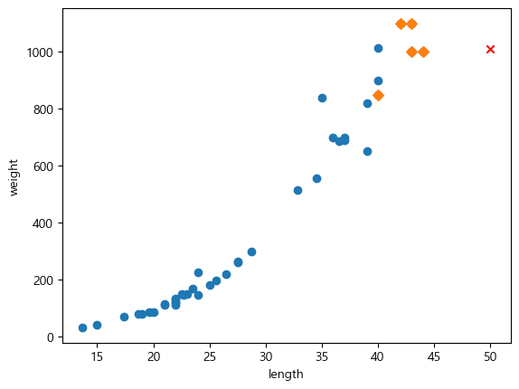

= Lab 4-1 KNN을 사용한 예측

이 연습에서는 새 생선을 분류하는 머신 러닝 응용 프로그램을 작성합니다. 아래 절차에 따릅니다.

== 실습 환경 준비

여기에서는 Visual Studio Code의 Jupyter Notebook을 사용하여 연습을 수행합니다. 이 연습의 수행 환경은 Lab 1-1에서와 같습니다.

1. Visual Studio Code를 실행합니다.
2. 파일 메뉴에서 폴더 열기 를 클릭합니다.
3. 연습을 수행할 폴더를 선택하고 확인 버튼을 클릭합니다.
4. Visual Studio Code의 Explorer 에서 New Button을 클릭하여 새 파일을 만들고, 이름을 lab3-1.ipynb로 지정합니다.
5. 오른쪽 위의 Select Kernel 을 클릭하고 Anaconda Python 환경을 선택합니다.
6. + Code 버튼을 클릭하여 노트북을 시작합니다.

== 라이브러리 import

이 연습에서는 Pandas, Numpy, Matplotlib, Scikit Learn 라이브러리를 사용합니다. 아래 절차에 따라 필요한 라이브러리를 import 합니다.

1. 생성한 Code 노트에 아래 코드를 입력합니다.
+
[source, python]
----
import pandas as pd
import numpy as np
import matplotlib.pyplot as plt
from sklearn.neighbors import KNeighborsClassifier

# 한글 처리
plt.rcParams['font.family'] ='Malgun Gothic'
plt.rcParams['axes.unicode_minus'] =False
----
+
2. Shift + Enter 를 클릭하여 작성한 코드를 실행합니다.

== 데이터 준비

이 연습에서는 도미와 빙어외에 다른 생선인 농어 생선 데이터를 사용합니다. 농어의 길이를 사용하여 농어의 무게를 예측합니다. 즉 농어의 길이가 특성이며, 무게가 타겟이 됩니다. 

1. 아래 코드를 복사하여 Jupyter Notebook으로 붙여 넣고 실행합니다.
+
[source, python]
----
perch_length = np.array([8.4, 13.7, 15.0, 16.2, 17.4, 18.0, 18.7, 19.0, 19.6, 20.0, 21.0,
       21.0, 21.0, 21.3, 22.0, 22.0, 22.0, 22.0, 22.0, 22.5, 22.5, 22.7,
       23.0, 23.5, 24.0, 24.0, 24.6, 25.0, 25.6, 26.5, 27.3, 27.5, 27.5,
       27.5, 28.0, 28.7, 30.0, 32.8, 34.5, 35.0, 36.5, 36.0, 37.0, 37.0,
       39.0, 39.0, 39.0, 40.0, 40.0, 40.0, 40.0, 42.0, 43.0, 43.0, 43.5,
       44.0])
perch_weight = np.array([5.9, 32.0, 40.0, 51.5, 70.0, 100.0, 78.0, 80.0, 85.0, 85.0, 110.0,
       115.0, 125.0, 130.0, 120.0, 120.0, 130.0, 135.0, 110.0, 130.0,
       150.0, 145.0, 150.0, 170.0, 225.0, 145.0, 188.0, 180.0, 197.0,
       218.0, 300.0, 260.0, 265.0, 250.0, 250.0, 300.0, 320.0, 514.0,
       556.0, 840.0, 685.0, 700.0, 700.0, 690.0, 900.0, 650.0, 820.0,
       850.0, 900.0, 1015.0, 820.0, 1100.0, 1000.0, 1100.0, 1000.0,
       1000.0])
----
+
2. 데이터의 산점도 그래프를 통해 분포를 알아봅니다. 특성 데이터(길이)를 x축에, 타겟 데이터(무게)를 y축에 사용합니다.
+
[source, python]
----
plt.scatter(x=perch_length, y=perch_weight)
plt.xlabel('length')
plt.ylabel('weight')
plt.show()
----
+

+
농어의 길이가 늘어남에 따라 무게도 늘어나는 것을 알 수 있습니다.
+
3. train_test_split() 함수를 사용하여 학습 세트와 테스트 세트로 나누고, reshape() 메소드를 사용하여 2차원 배열로 변경합니다.
+
[source, python]
----
train_input, test_input, train_target, test_target = train_test_split(perch_length, perch_weight, random_state=42)

train_input = train_input.reshape(-1, 1)
test_input = test_input.reshape(-1, 1)
----

== 모델 생성

여기에서는 Scikit Learn 패키지에서 KNeighborsRegressor 모델을 생성합니다. Scikit Learn 패키지에서 K-최근접 이웃 회귀 알고리즘의 구현 클래스인 KNeighborsRegressor 객체를 생성합니다. 아래 절차에 따릅니다.

1. 아래 코드를 실행하여 KNeighborsRegressor 클래스 객체를 생성합니다.
+
[source, python]
----
knr = KNeighborsRegressor()
----

== 학습 및 평가

위에서 준비한 데이터와 타겟을 사용하여, 모델을 학습한 후 평가합니다. 아래 절차에 따릅니다.

1. 아래 코드를 실행하여 모델을 학습합니다. 위에서 생성한 학습 세트를 사용합니다.
+
[source, python]
----
knr.fit(train_input, train_target)
----
+
2. 아래 코드를 실행하여 모델을 평가합니다. +
회귀 모델에서는 결정 계수(Coeffficient of determination)로 모델이 평가되며, 결정계수를 R^2^라고 부릅니다.
+
[source, python]
----
knr.score(test_input, test_target)
----

== 오차 측정

결정 계수 R^2^의 값으로는 모델의 적합도를 판단하기 어려울 경우, 평균 절대값 오차를 구해볼 수 있습니다. 아래 절차에 따릅니다.

1. 아래 코드를 실행하여 Scikit Learn 패키지의 matrics 모듈 중 mean_absolute_error 함수를 import 합니다.
+
[source, python]
----
from sklearn.metrics import mean_absolute_error
----
+
2. 아래 코드를 실행하여 테스트 세트에 대한 예측을 만듭니다.
+
[source, python]
----
test_prediction = knr.predict(test_input)
----
+
3. 아래 코드를 실행하여 평균 절대값 오차를 계산합니다.
+
----
mae = mean_absolute_error(test_target, test_prediction)
----

== 학습 세트와 테스트 세트 평가

학습 세트와 테스트 세트를 사용하여 각각의 결정 계수를 확인합니다. 아래 절차에 따릅니다.

1. 아래 코드를 실행하여 테스트 세트를 사용한 결정 계수를 확인합니다.
+
[source, python]
----
knr.score(test_input, test_target)
----
+
----
0.992809406101064
----
+
2. 아래 코드를 사용하여 학습 세트를 사용한 결정 계수를 확인합니다.
+
[source, python]
----
knr.score(train_input, train_target)
----
+
----
0.9698823289099254
----
+
평가와 오차를 사용하여 과대 적합(학습 세트에 과도하게 맞도록 학습된 경우)과 과소 적합(학습 세트의 결정 계수가 낮거나 학습 세트와 테스트 세트 모두의 결정 계수가 낮은 경우)을 판단할 수 있습니다.

== 예측

새 데이터를 사용하여 농어의 길이로 무게를 예측합니다. 아래 절차에 따릅니다.

1. 아래 코드를 실행하여 길이가 15cm인 농어의 무게를 예측합니다.
+
[source, python]
----
knr.predict([[15]])
----
+
2. 아래 코드를 실행하여 길이가 21cm인 농어의 무게를 예측합니다.
+
[source, python]
----
knr.predict([[15]])
----
+
3. 아래 코드를 실행하여 산점도 플롯에서 예측한 데이터의 위치를 확인합니다.
+
[source, python]
----
plt.scatter(train_input, train_target)

plt.scatter(15, 60, marker='x', color='red')
plt.scatter(31, 379, marker='x', color='red')
plt.xlabel('length')
plt.ylabel('weight')

plt.show()
----
+

== 문제점

여기에서는 준비된 길이 데이터보다 큰 데이터를 사용하여 모델의 문제점을 평가합니다. 아래 절차에 따릅니다.

1. 아래 코드를 실행하여 길이가 50cm인 농어의 무게를 예측합니다.
+
[source, python]
----
knr.predict([[50]])
----
+
----
array([1010.])
----
+
2. 아래 코드를 실행하여 K 데이터와 예측 데이터의 위치를 return 받습니다.
+
[source, python]
----
distances, indexes = knr.kneighbors([[50]])
----
+
3. 아래 코드를 실행하여 K 데이터와 예측 데이터의 위치를 산점도 플롯에서 확인합니다.
+
[source, python]
----
plt.scatter(train_input, train_target)
plt.scatter(train_input[indexes], train_target[indexes], marker='D')

plt.scatter(50, 1010, marker='x', color='red')
plt.xlabel('length')
plt.ylabel('weight')

plt.show()
----
+

+
4. 아래 코드를 실행하여 K 데이터의 평균을 확인합니다.
+
[source, python]
----
np.mean(train_target[[indexes]])
----
+
----
1010.0
----
+
5. 아래 코드를 실행하여 길이가 100cm인 농어의 무게를 확인합니다.
+
[source, python]
----
knr.predict([[100]])
----
+
----
array([1010.])
----
+
6. 아래 코드를 실행하여 예측 데이터의 위치를 확인합니다.
+
[source, python]
----
plt.scatter(train_input, train_target)
plt.scatter(train_input[indexes], train_target[indexes], marker='D')

plt.scatter(100, 1010, marker='x', color='red')
plt.xlabel('length')
plt.ylabel('weight')

plt.show()
----
+

실습이 종료되었습니다.