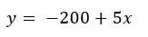

= 회귀 분석

어느 학생의 키 _x_ 를 보고 몸무게 _y_ 를 예측한다고 생각해봅시다.

아래와 같이 학생의 몸무게와 키 데이터가 있습니다. 

[source, python]
----
weight = [60,62,64,66,68,70,72,74,76]
height = [84,95,140,155,119,175,145,197,150]
----

**회귀 분석**은 어수선한 산점도에 맞는 직선을 찾는 것입니다. _x_ 는 독립변수 또는 예측변수라고 하고, _y_ 는 종속변수 또는 반응변수라고 합니다. 

위 데이터는 아래와 같은 산점도로 표시될 수 있습니다.

image:../images/image01.png[width=600]

산점도에 적합한 직선을 찾는 방법 중의 한 가지는, 직선으로부터 y 값의 전체 편차를 최소화하는 것입니다. 분산을 정의할때와 똑같이 y가 직선에서 떨어진 거리를 제곱해서 모두 더하면 오차 제곱합(SSE) - 또는 잔차제곱합(RSS) - 이 됩니다.

image:../images/image02.png[width=200]

회귀 직선(또는 최소제곱직선)은 SSE가 최소가 되는 직선을 말합니다.

회귀 직선의 식은 아래와 같습니다.

여기서,

image:../images/image05.png[width=220]

image:../images/image06.png[width=150]

평균을 중심으로 한 거리의 제곱의 합, _x~i~_ 와 _y~i~_ 의 합을 구하는 공식은 아래와 같습니다.

image:../images/image07.png[]

image:../images/image08.png[]

외적(교차곱)은 _SS~xx~_ 와 함께 계수 _b_ 를 결정합니다.

학생의 몸무게와 키 데이터를 계산하면 아래와 같습니다.

a, b의 값은 아래와 같습니다.

image:../images/image11.png[]

따라서, 회귀직선을 구하는 식은 아래와 같습니다.

회귀 직선은 아래와 같이 구할 수 있습니다.

image:../images/image03.png[width=600]

회귀 직선은 항상 x 평균과 y 평균값을 지납니다.

