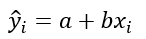
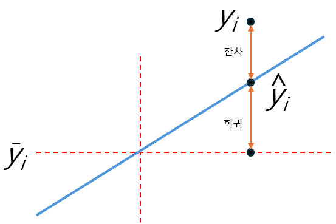

= 분산 분석(ANOVA)

* 종속변수의 분산(variance)을 설명하는 방법중 하나
* 명목 척도로 측정된 독립변수와 등간척도 또는 비율척도로 측정된 종속변수 사이의 관계를 연구하는 통계기법
* 두 개 이상 다수의 집단을 서로 비교하고자 할 때 사용
** 집단 내의 분산, 총 평균 및 각 집단의 평균의 차이에 의해 생긴 집단간 분산 비교
** F 분포를 이용하어 가설 검증
* **AN**alysis **O**f **VA**riance, 아노바(ANOVA)라고 부름

---

ANOVA는 1918년 로널드 피셔에 의해 개발된 통계학적 테스트이며, 두 개 이상 다수의 집단을 서로 비교하고자 할 때 집단 내의 분산, 총평균 그리고 각 집단의 평균의 차이에 의해 생긴 집단 간 분산의 비교를 통해 만들어진 F분포를 이용하여 가설검정을 하는 방법입니다.

회귀 직선이 최상의 적합한 직선이라면, 어느 정도 정확한가에 대한 궁금증이 생깁니다.

그 답은 데이터의 점들이 어느 정도 흩어져 있는지, 즉 데이터의 전체 편차보다 SSE가 어느정도 큰지에 달려있습니다. 예를 들면 다음과 같습니다.

image:../images/image13.png[]

이것을 계량화 해 보며면, 그래프의 식은

와 같이 됩니다. _Y~i~_ 는 회귀 직선으로 결정되는 몸무게 예측치가 됩니다.

