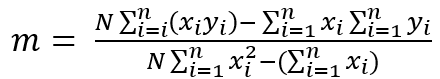
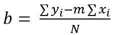
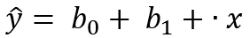
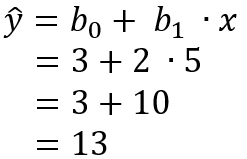
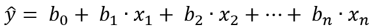
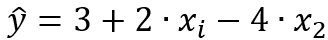
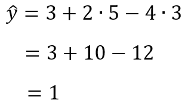

= 회귀 분석

머신 러닝의 목적은 데이터의 알려진 속성들을 학습하여 예측 모델을 만드는데 있습니다. 이때 찾아낼 수 있는 가장 직관적이고 간단한 모델은 선(Line)입니다. 

어느 학생의 키 _x_ 를 보고 몸무게 _y_ 를 예측한다고 생각해봅시다.

아래와 같이 학생의 몸무게와 키 데이터가 있습니다. 

[source, python]
----
weight = [60,62,64,66,68,70,72,74,76]
height = [84,95,140,155,119,175,145,197,150]
----

**회귀 분석(Regression Analysis)**은 어수선한 산점도에 맞는 직선을 찾는 것입니다. _x_ 는 독립변수 또는 예측변수라고 하고, _y_ 는 종속변수 또는 반응변수라고 합니다. 

* 독립 변수는 예측(Predictor)변수, 설명(Explanatory), 특성(Feature) 등으로 불립니다.
* 종속 변수는 반응(Response)변수, 레이블(Label), 타겟(Target) 등으로 불립니다.

이때, 독립 변수 X가 하나라면 단순선형 회귀(Simple Linear Regression), 2개 이상이면 다중 선형 회귀(Multiple Linear Regression)라고 합니다.

* 단순 선형 회귀 분석 : y = β~1~x + β~0~
* 다중 선형 회귀 분석 : y = β~0~ + β~1~x~1~ + β~2~x~2~ +...w~n~x~n~

위 데이터는 아래와 같은 산점도로 표시될 수 있습니다. 학생의 키는 독립 변수가 되고, 몸무게는 키에 따라 변화하는 종속 변수가 됩니다.

image:../images/image01.png[width=600]

산점도에 적합한 직선을 찾는 방법 중의 한 가지는, 직선으로부터 y 값의 전체 편차를 최소화하는 것입니다. 분산을 정의할때와 똑같이 y가 직선에서 떨어진 거리를 제곱해서 모두 더하면 오차 제곱합(SSE - Sum of Squares of Error) 이 됩니다.

오차 제곱합의 계산 방법은 아래와 같습니다. 

1. 각 데이터 포인트에 대해 실제 값과 모델의 예측 값 간의 차이를 계산합니다.
2. 이 차이를 제곱합니다.
3. 모든 차이의 제곱을 합산합니다.

이를 수식으로 나타내면 다음과 같습니다:

image:../images/image02.png[width=200]

회귀 직선(또는 최소제곱직선)은 SSE가 최소가 되는 직선을 말합니다.

회귀 직선의 식은 아래와 같습니다.

image:../images/image04.png[width=150]

여기서,

image:../images/image05.png[width=220]

image:../images/image06.png[width=150]

평균을 중심으로 한 거리의 제곱의 합, _x~i~_ 와 _y~i~_ 의 합을 구하는 공식은 아래와 같습니다.

image:../images/image07.png[]

image:../images/image08.png[]

외적(교차곱)은 _SS~xx~_ 와 함께 계수 _b_ 를 결정합니다.

image:../images/image09.png[]

학생의 몸무게와 키 데이터를 계산하면 아래와 같습니다.

image:../images/image10.png[]

a, b의 값은 아래와 같습니다.

image:../images/image11.png[]

따라서, 회귀직선을 구하는 식은 아래와 같습니다.

image:../images/image12.png[]

회귀 직선은 아래와 같이 구할 수 있습니다.

image:../images/image03.png[width=600] 

회귀 직선은 항상 x 평균과 y 평균값을 지납니다.

== 회귀 직선을 구하는 다른 방법

회귀 직선은 아래 공식으로도 구할 수 있습니다.

𝑦 = 𝑚𝑥 + 𝑏

𝑦: 종속 변수 (예측하려는 값) +
𝑥: 독립 변수 (입력 값) +
𝑚: 기울기 (slope) +
𝑏: 절편 (intercept)

=== 기울기(slope, 𝑚)

기울기 𝑚은 직선의 기울기 또는 기울어짐을 나타냅니다. 즉, 𝑥 값이 1만큼 증가할 때, 𝑦 값이 얼마나 변하는지를 설명합니다.

* 기울기는 두 변수 간의 관계를 나타냅니다. 예를 들어, 𝑚이 양수라면 𝑥가 증가함에 따라 𝑦도 증가하는 양의 관계가 있음을 의미합니다. 반대로, 𝑚이 음수라면 𝑥가 증가함에 따라 𝑦는 감소하는 음의 관계를 의미합니다.
* 기울기의 크기 ∣𝑚∣가 클수록, 즉 기울기가 급격할수록, 𝑥 값의 변화에 대해 𝑦 값이 더 크게 변합니다.

기울기를 구하는 공식은 아래와 같습니다.

N: 데이터 포인트의 개수 +
𝑥~𝑖~, 𝑦~𝑖~ : 각 데이터 포인트의 𝑥와 𝑦 값

=== 절편(Intercept, 𝑏)

절편 𝑏는 직선이 y축과 만나는 y 값을 나타냅니다. 즉, 𝑥 = 0일 때의 𝑦 값을 말합니다.

* 절편은 𝑥=0일 때의 출발점으로, 직선이 y축을 어디서 통과하는지를 나타냅니다.
* 절편은 직선의 위치를 조정하는 역할을 하며, 기울기가 같더라도 절편이 다르면 직선은 서로 다른 위치에서 y축을 교차합니다.

절편을 구하는 공식은 아래와 같습니다.

== 예측값을 구하는 방법

=== 단순 선형 회귀에서 예측값을 구하는 방법

단순 선형 회귀에서 예측값을 구하는 공식은 아래와 같습니다.

hat y : 예측값 (종속변수 𝑦의 예측값) +
𝑥: 독립변수 (입력값) +
𝑏~0~ : 절편 (intercept) +
𝑏~1~ : 기울기 (slope)

단순 선형 회귀는 독립변수 𝑥와 종속변수 𝑦 간의 관계를 선형(직선)으로 모델링하는 방법입니다. 여기서, 𝑏~0~는 직선의 y절편을 나타내고, 𝑏~1~은 기울기를 나타냅니다. 기울기 𝑏~1~은 독립변수 𝑥가 1단위 증가할 때 종속변수 𝑦가 얼마나 변하는지를 설명합니다.

단순 선형 회귀의 예측값을 구하는 과정은 다음과 같습니다.

주어진 값이 아래와 같을 때,

* 𝑏~0~ = 3 (절편)
* 𝑏~1~ = 2 (기울기)
* 𝑥 = 5 (독립변수)

예측값 계산은 아래와 같이 됩니다:

단순 선형 회귀의 예측값을 구하려면 회귀 모델의 절편 𝑏~0~와 기울기 𝑏~1~를 알고 있으면 됩니다. 이 값들을 독립 변수 𝑥애ㅔ 곱하고 더함으로서 종속 변수의 예측값을 구할 수 있습니다.

[source, python]
----
# 회귀 모델의 절편 (b0)과 기울기 (b1)
b0 = 3  # 절편
b1 = 2  # 기울기

# 예측할 독립변수 x
x = 5  # 독립변수 값

# 예측값 계산
y_pred = b0 + b1 * x

# 결과 출력
print("예측값(ŷ) =", y_pred)
----

== 다중 선형 회귀에서 예측값을 구하는 방법

다중 선형 회귀에서 예측값을 구하는 공식은 아래와 같습니다.

hat y:  예측값 (종속변수 𝑦의 예측값) +
𝑏~0~: 절편 (intercept) — 회귀 직선이 y축과 만나는 값 +
𝑏~1~,𝑏~2~,…,b~n~: 회귀 계수 (slope coefficients) — 각 독립변수 𝑥~1~,𝑥~2~,…,x~n~ 에 대한 기울기 +
𝑥~1~,𝑥~2~,…,𝑥~𝑛~: 독립변수들 (입력값들)

다중 선형 회귀의 값을 구하는 과정은 다음과 같습니다.

다중 선형 회귀 모델이 아래와 같고,

* b~0~ =3 (절편)
* 𝑏~1~ = 2 (독립변수 𝑥~1~에 대한 기울기)
* 𝑏~2~ = -44 (독립변수 𝑥~2~에 대한 기울기)

주어진 독립 변수의 값이 아래와 같다면,

* 𝑥~1~ = 5
* 𝑥~2~ = 3

예측값 hat y를 계산하는 방법은 아래와 같습니다:

다중 선형 회귀에서는 여러 독립변수 𝑥~1~,𝑥~2~,…,𝑥~𝑛~에 대한 기울기 𝑏~1~,𝑏~2~,…,𝑏~𝑛~ 와 절편 𝑏~0~을 사용하여 예측값을 계산합니다. 예측값 공식은 각 독립변수 값에 대해 그들의 회귀 계수를 곱한 후 더한 값에 절편을 더하는 방식으로 계산됩니다.

[source, python]
----
# 절편(b0)과 기울기(b1, b2) 설정
b0 = 3  # 절편
b1 = 2  # x1에 대한 기울기
b2 = -4 # x2에 대한 기울기

# 독립변수 값 설정
x1 = 5  # x1
x2 = 3  # x2

# 예측값 계산
y_pred = b0 + b1 * x1 + b2 * x2

# 예측값 출력
print("예측값(ŷ) =", y_pred)
----