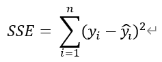
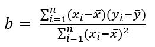
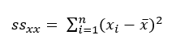
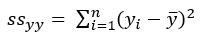
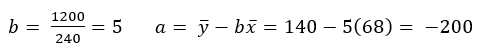

= 회귀 분석

어느 학생의 키 _x_ 를 보고 몸무게 _y_ 를 예측한다고 생각해봅시다.

아래와 같이 학생의 몸무게와 키 데이터가 있습니다. 

[source, python]
----
weight = [60,62,64,66,68,70,72,74,76]
height = [84,95,140,155,119,175,145,197,150]
----

**회귀 분석**은 어수선한 산점도에 맞는 직선을 찾는 것입니다. _x_ 는 독립변수 또는 예측변수라고 하고, _y_ 는 종속변수 또는 반응변수라고 합니다. 

위 데이터는 아래와 같은 산점도로 표시될 수 있습니다.

image:../images/image01.png[width=600]

산점도에 적합한 직선을 찾는 방법 중의 한 가지는, 직선으로부터 y 값의 전체 편차를 최소화하는 것입니다. 분산을 정의할때와 똑같이 y가 직선에서 떨어진 거리를 제곱해서 모두 더하면 오차 제곱합(SSE - Sum of Squares of Error) 이 됩니다.

오차 제곱합의 계산 방법은 아래와 같습니다. 

1. 각 데이터 포인트에 대해 실제 값과 모델의 예측 값 간의 차이를 계산합니다.
2. 이 차이를 제곱합니다.
3. 모든 차이의 제곱을 합산합니다.

이를 수식으로 나타내면 다음과 같습니다:

회귀 직선(또는 최소제곱직선)은 SSE가 최소가 되는 직선을 말합니다.

회귀 직선의 식은 아래와 같습니다.

image:../images/image04.png[width=150]

여기서,

image:../images/image06.png[width=150]

평균을 중심으로 한 거리의 제곱의 합, _x~i~_ 와 _y~i~_ 의 합을 구하는 공식은 아래와 같습니다.

외적(교차곱)은 _SS~xx~_ 와 함께 계수 _b_ 를 결정합니다.

image:../images/image09.png[]

학생의 몸무게와 키 데이터를 계산하면 아래와 같습니다.

image:../images/image10.png[]

a, b의 값은 아래와 같습니다.

따라서, 회귀직선을 구하는 식은 아래와 같습니다.

image:../images/image12.png[]

회귀 직선은 아래와 같이 구할 수 있습니다.

image:../images/image03.png[width=600]

회귀 직선은 항상 x 평균과 y 평균값을 지납니다.

////
https://www.youtube.com/watch?v=aq8VU5KLmkY
////

== 참고

회귀 직선은 아래 공식으로도도 구할 수 있습니다.

𝑦 = 𝑚𝑥 + 𝑏

𝑦: 종속 변수 (예측하려는 값) +
𝑥: 독립 변수 (입력 값) +
𝑚: 기울기 (slope) +
𝑏: 절편 (intercept)

=== 기울기(slope, 𝑚)

기울기 𝑚은 직선의 기울기 또는 기울어짐을 나타냅니다. 즉, 𝑥 값이 1만큼 증가할 때, 𝑦 값이 얼마나 변하는지를 설명합니다.

* 기울기는 두 변수 간의 관계를 나타냅니다. 예를 들어, 𝑚이 양수라면 𝑥가 증가함에 따라 𝑦도 증가하는 양의 관계가 있음을 의미합니다. 반대로, 𝑚이 음수라면 𝑥가 증가함에 따라 𝑦는 감소하는 음의 관계를 의미합니다.
* 기울기의 크기 ∣𝑚∣가 클수록, 즉 기울기가 급격할수록, 𝑥 값의 변화에 대해 𝑦 값이 더 크게 변합니다.

기울기를 구하는 공식은 아래와 같습니다.

image:../images/image36.png[]

N: 데이터 포인트의 개수 +
𝑥~𝑖~, 𝑦~𝑖~ : 각 데이터 포인트의 𝑥와 𝑦 값

=== 절편(Intercept, b)

절편 𝑏는 직선이 y축과 만나는 y 값을 나타냅니다. 즉, 𝑥 = 0일 때의 𝑦 값을 말합니다.

* 절편은 𝑥=0일 때의 출발점으로, 직선이 y축을 어디서 통과하는지를 나타냅니다.
* 절편은 직선의 위치를 조정하는 역할을 하며, 기울기가 같더라도 절편이 다르면 직선은 서로 다른 위치에서 y축을 교차합니다.

절편을 구하는 공식은 아래와 같습니다.

image:../images/image37.png[]