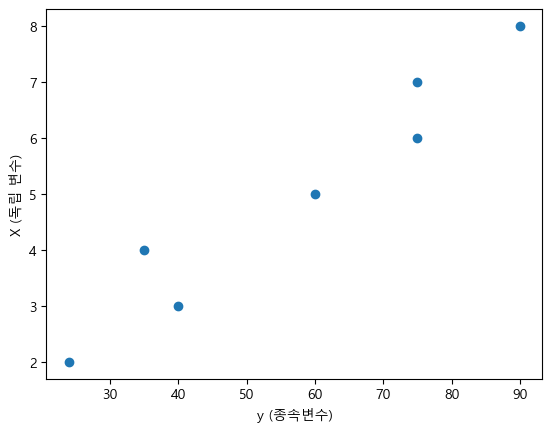
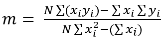
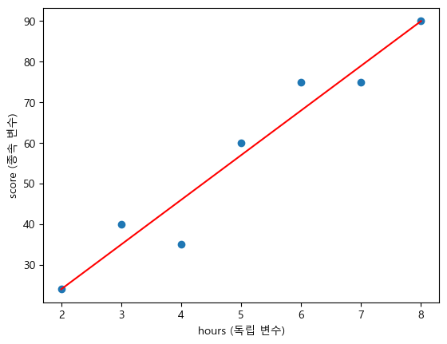

= Lab 4-2 회귀 직선 구하기

이 연습에서는 주어진 데이터를 사용하여 회귀 직선을 구합니다. 절차에 따릅니다.

== 실습 환경 준비

여기에서는 Visual Studio Code의 Jupyter Notebook을 사용하여 연습을 수행합니다. 이 연습의 수행 환경은 Lab 1-1에서와 같습니다.

1. Visual Studio Code를 실행합니다.
2. 파일 메뉴에서 폴더 열기 를 클릭합니다.
3. 연습을 수행할 폴더를 선택하고 확인 버튼을 클릭합니다.
4. Visual Studio Code의 Explorer 에서 New Button을 클릭하여 새 파일을 만들고, 이름을 lab4-2.ipynb로 지정합니다.
5. 오른쪽 위의 Select Kernel 을 클릭하고 Anaconda Python 환경을 선택합니다.
6. + Code 버튼을 클릭하여 노트북을 시작합니다.

== 라이브러리 import

이 연습에서는 Numpy, Matplotlib.pyplot 라이브러리를 사용합니다. 아래 절ㅊ파에 따라 필요한 라이브러리를 import 합니다.

1. 생성한 Code 노트에 아래 코드를 입력합니다.
+
[source, python]
----
import numpy as np
import matplotlib.pyplot as plt
----
+
2. Shift + Enter 를 클릭하여 작성한 코드를 실행합니다.

== 데이터 준비

이 연습에서는 공부 시간에 따른 시험 점수에 대한 관계를 요약하는 선형 회귀 직선을 구합니다. 아래 절차에 따라 공부 시간과 시험 점수 데이터를 준비합니다.

1. 아래 코드를 복사하여 Jupyter Notebook으로 붙여 넣고 실행합니다.
+
[source, python]
----
hours = [2,3,4,5,6,7,8]
score = [24,40,35,60,75,75,90]
----
+
2. 공부 시간에 따라 변화하는 시험 점수를 예측한다고 가정할 때, 공부 시간(hours)는 독립 변수, 시험 점수(score)는 종속 변수가 됩니다. 아래 코드를 실행하여 두 list를 numpy 배열로 변환합니다.

== 데이터 시각화

준비한 데이터의 산포도 그래프로 데이터를 확인합니다. 아래 절차에 따릅니다.

1. Code 노트에, 아래 코드를 입력하고 실행합니다.
+
[source, python]
----
plt.scatter(x=y, y=X)
plt.xlabel('y (종속변수)')
plt.ylabel('X (독립 변수)')
plt.show()
----
+

== 기울기와 절편 계산

선형 회귀 직선을 구하는 공식은 독립 변수에 따란 종속 변수의 값을 구하는 방법과 동일합니다. 공식은 아래와 같습니다.

𝑦 = 𝑚𝑥 + 𝑏

𝑦: 종속 변수 (예측하려는 값) +
𝑥: 독립 변수 (입력 값) +
𝑚: 기울기 (slope) +
𝑏: 절편 (intercept)

위 공식에 따라 선형 회귀 직선을 구하기 위해서는 기울기와 절편을 먼저 구해야 합니다. 

기울기를 구하는 공식은 아래와 같습니다.

절편을 구하는 공식은 아래와 같습니다.

image:../images/image37.png[]

[cols="1a"]
|===
|**참고** numpy의 sum 함수는 파라미터로 주어진 식의 sigma를 구합니다. 1,2,3,4,5 값을 가지는 배열이 있을 때, 배열의 모든 원소의 합(sigma)을 구하는 코드는 아래와 같이 작성할 수 있습니다.
[source, python]
----
values = [1,2,3,4,5]

result = 0
for i in values:
    result += i
----

numpy의 sum 함수를 사용하면 파라미터로 주어진 배열 원소의 합을 구합니다.

[source, python]
----
values = [1,2,3,4,5]

result = np.sum(values)
----

모든 원소에 특정한 식을 적용하여 계산된 원소의 합(sigma)를 구하고자 할 경우, 아래와 같은 코드를 작성할 수 있습니다.

[source, python]
----
values = [1,2,3,4,5]

result = 0
num = 2
for i in values:
    result += i + num
----

numpy의 sum 함수의 파라미터에 식을 입력하여, sigma를 구할 수 있습니다.

[source, python]
----
values = np.array([1,2,3,4,5])

num = 2
result = np.sum(values + 2)
----
|===

아래 절차에 따라 기울기를 구합니다.

=== 기울기 계산

1. Code 노트에, 아래 코드를 순서대로 작성합니다.
2. 아래 코드로 독립 변수의 개수(_N_)을 구합니다.
+
[source, python]
----
N = len(X)
----
+
3. 아래 코드로 공식의 분자를 구합니다.
+
[source, python]
----
numerator = N * np.sum(X * y) - np.sum(X) * np.sum(y)
----
+
4. 아래 코드로 분모의 값을 구합니다.
+
[source, python]
----
denominator = N * np.sum(X**2) - (np.sum(X))**2
----
+
5. 분자(nominator)를 분모(denominator)로 나누어 기울기를 구합니다.
+
[source, python]
----
m = numerator / denominator
----
+
6. 완성된 코드는 아래와 같을 것입니다.
+
[source, python]
----
N = len(X)
    
numerator = N * np.sum(X * y) - np.sum(X) * np.sum(y)
denominator = N * np.sum(X**2) - (np.sum(X))**2
    
m = numerator / denominator
----
+
7. Shift + Enter 키를 눌러 코드를 실행합니다.

=== 절편 계산

1. Code 노트에 아래 코드를 순서대로 작성합니다.
2. 아래 코드로 독립 변수의 개수(_N_)을 구합니다.
+
[source, python]
----
N = len(X)
----
+
3. 아래 코드로 절편을 구합니다.
+
[source, python]
----
b = (np.sum(y) - m * np.sum(X)) / N
----
+
4. 완성된 코드는 아래와 같을 것입니다.
+
[source, python]
----
N = len(X)
b = (np.sum(y) - m * np.sum(X)) / N
----
+
5. 완성된 코드는 아래와 같을 것입니다.

== 독립 변수에 따른 종속 변수의 값 계산

1. 아래 코드를 실행하여 각 독립 변수에 따른 종속 변수의 값을 구합니다.
+
[source, python]
----
y_pred = m * X + b
----
+
2. 아래 코드를 실행하여 계산된 종속 변수를 확인합니다.
+
[source, python]
----
print(y_pred)
----
+
----
[24. 35. 46. 57. 68. 79. 90.]
----

== 회귀 곡선

여기에서는 구한 각 독립 변수에 따른 종속 변수를 사용하여 회귀 곡선을 그립니다. 아래 절차에 따릅니다.

1. 아래 코드를 실행하여 각 독립 변수에 따른 종속 변수의 값을 구합니다.
+
[source, python]
----
plt.scatter(X, y)
plt.plot(X, y_pred, color='red',)
plt.xlabel('hours (독립 변수)')
plt.ylabel('score (종속 변수)')
plt.show()
----
+
2. 회귀 곡선을 확인합니다.
+

== 예측

여기서는 작성한 회귀 모델을 사용하여 10시간을 공부했을 때 예상되는 점수를 예측합니다. 단순 선형 회귀에서 예측값은 아래와 같이 구할 수 있습니다.

image:../images/image41.png[width=210]

* hat y : 예측값 (종속변수 𝑦의 예측값) +
* 𝑥: 독립변수 (입력값) +
* 𝑏~0~ : 절편 (intercept) +
* 𝑏~1~ : 기울기 (slope)

아래 절차에 따릅니다.

1. 아래 코드를 입력하고 실행합니다.
+
[source, python]
----
new_hour = 10
y_pred = b + m * new_hour
----
+
2. 결과를 출력합니다.
+
----
print(y_pred)
----