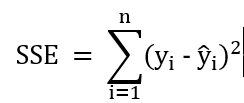
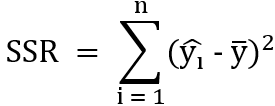
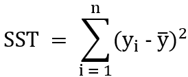
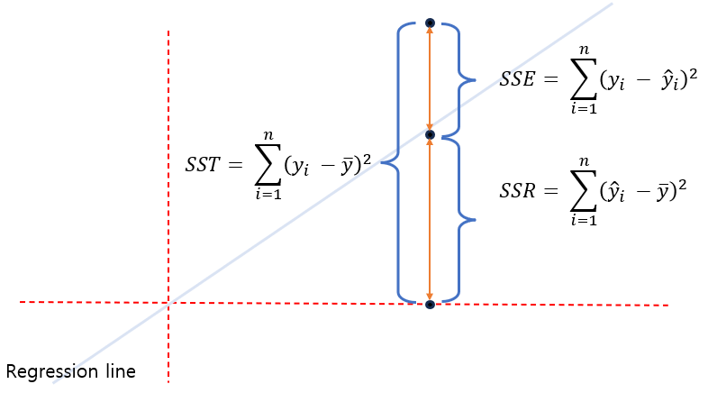

= 분산 계산

SSE, SSR, SST
SSE, SSR, 그리고 SST는 회귀 분석에서 중요한 통계적 지표로 사용됩니다. 이 세 가지는 모델의 적합성을 평가하고 데이터의 변동성을 이해하는 데 도움을 줍니다.

* SSE (Sum of Squared Errors) +
회귀 모델의 잔차(실제 값과 예측 값의 차이)의 제곱합을 나타냅니다. 이 값이 작을수록 모델이 데이터에 더 잘 맞는다는 것을 의미합니다.
+

+
𝑦~𝑖~ 는 실제 값, hat 𝑦~𝑖~ 는 예측 값, 𝑛은 데이터 포인트의 수입니다.

* SSR (Sum of Squared Regression) +
SSR은 회귀 모델이 설명하는 데이터 변동량을 나타냅니다. 이는 예측 값과 평균 값 간의 차이의 제곱합입니다. SSR이 크면 모델이 데이터 변동을 잘 설명하고 있다는 것을 의미합니다
+

+
hat 𝑦~𝑖~는 예측 값, bar 𝑦는 실제 값의 평균입니다.
+
* SST (Total Sum of Squares) +
SST는 총변동량으로, 실제 값과 평균 값 간의 차이의 제곱합입니다. SST는 데이터를 완전히 설명하지 않은 상태에서의 총 변동량을 나타냅니다.
+

+
𝑦~𝑖~는 실제 값, bar 𝑦는 실제 값의 평균입니다.

* 관계
SST는 SSE와 SSR의 합으로 표현할 수 있습니다: 

**SST = SSE + SSR**

즉, 총변동량(SST)은 회귀 모델이 설명하는 변동량(SSR)과 모델이 설명하지 못한 잔차 변동량(SSE)으로 구성됩니다. 이 관계는 회귀 모델의 효율성을 평가하는 데 중요한 지표가 됩니다.

