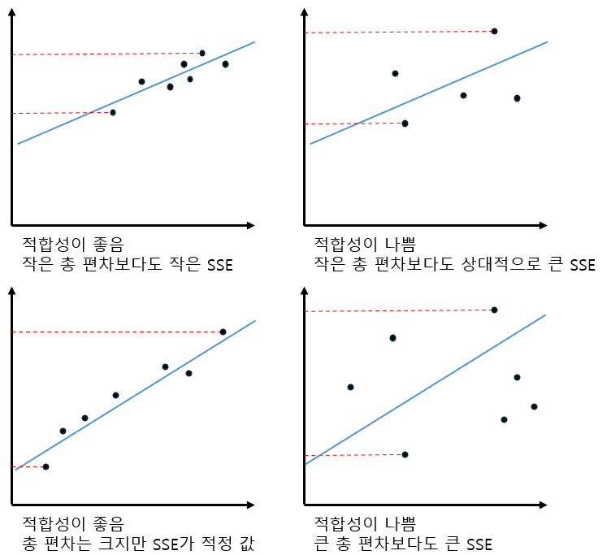
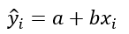
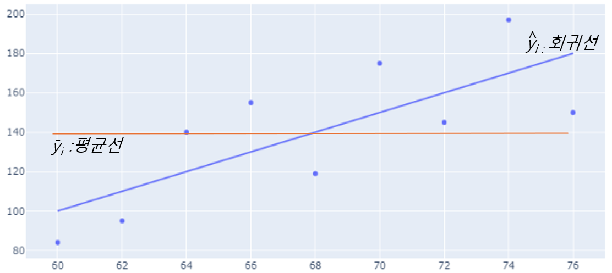
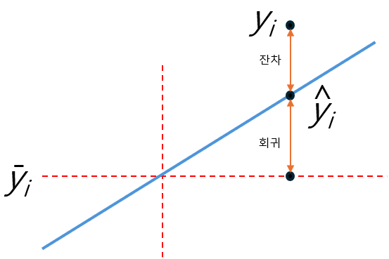

= 분산 분석(ANOVA)

* 종속변수의 분산(variance)을 설명하는 방법중 하나
* 명목 척도로 측정된 독립변수와 등간척도 또는 비율척도로 측정된 종속변수 사이의 관계를 연구하는 통계기법
* 두 개 이상 다수의 집단을 서로 비교하고자 할 때 사용
** 집단 내의 분산, 총 평균 및 각 집단의 평균의 차이에 의해 생긴 집단간 분산 비교
** F 분포를 이용하어 가설 검증
* **AN**alysis **O**f **VA**riance, 아노바(ANOVA)라고 부름

---

ANOVA는 1918년 로널드 피셔에 의해 개발된 통계학적 테스트이며, 두 개 이상 다수의 집단을 서로 비교하고자 할 때 집단 내의 분산, 총평균 그리고 각 집단의 평균의 차이에 의해 생긴 집단 간 분산의 비교를 통해 만들어진 F분포를 이용하여 가설검정을 하는 방법입니다.

회귀 직선이 최상의 적합한 직선이라면, 어느 정도 정확한가에 대한 궁금증이 생깁니다.

그 답은 데이터의 점들이 어느 정도 흩어져 있는지, 즉 데이터의 전체 편차보다 SSE가 어느정도 큰지에 달려있습니다. 예를 들면 다음과 같습니다.

이것을 계량화 해 보면, 그래프의 식은

와 같이 됩니다. hat _Y~i~_ 는 회귀 직선으로 결정되는 몸무게 예측치가 됩니다.

== 오차(Error)

오차는 모집단(분석에 사용되는 모든 데이터의 전체 집합)의 회귀식과 관측치(개별 값)의 차이를 의미합니다.

위 그림에서 파란색 실선은 회귀식을 의미하고, 파란색 점은 관측치(개별 값)을 의미하며, 오차는 회귀선과 관측치의 차이를 의미합니다.

여기서 표준 오차(Standard Error)의 개념이 나옵니다.

각 표본의 평균이 전체의 평균과 얼마나 차이가 있는지 알려주는 지표로서 표본 평균과 모 평균(모집단 전체의 평균)의 차이를 의미합니다. 실제 모집단과 각 표본 평균이 얼마만큼의 편차를 가지고 있는지 알려주기에 평균의 정확도를 추정할 때 사용하며, 표준 오차가 적을 수록 표본의 대표성이 높다고 판단하게 됩니다. 일반적으로 표본 추출은 1회 실시하지만, 이론적으로 계산 할 수는 있습니다.

회귀 분석에서, 오차에는 아래와 같은 종류의 것들이 있습니다.

* 잔차(residuals) +
개별 데이터 포인트의 실제 값과 예측 값의 차이로, 각 데이터 포인트마다 계산되며 모델이 얼마나 데이터를 잘 적합시키는지 보여줍니다.
* 평균 제곱 오차(MSE, Mean Square Error) +
모든 잔차를 곱한 후 평균을 구한 값입니다. 제곱을 수행함으로 오차가 양수로 변환되며, 이는 큰 오차를 더 크게 반영하는 특징이 있습니다.
* 평균 절대 오차(MAE, Mean Absolute Error) +
모든 잔차의 절대값을 평균한 값입니다. 이는 각 오차의 절대값으로 고려하여 오차의 크기를 평가합니다.
* 결정 계수(Coefficient if Determination, _R^2^_) +
모델이 데이터의 변동성을 얼마나 설명하는지를 나타내는 지표이며, 0과 1사이의 값을 가집니다. 1에 가까울 수록 모델이 데이터를 잘 설명한다는 의미입니다.

