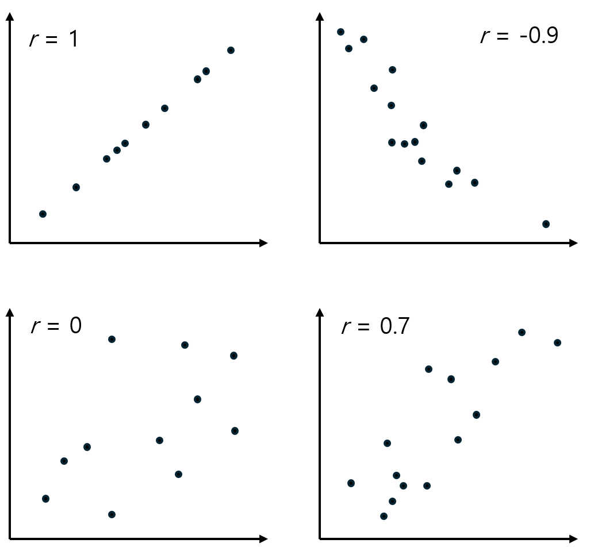

= 상관 계수(Correlation Coefficient)

상관 계수는 두 변수 간의 관계의 강도와 방향을 나타내는 통계적 지표입니다. 상관 계수는 -1에서 1사이의 값을 가지며, 두 변수 간의 선형 관계를 측정합니다.

상관 계수(_r_)는 회귀선의 정확도를 측정하고, x가 증가할 때 y가 증가하는지 감소하는지를 말해줍니다.

* 값의 범위는 아래와 같이 표현됩니다.
** 1: 완벽한 양의 상관관계 (두 변수가 동일한 방향으로 이동).
** -1: 완벽한 음의 상관관계 (두 변수가 반대 방향으로 이동).
** 0: 상관관계가 없음 (두 변수 간에 직선적 관계가 없음).

* 양의 상관관계
** 상관계수가 0보다 큰 경우, 두 변수가 함께 증가하거나 함께 감소하는 경향을 보입니다. 예를 들어, 공부 시간과 시험 점수는 양의 상관관계를 가질 수 있습니다.

* 음의 상관관계
** 상관계수가 0보다 작은 경우, 한 변수가 증가할 때 다른 변수가 감소하는 경향을 보입니다. 예를 들어, 스트레스 수준과 수면 시간은 음의 상관관계를 가질 수 있습니다.

