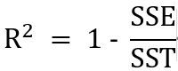
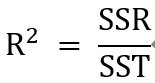

= 결정 계수(Coeffficient of determination - R²)

결정 계수(R²)는 회귀 분석에서 모델의 설명력을 나타내는 지표로, 종속 변수의 변동성 중에서 독립 변수로 설명할 수 있는 비율을 의미합니다. 결정계수는 0에서 1 사이의 값을 가지며, 값이 클수록 모델이 데이터를 잘 설명한다는 것을 나타냅니다.

== 결정 계수 계산

결정 계수는 다음과 같이 계산됩니다:

또한, 결정계수는 다음과 같은 관계로도 표현할 수 있습니다:

== 결정 계수 해석

* R² = 0: 독립 변수가 종속 변수의 변동성을 전혀 설명하지 못합니다.
* R² = 1: 독립 변수가 종속 변수의 변동성을 완벽하게 설명합니다.
* 0 < R² < 1: 모델이 종속 변수의 변동성을 어느 정도 설명합니다. 값이 클수록 설명력이 높습니다.

만약 R² 값이 0.8이라면, 이는 독립 변수가 종속 변수의 변동성의 80%를 설명한다는 의미입니다. 나머지 20%는 모델이 설명하지 못하는 변동성으로 남아 있습니다.

결정계수는 회귀 모델의 성능을 평가하는 중요한 지표 중 하나이며, 모델의 예측력을 판단하는 데 큰 도움이 됩니다