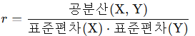
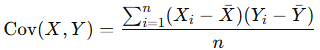
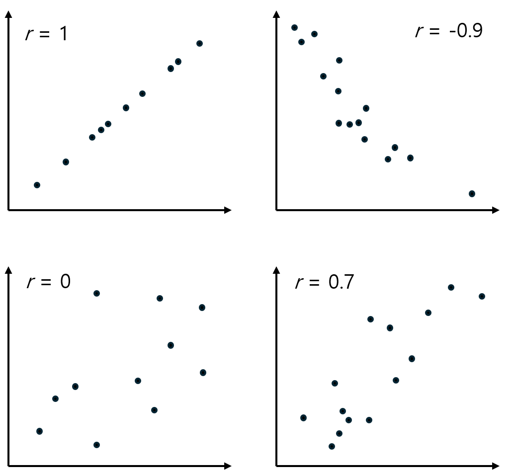

= 상관 계수(Correlation Coefficient)

상관 계수는 두 변수 간의 관계의 강도와 방향을 나타내는 통계적 지표입니다. 상관 계수는 -1에서 1사이의 값을 가지며, 두 변수 간의 선형 관계를 측정합니다.

상관 계수(_r_)는 회귀선의 정확도를 측정하고, x가 증가할 때 y가 증가하는지 감소하는지를 말해줍니다.

== 정의

상관계수는 피어슨 상관계수(Pearson correlation coefficient)가 가장 일반적으로 사용되며, 다음과 같이 계산됩니다

* 공분산 +
(Cov(𝑋,𝑌)): 두 변수의 값이 함께 변하는 정도를 나타냅니다.
+

+ 
* 표준편차 (𝜎) +
각 변수 값의 변동성을 나타냄.

== 범위

−1 ≤ 𝑟 ≤ 1

* 𝑟 > 0 : 양의 상관관계 (한 변수가 증가하면 다른 변수도 증가) +
예: 키가 클수록 체중이 증가하는 경향.
* 𝑟 < 0 : 음의 상관관계 (한 변수가 증가하면 다른 변수는 감소) +
예: 온도가 낮아질수록 난방비가 증가.
* 𝑟 = 0: 상관관계 없음 (두 변수 간에 선형적 관계가 없음).

* 양의 상관관계
** 상관계수가 0보다 큰 경우, 두 변수가 함께 증가하거나 함께 감소하는 경향을 보입니다. 예를 들어, 공부 시간과 시험 점수는 양의 상관관계를 가질 수 있습니다.

* 음의 상관관계
** 상관계수가 0보다 작은 경우, 한 변수가 증가할 때 다른 변수가 감소하는 경향을 보입니다. 예를 들어, 스트레스 수준과 수면 시간은 음의 상관관계를 가질 수 있습니다.

== 결정 계수와 상관 계수의 차이

[%header, cols="1,3,3"]
|===
|특징|결정계수 (𝑅^2^)|상관계수 (𝑟)
|목적|설명력 (변동성 설명)|관계 강도와 방향
|범위|0 ≤ 𝑅^2^ ≤ 1|−1 ≤ 𝑟 ≤ 1
|사용 대상|회귀모형|두 변수 간 선형 관계
|관계|𝑅^2^ = 𝑟^2^(단순 선형회귀에서만 해당)|𝑟 = root 𝑅 (방향에 따라 ±)
|===