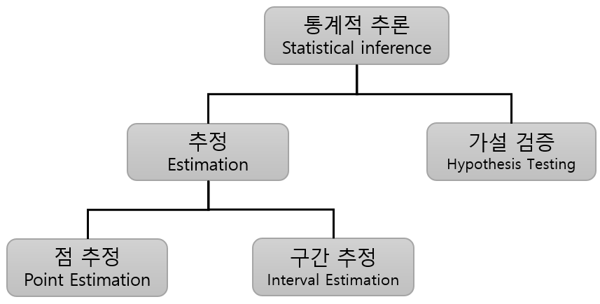

= 통계적 추론

1. 표본과 모집단
* 모집단(Population): 연구 대상이 되는 전체 집단입니다. 예를 들어, 모든 한국 성인의 키가 모집단이 될 수 있습니다.
* 표본(Sample): 모집단에서 추출한 부분 집합으로, 이를 통해 모집단의 특성을 추정합니다. 예를 들어, 1,000명의 한국 성인의 키를 측정한 데이터가 표본이 될 수 있습니다.
2. 점 추정(Point Estimation)과 구간 추정(Interval Estimation)
* 점 추정: 표본 데이터를 사용하여 모집단 모수를 하나의 값으로 추정하는 방법입니다. 예를 들어, 표본 평균을 사용하여 모집단 평균을 추정합니다.
* 구간 추정: 표본 데이터를 사용하여 모집단 모수가 특정 범위 내에 있을 확률을 제공하는 방법입니다. 예를 들어, 신뢰구간을 통해 모집단 평균이 특정 범위에 포함될 확률을 제시합니다.
3. 가설 검정(Hypothesis Testing) +
가설 검정은 표본 데이터를 사용하여 모집단에 대한 가설을 검정하는 과정입니다. 다음은 가설 검정의 주요 단계입니다:
+
* 귀무가설(Null Hypothesis, 𝐻~0~) + 
검정하고자 하는 기본 가설로, 보통 '차이가 없다'거나 '효과가 없다'는 진술입니다.
* 대립가설(Alternative Hypothesis, 𝐻~1~) +
귀무가설에 대립되는 가설로, 보통 '차이가 있다'거나 '효과가 있다'는 진술입니다.
* 유의수준(Significance Level, 𝛼) +
귀무가설을 기각할 기준이 되는 확률로, 보통 0.05(5%)를 사용합니다.
* 검정 통계량(Test Statistic) +
표본 데이터를 바탕으로 계산된 값으로, 이 값을 이용해 귀무가설을 기각할지 결정합니다.
* p값(p-value) +
검정 통계량에 대응하는 확률로, 이 값이 유의수준보다 작으면 귀무가설을 기각합니다.

4. 신뢰구간(Confidence Interval)
신뢰구간은 특정 모수가 일정 범위 내에 포함될 확률을 제공합니다. 예를 들어, 95% 신뢰구간은 모수가 해당 구간 내에 포함될 확률이 95%임을 의미합니다.

== 예시

단순한 예로, 표본 데이터를 바탕으로 평균 키를 추정하는 과정에서 점 추정을 통해 특정 값을, 구간 추정을 통해 신뢰구간을 계산하여 모집단 평균을 추정할 수 있습니다. 또한, 특정 영양제의 효과를 검정하는 경우, 가설 검정을 통해 영양제가 효과가 있는지 없는지를 판단할 수 있습니다.