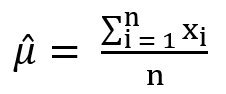
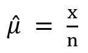
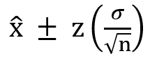

= 추정

통계에서 추정(Estimation)은 표본 데이터를 사용하여 모집단의 특성을 추정하는 과정을 말합니다. 이를 통해 모집단에 대한 유용한 정보를 얻을 수 있으며, 추정 방법은 크게 두 가지로 나뉩니다: 점 추정(Point Estimation)과 구간 추정(Interval Estimation)입니다.

== 점 추정

점 추정(Point Estimation)은 표본 데이터를 사용하여 모집단 모수(예: 평균, 비율 등)를 단일 값으로 추정하는 방법입니다. 점 추정은 특정 값을 이용해 모집단의 특성을 간단하게 나타내는 데 유용합니다.

* **단일 값** +
점 추정은 단일 값으로 모집단 모수를 추정합니다. 예를 들어, 표본 평균을 이용해 모집단 평균을 추정합니다.
* **편리성** +
계산이 간단하고 결과를 쉽게 이해할 수 있습니다.
* **기초 통계** +
점 추정은 통계적 추론과 가설 검정의 기초가 됩니다.

=== 평균 추정

모집단 평균을 추정하기 위해 표본 평균을 사용합니다.

hat 𝜇 는 모집단 평균의 점 추정값이며, _x~i~_ 는 표본의 각 데이터 값, _n_ 은 표본 크기입니다.

=== 분산 추정

모집단 분산을 추정합니다. SSE, SST등 ANOVA가 사용됩니다.

=== 비율 추정

모집단 비율을 추정하기 위해 표본 비율을 사용합니다.

=== 예제

아래 코드는 점 추정을 계산하는 간단한 예를 보여줍니다.

[source, python]
----
import numpy as np

# 예시 데이터 (표본)
data = [5, 7, 8, 4, 6, 9, 3, 7, 6, 8]

# 표본 평균 계산
sample_mean = np.mean(data)
print(f"표본 평균 (점 추정): {sample_mean}")

# 예시 비율 데이터 (0과 1로 이루어진 데이터)
data_proportion = [1, 0, 1, 1, 0, 1, 0, 1, 0, 1]

# 표본 비율 계산
sample_proportion = np.mean(data_proportion)
print(f"표본 비율 (점 추정): {sample_proportion}")
----

----
표본 평균 (점 추정): 6.3
표본 비율 (점 추정): 0.6
----

== 구간 추정

구간 추정(Interval Estimation)은 모집단의 모수가 특정 구간 내에 있을 확률을 제공하는 통계적 방법입니다. 즉, 점 추정이 단일 값을 사용하여 모수를 추정하는 반면, 구간 추정은 모수가 포함될 수 있는 범위를 제시합니다. 구간 추정은 주로 신뢰구간(Confidence Interval)을 통해 표현됩니다.

구간 추정은 아래 요소들로 이루어집니다.

* **점 추정(Point Estimate)** +
모집단 모수의 중심 추정값. 예를 들어, 표본 평균.
* **오차한계(Margin of Error)** +
점 추정값이 모집단 모수에서 벗어날 수 있는 최대 허용 오차.
* **신뢰수준(Confidence Level)** +
모수가 신뢰구간 내에 있을 확률을 나타내며, 보통 95% 또는 99%를 사용합니다. 95% 신뢰 구간은 모집단 모수가 계산된 구간 내에 95%의 확률로 포함된다고 해석됩니다.
+
예를 들어, 특정 약물의 효과를 연구하기 위해 100명의 환자를 대상으로 실험을 했다고 가정합시다. 이 표본에서 얻은 평균 효과가 5이고, 95% 신뢰구간이 [4, 6]이라면, 이는 모집단 평균 효과가 95%의 확률로 4와 6 사이에 있다는 것을 의미합니다.

=== 계산

구간 추정을 계산하는 대표적인 방법 중 하나는 표본 평균과 표준 오차를 이용하는 것입니다. 95% 신뢰구간은 다음과 같이 계산됩니다:

* bar 𝑥: 표본 평균
* 𝑧 : 신뢰수준에 대응하는 z-값 (예: 95% 신뢰수준에서는 약 1.96)
* 𝜎 : 표본 표준편차
* 𝑛 : 표본 크기

=== 예제

아래 소스코드는 95% 신뢰 구간을 계산하는 간단한 예시를 보여줍니다.

[source, python]
----
import numpy as np
import scipy.stats as stats

# 예시 데이터
data = [5, 6, 7, 5, 6, 7, 8, 9, 5, 6]

# 점 추정 (표본 평균)
sample_mean = np.mean(data)

# 표본 표준편차와 표본 크기
sample_std = np.std(data, ddof=1)
n = len(data)

# 95% 신뢰수준에 해당하는 z-값
z_value = stats.norm.ppf(0.975)

# 오차한계
margin_of_error = z_value * (sample_std / np.sqrt(n))

# 신뢰구간
confidence_interval = (sample_mean - margin_of_error, sample_mean + margin_of_error)
print(f"95% 신뢰구간: {confidence_interval}")
----

----
95% 신뢰구간: (5.563340473739742, 7.236659526260259)
----

////
https://thegap.tistory.com/169
////