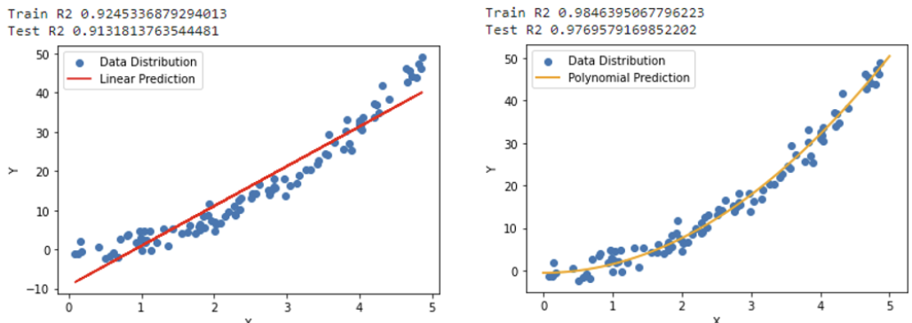

= 다항 회귀(Polynormal Regression)

다항 회귀는 선형 회귀의 확장으로, 데이터의 비선형 관계를 모델링 하기 위해 독립 변수의 다항 항(term)을 사용하는 회귀 분석 방법입니다. 이 방법을 통해 복잡한 곡선 형태의 데이터를 더 잘 설명할 수 있습니다.

== 다항 회귀의 수식

다항 회귀는 별도의 알고리즘이 존재하지 않습니다. 독립 변수를 제곱, 서로 곱한 값 등 좀 더 복잡한 값으로 만들어 선형 회귀에 넣어 학습 시키는 것을 말합니다. 한 개의 독립 변수와 종속 변수가 아래와 같은 비선형 모양을 띈다면 단순히 독립 변수를 선형 회귀에 넣어 학습 시킨 것 보다 독립 변수를 제곱해서 선형 회귀에 입력하면 모델의 성능이 향상됩니다.

기본 선형 회귀 모델의 식은 아래와 같습니다.

𝑦 = 𝛽~0~ + 𝛽~1~ 𝑥

다항 회귀는 기본 선형 회귀 식의 x에 고차항을 추가하여 확장합니다.

𝑦 = 𝛽~0~ + 𝛽~1~ 𝑥 + 𝛽~2~ 𝑥^2^+ 𝛽~3~ 𝑥^3^ + ... + 𝛽~𝑛~ 𝑥^𝑛^

다항 회귀는 비선형 데이터를 모델링 하는데는 적합하지만, 선형 회귀 기법을 사용하여 계수를 추정합니다.

* 𝑦: 종속 변수
* 𝑥: 독립 변수
* 𝛽~0~, 𝛽~1~, 𝛽~2~, ⋯,𝛽~𝑛~: 회귀 계수
* 𝑛: 다항식의 차수
* 𝜖: 오차항

== 특징

1. 다항식 기반
* 독립 변수의 𝑛차 다항식을 사용하여 데이터의 비선형 관계를 모델링.
2. 선형 회귀의 확장
* 다항 회귀도 결국 선형 회귀의 특수한 경우입니다.
* 다항 회귀는 독립 변수의 변환(예: 𝑥^2^,𝑥^3^)을 통해 다중 선형 회귀로 변환할 수 있습니다.
3. 비선형 관계 처리
* 독립 변수와 종속 변수 사이의 복잡한 비선형 관계를 모델링할 수 있음.

== 다행 회귀의 단계

1. 데이터 준비
* 독립 변수와 종속 변수를 정의.
2. 다항 항 추가
* 독립 변수 𝑥x에 대해 𝑥^2^, 𝑥^3^,⋯ ,𝑥^𝑛^와 같은 추가 항목 생성.
3. 모델 학습
* 선형 회귀 알고리즘으로 회귀 계수를 학습.
4. 예측
* 학습된 모델을 사용해 예측 수행.
5. 평가
* 잔차 분석, 𝑅^2^, RMSE 등을 사용해 모델의 성능 평가

== 장점

1. 비선형 데이터 처리:
* 데이터를 선형으로 변환하지 않고도 비선형 관계를 모델링 가능.
2. 확장성
* 모델의 복잡도를 조정하기 위해 다항식 차수를 쉽게 조정 가능.
3. 해석 가능성:
* 특정 차수의 다항식이 데이터에 잘 맞으면, 해당 차수가 데이터의 패턴을 설명한다고 볼 수 있음.

== 단점

1. 과적합:
* 다항식의 차수가 너무 높으면, 모델이 훈련 데이터에 과적합될 위험이 있음.
2. 복잡성 증가:
* 차수가 높아질수록 모델이 복잡해지고 계산량이 증가.
3. 외삽(extrapolation) 문제:
* 모델이 훈련 데이터 범위를 벗어난 값을 잘 예측하지 못함.

== 다항 회귀와 과적합

* 과적합 방지 +
다항식의 차수를 적절히 선택해야 하며, 교차 검증이나 정규화(예: Ridge, Lasso)를 통해 과적합 문제를 완화할 수 있습니다.
* 차수 선택 +
𝑘-폴드 교차 검증을 사용해 최적의 다항식 차수를 결정.

== 다항 회귀와 관련 개념

1. 선형 회귀와의 관계:
* 다항 회귀는 선형 회귀를 다항식 변수로 확장한 형태.
* 예를 들어 𝑥~2~,𝑥~3~등의 항을 추가한 후, 선형 회귀 알고리즘을 적용.
2. 과적합(Overfitting):
* 다항식의 차수가 데이터에 비해 너무 높으면 모델이 데이터에 과적합될 가능성이 큼.
3. 비선형 회귀와 차이:
* 다항 회귀는 비선형 모델링이지만, 변수 변환 후 선형 회귀로 해결.
* 반면, 비선형 회귀는 함수 자체가 비선형(예: 로그, 지수 함수)인 경우에 사용.

다항 회귀는 독립 변수와 종속 변수 간의 관계가 비선형일 때 효과적인 방법입니다. 하지만, 다항식의 차수를 적절히 선택하지 않으면 과적합 문제를 유발할 수 있습니다. 따라서 데이터를 잘 이해하고 모델의 복잡도를 조정하는 것이 중요합니다.