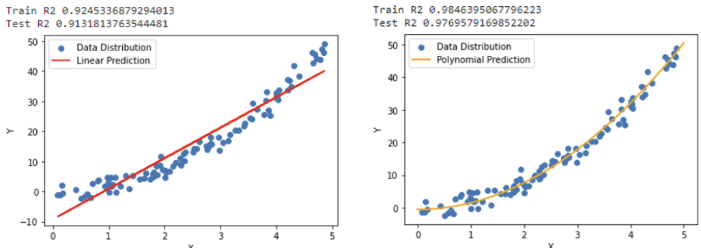

= 다항 회귀(Polynormal Regression)

다항 회귀는 선형 회귀의 확장으로, 데이터의 비선형 관계를 모델링 하기 위해 독립 변수의 다항 항(term)을 사용하는 회귀 분석 방법입니다. 이 방법을 통해 복잡한 곡선 형태의 데이터를 더 잘 설명할 수 있습니다.

다항 회귀는 별도의 알고리즘이 존재하지 않습니다. 독립 변수를 제곱, 서로 곱한 값 등 좀 더 복잡한 값으로 만들어 선형 회귀에 넣어 학습 시키는 것을 말합니다. 한 개의 독립 변수와 종속 변수가 아래와 같은 비선형 모양을 띈다면 단순히 독립 변수를 선형 회귀에 넣어 학습 시킨 것 보다 독립 변수를 제곱해서 선형 회귀에 입력하면 모델의 성능이 향상됩니다.

기본 선형 회귀 모델의 식은 아래와 같습니다.

𝑦 = 𝛽~0~ + 𝛽~1~ 𝑥

다항 회귀는 기본 선형 회귀 식의 x에 고차항을 추가하여 확장합니다.

𝑦 = 𝛽~0~ + 𝛽~1~ 𝑥 + 𝛽~2~ 𝑥^2^+ 𝛽~3~ 𝑥^3^ + ... + 𝛽~𝑛~ 𝑥^𝑛^

다항 회귀는 비선형 데이터를 모델링 하는데는 적합하지만, 선형 회귀 기법을 사용하여 계수를 추정합니다.

