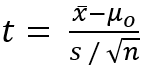
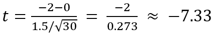

= 가설 검증의 예

== 문제

어떤 회사는 새로운 다이어트 음료가 체중 감소에 효과가 있다고 주장합니다. 연구자는 이 음료가 효과가 있는지 확인하기 위해 실험을 설계합니다.

=== 가설 설정

* 귀무가설 (𝐻~0~) +
새로운 음료는 체중 감소에 효과가 없다. (즉, 음료 섭취 전후 평균 체중 변화 = 0)
* 대립가설 (𝐻~1~) +
새로운 음료는 체중 감소에 효과가 있다. (즉, 음료 섭취 전후 평균 체중 변화 < 0)

== 실험 설계

1. 표본 데이터 + 
30명의 참가자를 모집하여 음료를 4주 동안 섭취하도록 합니다. +
실험 전후 체중 변화를 측정합니다.

2. 수집된 데이터 요약 +
* 표본 평균 체중 변화 (bar 𝑥) = -2kg
* 표본의 표준편차 (𝑠) = 1.5kg
* 표본 크기 (𝑛) = 30

== 가설 검정 과정

1. 유의 수준 설정
* 유의 수준 (𝛼) = 0.05 (5% 오류 가능성 허용)
2. 검정 통계량 계산 
* 검정 통계량 (𝑡)은 다음 공식으로 계산됩니다
+

+
여기서, 𝜇~0~는 귀무가설 하에서의 평균(0), bar 𝑥는 표본 평균, 𝑠는 표본 표준편차, 𝑛은 표본 크기입니다.
+

3. 임계값 확인 및 결론 도출
* 𝑡-분포표를 사용해 자유도 (𝑑𝑓 = 𝑛 − 1 = 29)에서 𝛼 = 0.05에 해당하는 임계값을 확인합니다. +
단측 검정일 경우 임계값은 약 −1.699입니다.
* 계산된 𝑡 값이 −7.33으로 임계값 −1.699보다 작으므로, 귀무가설을 기각합니다.

== 결론
음료를 섭취한 후 체중 변화는 통계적으로 유의미하게 감소한 것으로 나타났습니다 (
𝑝-값 < 0.05). 따라서 이 음료는 체중 감소에 효과가 있다고 결론지을 수 있습니다.