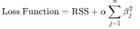

= Ridge 모델

Ridge 회귀는 선형 회귀의 확장으로, 정규화를 통해 과적합(Overfitting) 문제를 완화하는 기법입니다. Ridge 회귀는 L2 정규화를 사용하여 회귀 계수의 크기를 제어하며, 모든 계수를 0에 가깝게 줄이지만 완전히 0으로 만들지는 않습니다.

== Ridge의 목적
1. 과적합 방지:
* 모델이 데이터의 노이즈까지 학습하지 않도록 제약을 추가합니다.
2. 다중공선성 해결:
* 독립 변수 간의 높은 상관관계(다중공선성) 문제를 완화합니다.
3. 일반화 성능 향상:
* 새로운 데이터에 대한 예측 정확도를 높입니다.

== 규제

=== Ridge의 손실 함수
Ridge 회귀는 다음의 손실 함수를 최소화합니다:

* RSS: 잔차 제곱합 
* 𝛼: 정규화 강도를 조절하는 하이퍼파라미터 (𝛼 ≥ 0)
* 𝛽~𝑗~ : 회귀 계수

=== L2 규제
Ridge는 L2 정규화를 사용하여 계수의 제곱합에 패널티를 부과합니다. 이는 계수 값을 작게 만드는 방향으로 작동하지만, 계수를 완전히 0으로 만들지는 않습니다.

=== Ridge의 특징
1. 모든 변수 유지:
* Ridge는 모든 변수의 계수를 0에 가깝게 줄이지만 완전히 0으로 만들지 않습니다.
* 변수 선택은 수행하지 않으며, 모든 변수를 모델에 포함합니다.
2. 다중공선성 해결:
* 독립 변수 간의 상관관계가 높은 경우 Ridge는 계수를 안정적으로 만듭니다.
* 계수 값이 매우 커지는 것을 방지합니다.
3. 규제 강도 조절:
* 𝛼 값이 클수록 규제가 강해져 계수 값이 더 작아집니다.
* 𝛼 = 0 이면 일반 선형 회귀와 동일합니다.

== Ridge의 한계

1. 변수 선택 불가능:
* Ridge는 모든 변수를 모델에 포함하며, 계수를 완전히 0으로 만들지 않습니다.
* 변수 선택이 필요한 경우 Lasso 또는 Elastic Net 사용을 고려해야 합니다.
2. 비선형 관계 제한:
* Ridge는 선형 모델이므로, 독립 변수와 종속 변수 간의 비선형 관계를 처리할 수 없습니다.
* 다항식 특징 추가나 비선형 모델과의 결합이 필요할 수 있습니다.