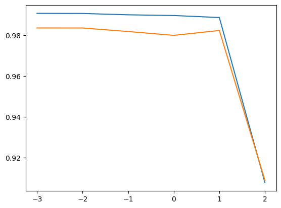

= Lab 5-4 규제 적용 (Lasso 모델)

이 연습에서는 특성의 개수에 따른 학습 과대적합을 학습합니다. 아래 절차에 따릅니다.

== 실습 환경 준비

여기에서는 Visual Studio Code의 Jupyter Notebook을 사용하여 연습을 수행합니다. 이 연습의 수행 환경은 Lab 1-1에서와 같습니다.

1. Visual Studio Code를 실행합니다.
2. 파일 메뉴에서 폴더 열기 를 클릭합니다.
3. 연습을 수행할 폴더를 선택하고 확인 버튼을 클릭합니다.
4. Visual Studio Code의 Explorer 에서 New Button을 클릭하여 새 파일을 만들고, 이름을 lab3-1.ipynb로 지정합니다.
5. 오른쪽 위의 Select Kernel 을 클릭하고 Anaconda Python 환경을 선택합니다.
6. + Code 버튼을 클릭하여 노트북을 시작합니다.

== 라이브러리 import

이 연습에서는 Pandas, Numpy, Matplotlib, Scikit Learn 라이브러리를 사용합니다. 아래 절차에 따라 필요한 라이브러리를 import 합니다.

1, 생성한 Code 노트에 아래 코드를 입력합니다.
+
[source, python]
----
import pandas as pd
import numpy as np
from sklearn.model_selection import train_test_split
from sklearn.linear_model import LinearRegression
from sklearn.preprocessing import PolynomialFeatures
import matplotlib.pyplot as plt
----
+
2. Shift + Enter 를 클릭하여 작성한 코드를 실행합니다.

== 데이터 준비

이 연습에서는 농어의 길이와 무게 데이터에 더해, 높이와 두께가 데이터를 추가로 사용합니다. 아래 절차에 따릅니다.

1. https://github.com/gikpreet/class-machine_learning/blob/main/Module%2005%20Feature%20Engineering/data/perch.csv 에서 소스 파일을 다운로드 합니다.
2. 아래와 유사한 코드를 실행하여 데이터를 DataFrame으로 로드하고 데이터를 확인합니다.
+
[source, python]
----
df = pd.read_csv('../data/perch.csv')
df.head()
----
+
[%header, cols="1,2,2,2" width=50%]
|===
||	length|	height|	width
|0|	8.4|	2.11|	1.41
|1|	13.7|	3.53|	2.00
|2|	15.0|	3.82|	2.43
|3|	16.2|	4.59|	2.63
|4|	17.4|	4.59|	2.94
|===

3. 다음 코드를 실행하여 데이터 프레임을 numpy 배열로 변환하고, 데이터를 확인합니다.
+
[source, python]
----
perch_full = df.to_numpy()
print(perch_full)
----
+
4. Target 데이터는 이전의 데이터를 그대로 사용합니다. 아래 코드를 실행합니다.
+
[source, python]
----
perch_weight = np.array([5.9, 32.0, 40.0, 51.5, 70.0, 100.0, 78.0, 80.0, 85.0, 85.0, 110.0,
       115.0, 125.0, 130.0, 120.0, 120.0, 130.0, 135.0, 110.0, 130.0,
       150.0, 145.0, 150.0, 170.0, 225.0, 145.0, 188.0, 180.0, 197.0,
       218.0, 300.0, 260.0, 265.0, 250.0, 250.0, 300.0, 320.0, 514.0,
       556.0, 840.0, 685.0, 700.0, 700.0, 690.0, 900.0, 650.0, 820.0,
       850.0, 900.0, 1015.0, 820.0, 1100.0, 1000.0, 1100.0, 1000.0,
       1000.0])
----
+
5. 아래 코드를 실행하여 학습 세트와 테스트 세트를 나눕니다.
+
[source, python]
----
train_input, test_input, train_target, test_target = train_test_split(perch_full, perch_weight, random_state=42)
----

== 특성 추가

여기에서는 차원을 5개로 설정하여 특성의 개수를 늘입니다. 아래 절차에 따릅니다.

1. 아래 코드를 실행하여 5차원 특성을 만듭니다. 
+
[source, python]
----
poly = PolynomialFeatures(degree=5, include_bias=False)
poly.fit(train_input)
----
+
2. 생성한 특성을 이용하여 학습 세트와 테스트 세트를 생성합니다.
+
[source, python]
----
train_poly = poly.transform(train_input)
test_poly = poly.transform(test_input)
----

== Lasso 모델을 사용한 규제 적용

여기에서는 특성의 스케일을 조정하기 위해 StandardScaler 클래스를 사용하여 계수 값을 규제하고, 정규화된 데이터를 사용하여 Lasso 모델을 작성한 후 학습합니다. 아래 절차에 따릅니다.

1. Scikit Learn 패키지의 StandardCScaler 모듈을 import 합니다.
+
[source, python]
----
from sklearn.preprocessing import StandardScaler
----
+
2. 아래 코드를 실행하여 StandardScaler 객체를 생성하고 데이터를 변환합니다.
+
[source, python]
----
ss = StandardScaler()
ss.fit(train_poly)
train_scaled = ss.transform(train_poly)
test_scaled = ss.transform(test_poly)
----
+
3. Lasso 모델을 import 합니다.
+
[source, python]
----
from sklearn.linear_model import Lasso
----
+
4. 아래 코드를 실행하여 Ridge 객체를 생성하고, 학습 세트를 사용하여 학습합니다.
+
[source, python]
----
lasso = Lasso()
lasso.fit(train_scaled, train_target)
----
+
5. 학습 세트와 테스트 세트를 사용하여 평가합니다.
+
[source, python]
----
print(lasso.score(train_scaled, train_target))
print(lasso.score(test_scaled, test_target))
----
+
----
0.989789897208096
0.9800593698421884
----

== 규제의 양 조절

Lasso 모델을 사용할 때 규제의 양을 임의로 조절할 수 있습니다. 모델 객체를 만들 때 alpha 값을 하이퍼파라미터로 사용하여 규제의 강조를 조절합니다. alpha 값이 크면 규제 강도가 세지므로 계수 값을 줄이고 과소적합되도록 유도하며, alpha 값이 작으면 선형 회귀 모델과 유사해져서 과대 적합될 가능성이 높습니다.

여기에서는 각 alpha 값에 대한 R^2^(결정 계수) 그래프를 그려서 어떤 alpha 값이 가장 적당한지 알아봅니다. 아래 절차에 따릅니다.

1. 아래 코드를 실행하여 각 alpha 값에 따른 결정 계수를 저장할 리스트를 생성합니다.
+
[source, python]
----
train_score = []
test_score = []
----
+
2. 아래 코드를 실행하여 alpha 값을 0.001 부터 10배수 하여 100 까지의 리스트로 생성합니다.
+
[source, python]
----
alpha_list = [0.001, 0.01, 0.1, 1, 10, 100]
----
+
3. 아래 코드를 실행하여 각 alpha 값에 대한 R^2^를 리스트에 저장합니다.
+
[source, python]
----
for alpha in alpha_list:
    lasso = Lasso(alpha=alpha)
    lasso.fit(train_scaled, train_target)
    train_score.append(lasso.score(train_scaled, train_target))
    test_score.append(lasso.score(test_scaled, test_target))
----
+
4. 아래 코드를 실행하여 alpha 값에 대한 R^2^ 그래프를 그립니다.
+
[source, python]
----
plt.plot(np.log10(alpha_list), train_score)
plt.plot(np.log10(alpha_list), test_score)
plt.xlabel('R^2')
plt.xlabel('alpha')

plt.show()
----
+

== Alpha 파라미터를 사용한 재 학습

여기에서는 측정한 Alpha 파라미터를 사용하여 Ridge 선형 회귀 모델을 재학습합니다. 아래 절차에 따릅니다.

1. 아래 코드를 실행하여 alpha 값으로 0.1을 사용하여 Ridge 클래스를 생성합니다.
+
[source, python]
----
lasso = Lasso(alpha=10)
----
+
2. 아래 코드를 실행하여 학습 세트로 모델을 학습하고 평가합니다.
+
[source, python]
----
ridge.fit(train_scaled, train_target)
lasso.fit(train_scaled, train_target)
print(lasso.score(train_scaled, train_target))
print(lasso.score(test_scaled, test_target))
----
+
----
0.9888067471131867
0.9824470598706695
----