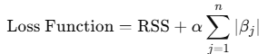

= Lasso(Least Absolute Shrinkage and Selection Operator) 모델

Lasso (Least Absolute Shrinkage and Selection Operator)는 회귀 분석에서 사용되는 기법으로, 변수 선택과 정규화를 동시에 수행하는 선형 회귀 모델의 확장입니다. 이 기법은 일부 회귀 계수를 정확히 0으로 만들어 모델을 간단하게 하고, 과적합을 방지하는 데 도움을 줍니다.

== Lasso의 목적

Lasso 모델은 다음을 목표로 합니다:

1. 모델 단순화:
* 중요하지 않은 변수의 계수를 0으로 만들어 변수 선택(feature selection)을 자동으로 수행합니다.
2. 규제(Regulation):
* 잔차 제곱합을 최소화하면서 계수 값에 제약을 가해 모델 복잡도를 줄입니다.
3. 과적합 방지:
* 데이터를 과도하게 학습하지 않도록 규제를 적용하여 일반화 성능을 향상시킵니다.

== Lasso 규제

=== Lasso의 손실 함수

Lasso 회귀는 다음의 손실 함수를 최소화합니다:

* RSS: 잔차 제곱합 (
* 𝛼: 정규화 강도를 조절하는 하이퍼파라미터 (𝛼 ≥ 0)
* 𝛽~𝑗~ : 회귀 계수

== α 값의 역할
1. 𝛼 > 0 
* 정규화가 적용되어 회귀 계수 𝛽~𝑗~에 패널티를 부과합니다.
* α 값이 클수록 패널티가 강해지고, 𝛽~𝑗~가 0으로 수렴할 가능성이 높아집니다.
* 중요한 변수를 선택하면서 덜 중요한 변수의 계수를 0으로 만들어 차원을 축소합니다.
2. 𝛼 = 0
* 정규화가 적용되지 않으며, 일반 선형 회귀와 동일합니다.
* 모든 독립 변수가 모델에 포함됩니다.
3. 𝛼 값이 너무 크면
* 모델이 과도하게 규제되어, 중요한 변수도 제외되거나 계수가 과소 추정될 수 있습니다.
* 과소적합(Underfitting)의 위험이 있습니다.
4. α 값이 너무 작으면:
* 정규화 효과가 거의 없어서 일반 선형 회귀와 비슷해질 수 있습니다.
* 과적합(Overfitting)의 위험이 있습니다.

=== L1 규제
Lasso는 L1 규제를 사용합니다. 이는 계수의 절대값 합에 패널티를 부과하여 일부 계수를 0으로 만듭니다. 이 특성이 Lasso의 변수 선택 기능을 가능하게 합니다.

== Lasso의 특징

1. 변수 선택:
* Lasso는 중요하지 않은 변수의 계수를 0으로 만듭니다.
* 모델의 해석 가능성을 높이고, 불필요한 변수로 인한 복잡성을 줄입니다.
2. 과적합 방지:
* 𝛼 값이 클수록 모델이 단순화되며, 과적합을 방지하는 데 유리합니다.
3. 규제 강도 조절:
* 𝛼 값이 클수록 규제가 강해지며, 더 많은 변수의 계수가 0이 됩니다.
* 𝛼 = 0α=0이면 일반 선형 회귀와 동일하게 작동합니다.
4. 계수의 희소성:
* 일부 계수만 0이 아닌 값을 가지며, 나머지는 0이 됩니다.

== Lasso 모델의 한계
1. 다중공선성 문제
* 다중공선성이 심한 데이터에서는 특정 변수만 선택하고 다른 변수를 무시할 가능성이 있습니다.
* 이 경우 Elastic Net을 사용하는 것이 더 적합할 수 있습니다.
2. 복잡한 데이터
* 데이터의 비선형 관계를 모델링하기에는 적합하지 않습니다.
* 다항식 회귀와 결합하거나 비선형 기법과 함께 사용해야 합니다.

== Ridge와 Lasso

[%header, cols="1,2,2"]
|===
|특성|Ridge|Lasso
|규제 유형|L2 규제 (𝛽^2^ )|L1 규제 
|변수 선택 기능|없음|있음
|다중공선성 처리|효과적|다소 효과적
|계수 값|모든 계수가 0이 되지 않음|일부 계수는 0
|===