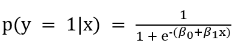

= 분류(Classification) 모델

* 목적
** 데이터를 특정 범주나 클래스로 분류하는 데 사용
** 스팸 이메일 분류, 질병 진단, 이미지 분류 등
* 특징
** **출력 데이터 유형** +
이산적(카테고리 형) 데이터
** **알고리즘** +
로지스틱 회귀, 의사결정나무, 랜덤 포레스트, 서포트 벡터 머신(SVM), 신경망(ANN, CNN 등)
** **평가 지표** +
정확도(Accuracy), 정밀도(Precision), 재현율(Recall), F1 점수, ROC-AUC 등.
* 예제
** 이메일이 스팸인지 아닌지 분류
** 환자가 특정 질병에 걸렸는지 아닌지 판별
** 이미지 속 사물이 고양이인지 개인지 분류

---

분류 모델은 데이터 포인트를 미리 정의된 여러 클래스 중 하나로 분류하는 데 사용되는 머신러닝 기법입니다. 분류 문제는 이진 분류 (두 개의 클래스)와 다중 클래스 분류 (세 개 이상의 클래스)로 나눌 수 있습니다. 

== 개념

분류 모델은 주어진 입력 데이터(독립 변수)를 기반으로 특정 범주(종속 변수)를 예측합니다. 예를 들어, 이메일이 스팸인지 아닌지를 예측하거나, 의료 영상에서 종양이 악성인지 양성인지 분류하는 작업이 여기에 해당합니다.

분류 모델의 기본 개념은 다음과 같습니다

* 입력 변수(X): 예측에 사용되는 특성(features) 또는 독립 변수들.
* 출력 변수(y): 분류할 클래스 라벨(타겟 변수 또는 종속 변수).

== 주요 알고리즘

**로지스틱 회귀 (Logistic Regression)** +
로지스틱 회귀는 분류 문제를 해결하는 가장 기본적인 알고리즘 중 하나입니다. 로지스틱 회귀는 선형 회귀와 달리, 종속 변수가 이진 범주형 데이터일 때 사용됩니다. 로지스틱 회귀의 출력은 0과 1 사이의 확률 값으로, 특정 클래스에 속할 확률을 나타냅니다.

**결정 트리 (Decision Tree)** +
결정 트리는 데이터를 분할하여 의사결정을 하는 트리 구조의 알고리즘입니다. 각 노드는 특정 특성에 기반한 질문을 하고, 그에 따라 데이터를 분할합니다. 최종 노드(리프 노드)에서 분류 결과를 제공합니다.

**랜덤 포레스트 (Random Forest)** +
랜덤 포레스트는 여러 개의 결정 트리를 앙상블하여 예측 성능을 향상시키는 알고리즘입니다. 각 트리는 데이터의 부분 집합과 특성의 부분 집합을 사용하여 학습하며, 최종 예측은 모든 트리의 예측 결과를 평균하거나 다수결로 결정합니다.

**서포트 벡터 머신 (SVM)** +
서포트 벡터 머신은 데이터 포인트를 분리하는 최적의 초평면을 찾는 알고리즘입니다. SVM은 선형적으로 분리 가능한 문제뿐만 아니라 비선형 문제도 해결할 수 있습니다. 이를 위해 커널 트릭을 사용하여 데이터를 고차원 공간으로 변환합니다.

**신경망 (Neural Networks)** +
신경망은 인간의 뇌 구조를 모방한 알고리즘으로, 복잡한 패턴을 학습하여 분류를 수행합니다. 다층 퍼셉트론(MLP)과 같은 기본 신경망부터, 합성곱 신경망(CNN)과 순환 신경망(RNN) 같은 복잡한 구조까지 다양합니다.

**나이브 베이즈 (Naive Bayes)** +
확률 기반 알고리즘으로 특히 텍스트 분류(예: 스팸 필터)에 유용합니다.

== 평가 지표

분류 모델의 성능을 평가하기 위해 다양한 지표를 사용합니다. 주요 지표는 다음과 같습니다:

* 정확도 (Accuracy) +
전체 데이터에서 올바르게 분류된 샘플의 비율로, _정확도 = (정답 / 전체 예측 수)_ 로 표시됩니다.
* 정밀도 (Precision) +
모델이 양성으로 예측한 것 중 실제 양성의 비율.
* 재현율 (Recall) +
실제 양성 중 모델이 양성으로 예측한 비율.
* F1 점수 (F1 Score) +
정밀도와 재현율의 조화 평균.
* ROC 곡선 (ROC Curve) +
TPR(참 양성률)과 FPR(거짓 양성률)을 나타내는 그래프.
* AUC (Area Under the Curve) +
ROC 곡선 아래의 면적으로, 모델의 전체 성능을 나타냅니다.

분류 모델은 다양한 실제 문제를 해결하는 데 필수적인 도구입니다. 다양한 알고리즘과 평가 지표를 통해 분류 성능을 최적화하고, 이를 바탕으로 보다 정확한 예측을 할 수 있습니다. 분류 모델은 이메일 필터링, 이미지 인식, 의료 진단 등 여러 분야에서 널리 사용되고 있습니다.