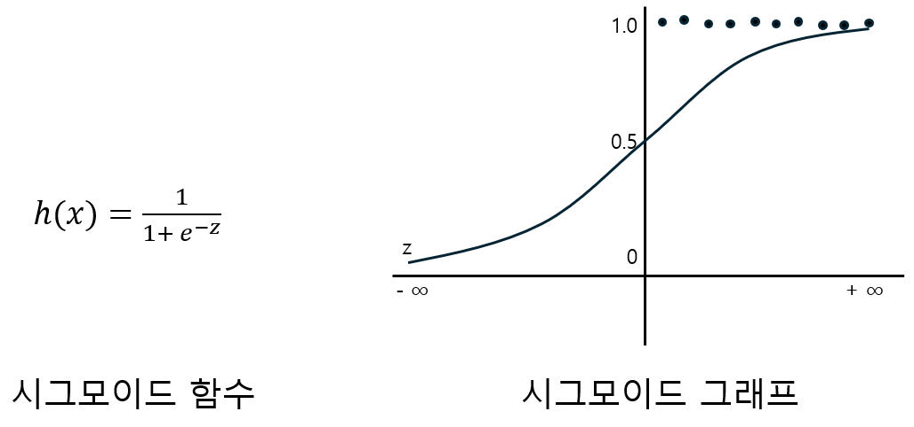

= 로지스틱 회귀 분석 개요

* D.R Cox가 1958년 제한한 확률 모델
* 두 개의 값만을 가지는 종속 변수와 독립 변수들 간의 종속 변수와 독립 변수들 간의 인과관계를 시그모이드 함수를 사용하여 예측
* 목적
** 이진 분류 (Binary Classification): 데이터를 두 개의 클래스(예: 0과 1, 스팸과 비스팸)로 분류.
** 다중 클래스 분류도 확장된 형태로 가능(예: 다항 로지스틱 회귀).
* 기본 원리
** 선형 회귀와 유사하게 입력 데이터(𝑋로 표시)와 가중치(𝑤)를 결합하여 결과값을 계산
** 출력은 연속형 값이 아닌 **확률값(0과 1 사이)**로 표현됨
* 활용되는 함수
** 로지스틱 회귀는 시그모이드 함수를 사용하여 출력값을 확률로 변환
+

+
𝑧 = 𝑤𝑋 + 𝑏(선형 결합).
* 결과 해석
ℎ(𝑋) 의 값이 0.5 이상이면 한 클래스(예: 1), 그렇지 않으면 다른 클래스(예: 0)로 분류.
+
[%header, cols="1,2,2"]
|===
|구분|로지스틱 회귀|선형 회귀
|목적|분류 문제 해결|연속형 값 예측
|출력 값|확률(0~1)로 변환 후 클래스 결정|실수 값
|손실 함수|로그 손실(Log-Loss)|평균 제곱 오차(MSE)
|결과 해석|이산적인 클래스(0, 1)|연속적인 값
|===

---

로지스틱 회귀(Logistic Regression)는 이진 종속 변수(또는 결과 반응 변수)와 하나 이상의 독립 변수(또는 예측 변수, 설명 변수)간의 관계를 분석하고 모델링하는데 사용되는 통계적 방법입니다.

로지스틱 회귀 모델은 일반화 선형 모델의 일종으로, 독립 변수의 선형 조합을 시그모이드 함수(또는 로지스틱 함수)를 사용하여 종속 변수에 대한 확률 점수로 변환합니다. 시그모이드 함수는 입력 값을 0과 1사이의 값으로 매핑하여 종속 변수가 1의 값을 취할 확률로 해석할 수 있습니다.

로지스틱 회귀 모델은 독립 변수의 계수를 추정합니다. 이 게수는 해당 독립변수의 한 단위 변화에 대한 종속 변수의 로그 오즈 변화를 나타내며, 다른 모든 변수를 일정하게 유지하는 동안 적용됩니다.

로지스틱 회귀는 이진 및 다중 클래스 분류 뿐만 아니라 시그모이드 패턴을 따르는 연속 결과 모델링에도 사용될 수 있습니다. 의학, 경제, 사회 과학 등 다양한 분야에서 널리 사용됩니다.

////
https://velog.io/@zlddp723/%EB%A1%9C%EC%A7%80%EC%8A%A4%ED%8B%B1-%ED%9A%8C%EA%B7%80Logistic-Regression 
////