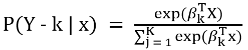
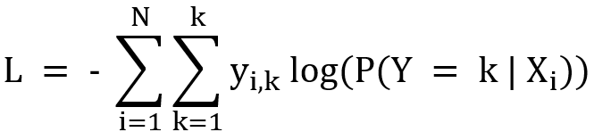

= 다중 로지스틱 회귀 (Multinomial Logistic Regression)

* 종속 변수가 세개 이상의 범주를 가질 때 사용하는 분류 기법
* 로지스틱 회귀의 확장 버전

* 개념
** 목적 +
입력 변수(독립 변수)를 사용하여 범주형 종속 변수의 각 클래스에 속할 확률을 추정
예를 들어, 종속 변수가 "A", "B", "C" 세 가지 범주를 가진다면, 다중 로지스틱 회귀는 각 범주에 속할 확률 
𝑃(𝐴),𝑃(𝐵),𝑃(𝐶)P(A),P(B),P(C)를 계산
** 확률의 합은 항상 1이 됨
𝑃(𝐴) + 𝑃(𝐵) + 𝑃(𝐶) = 1

* 수학적 표현
** 다중 로지스틱 회귀는 **소프트맥스 함수(Softmax Function)**를 사용하여 각 클래스의 확률을 계산
** 𝐾 개의 클래스가 있을 때, 클래스 𝑘에 속할 확률 𝑃(𝑌 = 𝑘∣ 𝑋)는 댜음과 같이 계산됨
+

+ 
*** 𝛽~𝑘~는 클래스 k에 대한 회귀 계수 벡터 +
*** 𝑋 X는 독립 변수 벡터

* 모델 훈련
** 손실 함수: 다중 로지스틱 회귀는 **교차 엔트로피 손실 함수(Cross-Entropy Loss)**를 최소화하여 최적의 파라미터를 찾음
+

+
*** 𝑦~𝑖,𝑘~ 는 샘플 i가 클래스 𝑘에 속하면 1, 그렇지 않으면 0

* 가정
** 독립 변수와 종속 변수 간의 관계는 선형적으로 연결됨
** 클래스 간의 관계는 상호 배타적

* 특징
** 확률 출력 +
모델은 각 클래스에 속할 확률을 제공
** 다중 클래스 문제 해결 +
종속 변수가 3개 이상인 문제를 처리할 수 있음
** 해석 가능성 +
각 독립 변수의 회귀 계수를 통해 변수의 영향을 해석할 수 있음

* 응용 사례
** 이미지 분류 +
여러 클래스 중 이미지가 어떤 카테고리에 속하는지 예측
** 의학 +
질병 유형(예: 감기, 독감, 폐렴)을 분류
** 소비자 행동 분석 +
고객이 특정 제품을 구매할지, 다른 제품을 선택할지 예측

* 제약
** 독립 변수와 종속 변수 간의 관계가 항상 선형적이지 않을 수 있음
** 클래스 간의 불균형이 있을 경우 성능 저하 가능
** 상관관계가 높은 독립 변수(다중공선성)는 모델 성능에 부정적인 영향을 미칠 수 있음