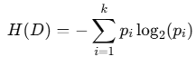
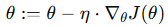

= 결정 트리(Decision Tree)

결정 트리는 데이터를 분할하여 결정을 내리는 규칙 기반의 트리 구조를 사용하여 예측하는 지도 학습 알고리즘입니다. 분류(Classification)와 회귀(Regression) 문제 모두에 사용될 수 있습니다.

== 결정 트리의 구조
결정 트리는 다음과 같은 요소로 구성됩니다:

1. 루트 노드 (Root Node):
* 트리의 시작점으로, 전체 데이터를 기반으로 가장 중요한 특성을 기준으로 데이터를 분할합니다.
2. 내부 노드 (Internal Node):
* 데이터를 분할하는 규칙(조건)이 위치한 노드.
* 각 조건은 특성(feature)과 임계값(threshold)으로 구성됩니다.
3. 리프 노드 (Leaf Node):
* 최종적인 예측 값(클래스 레이블 또는 회귀값)을 반환하는 노드.
* 더 이상 데이터를 분할하지 않음.
4. 가지 (Branch):
* 분할된 경로로, 특정 조건에 따라 데이터를 이동시키는 경로.

== 작동 원리
1. 특성 선택:
* 데이터를 분할하기 위해 어떤 특성을 기준으로 할지 결정합니다.
* 목표: 각 분할에서 불순도를 최대한 줄이는 것.
2. 분할 기준:
* 분류 문제에서는 정보 이득(Information Gain) 또는 **지니 계수(Gini Index)**를 사용.
* 회귀 문제에서는 **평균 제곱 오차(Mean Squared Error, MSE)**를 사용.
3. 반복적인 분할:
* 루트 노드에서 시작해 데이터를 조건에 따라 분할하면서 트리를 확장합니다.
4. 종료 조건:
* 데이터가 충분히 순수(모든 샘플이 같은 클래스)하거나, 분할 후 데이터 수가 너무 작아지면 분할을 멈춥니다.

== 주요 분할 기준
1. 엔트로피와 정보 이득:
* 엔트로피(Entropy): 데이터의 불확실성을 측정.
+

+
** 𝑝~𝑖~: 클래스 𝑖의 비율.
* 정보 이득(Information Gain)
+

2. 지니 계수 (Gini Index):
* 데이터의 불순도를 측정
+
image:../images/image12.png[]
+
3. 분할 기준의 선택:
* 가장 높은 정보 이득(또는 가장 낮은 지니 계수)을 제공하는 특성으로 데이터를 분할.

== 장단점

=== 장점
1. 해석 용이성:
* 사람이 이해하기 쉬운 규칙 기반 구조.
* 트리를 시각화하면 모델의 작동 원리를 쉽게 설명할 수 있음.
2. 비선형 데이터 처리:
* 데이터의 선형성과 독립성 가정이 필요하지 않음.
3. 전처리 요구사항이 낮음:
* 정규화나 스케일링이 필요하지 않음.
4. 다목적 사용 가능:
* 분류와 회귀 모두에 적합.

=== 단점
1. 과적합 위험:
* 트리가 너무 깊어질 경우 학습 데이터에 과적합될 가능성이 큼.
* 이를 방지하기 위해 가지치기(Pruning) 또는 최대 깊이 제한을 사용.
2. 변동성:
* 데이터가 약간만 변경되어도 트리 구조가 크게 변할 수 있음.
3. 비효율성:
* 트리 학습 과정에서 각 분할 기준을 테스트해야 하므로 계산량이 많음.

== 과적합 방지 기법
1. 가지치기(Pruning):
* 트리의 불필요한 가지를 잘라내 과적합을 방지.
* 사전 가지치기: 트리의 최대 깊이, 최소 샘플 수 등을 설정.
* 사후 가지치기: 트리를 완전히 생성한 후, 가지를 제거.
2. 최대 깊이 제한
* 트리의 깊이를 제한해 복잡도를 줄임.
3. 최소 샘플 분할 수
* 노드 분할에 필요한 최소 샘플 수를 설정.
4. 앙상블 방법:
* 랜덤 포레스트(Random Forest) 또는 그래디언트 부스팅(Gradient Boosting) 같은 앙상블 기법을 사용하여 개별 결정 트리의 단점을 보완.

== 활용 사례

1. 분류 문제:
* 이메일 스팸 필터링, 의료 진단(암 여부 예측) 등.
2. 회귀 문제:
* 주택 가격 예측, 판매량 예측 등.
3. 의사결정 지원:
* 고객 세분화, 비즈니스 의사결정 지원.

결정 트리는 간단한 규칙으로 데이터를 분류하고 예측할 수 있는 강력한 도구입니다. 과적합 방지를 위한 규제 기법과 앙상블 방법을 활용하면 다양한 데이터 문제에 대해 높은 성능을 발휘할 수 있습니다.