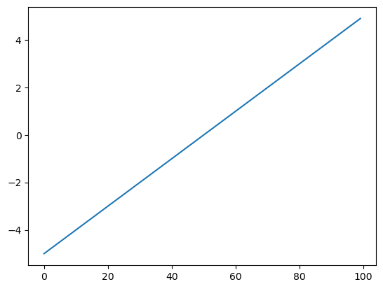
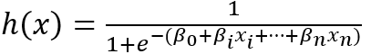
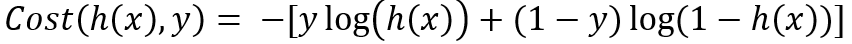

= 로지스틱 회귀 분석

**로지스틱 회귀(Logistic Regression)**는 종속 변수가 범주형인 경우에 사용되는 통계 및 머신러닝 모델입니다. 특히, 이진 분류(종속 변수가 두 개의 범주로 나뉘는 경우)에 많이 활용되며, 확장하면 다중 클래스 문제에도 적용할 수 있습니다.

==  로지스틱 회귀의 기본 개념

1. 선형 모델 +
로지스틱 회귀는 입력 변수와 출력 사이의 관계를 선형으로 가정합니다. 그러나 최종 출력은 이 선형 결과에 대해 로지스틱 함수(시그모이드 함수)를 적용하여 확률 값으로 변환됩니다.
2. 시그모이드 함수 +
로지스틱 회귀에서 중요한 부분은 시그모이드 함수입니다. 이 함수는 입력 값이 어떤 실수일지라도 0과 1 사이의 값으로 변환합니다. 시그모이드 함수는 다음과 같습니다:
+
image:../images/image06.png[width=130]
+
여기서 𝑧는 선형 회귀 모델에서 구한 값입니다. 즉, 𝑧 = 𝑤~1~𝑥~1~ + 𝑤~2~𝑥~2~ + ⋯ + 𝑤~𝑛~𝑥~𝑛~ + 𝑏입니다. 이 값을 시그모이드 함수에 통과시키면 결과가 0과 1 사이의 값이 됩니다.
3. 확률 예측 +
로지스틱 회귀는 이 확률 값을 기반으로 클래스 예측을 수행합니다. 예를 들어, 확률이 0.5보다 크면 클래스 1(긍정적 예측)을, 그렇지 않으면 클래스 0(부정적 예측)을 선택할 수 있습니다.

== 로지스틱 회귀의 핵심 수식

로지스틱 회귀의 핵심은 시그모이드 함수(로지스틱 함수)를 사용하는 것입니다.

=== 선형 모델

로지스틱 회귀는 분류모델입니다. 이 알고리즘은 선형 회귀와 동일하게 선형 방정식을 학습합니다. 아래 식에서 𝑥~1, 𝑥~2~,...,𝑥~𝑛~은 가중치 또는 계수입니다. 이는 다중 회귀를 윟나 선형 방정식과 동일합니다.

𝑧 = 𝛽~0~ + 𝛽~1~𝑥~1~ + 𝛽~2~𝑥~2~ + ⋯ + 𝛽~𝑛~𝑥~𝑛~

* z는 독립 변수의 선형 결합𝑧 = m𝑋 + 𝑏

로지스틱 회귀는 확률을 구하는 것이므로, z값은 0에서 1사이(또는 0%에서 100%)가 되어야 합니다. 시그모이드 함수(또는 로지스틱 함수)가 이 역할을 수행합니다.

=== 시그모이드 함수

로지스틱 회귀는 𝑧를 시그모이드 함수에 통과시켜 확률 𝑝를 계산합니다.

image:../images/image06.png[width=130]

* 𝑝는 특정 클래스(예: 1)에 속할 확률입니다.

=== 예제

선형 방정식(z)이 -5와 5사이의 값을 0.1 간격으로 산출하여 배열 z를 만들었다고 할 때,

[source, python]
----
z = np.arange(-5, 5, 0.1)
----

그래프를 아래와 같이 표시됩니다.

시그모이드드 함수로 배열 z의 값을 변환하면, 아래와 같은 그래프로 표시됩니다.

[source, python]
----
phi = 1 / (1 + np.exp(-z))
----

== 가설 함수

로지스틱 회귀의 가설 함수는 다음과 같습니다:

 
이 함수는 𝑥를 입력받아 𝑦=1일 확률을 출력합니다.

== 손실 함수

로지스틱 회귀는 선형 회귀와 달리 **평균 제곱 오차(MSE)**를 사용하지 않고, **로그 손실 함수(Log Loss)**를 사용합니다.

전체 데이터셋에 대한 손실 함수는 다음과 같이 작성됩니다:

image:../images/image09.png[width=500]

* 𝑚은 데이터 포인트 수입니다.

== 최적화

모델의 가중치(파라미터 𝛽)는 경사 하강법(Gradient Descent) 또는 다른 최적화 알고리즘을 사용해 학습합니다.

== 다중 클래스 로지스틱 회귀

* 다항 로지스틱 회귀(Multinomial Logistic Regression) +
종속 변수가 3개 이상의 범주를 가지는 경우, 소프트맥스 함수(Softmax Function)를 사용해 각 클래스에 속할 확률을 계산합니다.
* 일대다(OvR: One-vs-Rest) 방식으로 다중 클래스 문제를 해결하기도 합니다.

== 로지스틱 회귀의 특징

* 해석 가능성 +
결과를 확률로 해석할 수 있어 의사결정에 유용합니다.
* 빠르고 효율적 +
적은 데이터셋에서도 잘 작동하며 계산 비용이 낮습니다.
* 제한 사항 +
비선형 데이터에는 성능이 떨어지며, 다중 공선성 문제에 민감합니다.

== 로지스틱 회귀의 예시

문제: 환자의 나이와 혈압을 사용하여 질병의 유무를 예측.

* 독립 변수: 나이, 혈압.
* 종속 변수: 질병 유무 (0 = 없음, 1 = 있음).
* 로지스틱 회귀를 통해 𝑝를 계산. 예를 들어, 𝑝 > 0.5p>0.5인 경우 질병이 있다고 예측.

로지스틱 회귀는 의료 진단, 금융 리스크 분석, 마케팅 등 다양한 분야에서 중요한 도구로 사용됩니다.