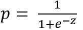
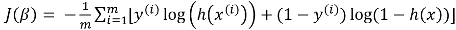

= 로지스틱 회귀 분석

**로지스틱 회귀(Logistic Regression)**는 종속 변수가 범주형인 경우에 사용되는 통계 및 머신러닝 모델입니다. 특히, 이진 분류(종속 변수가 두 개의 범주로 나뉘는 경우)에 많이 활용되며, 확장하면 다중 클래스 문제에도 적용할 수 있습니다.

==  로지스틱 회귀의 기본 개념
* 선형 회귀와 유사하게 독립 변수와 종속 변수 간의 관계를 모델링하려 하지만, 종속 변수가 연속형이 아닌 범주형인 경우에 적합합니다.
* 출력 값이 0과 1 사이의 확률로 변환되며, 특정 임계값(예: 0.5)을 기준으로 범주를 분류합니다.

== 로지스틱 회귀의 핵심 수식

로지스틱 회귀의 핵심은 시그모이드 함수(로지스틱 함수)를 사용하는 것입니다.

선형 모델

𝑧 = 𝛽~0~ + 𝛽~1~𝑥~1~ + 𝛽~2~𝑥~2~ + ⋯ + 𝛽~𝑛~𝑥~𝑛~

* z는 독립 변수의 선형 결합입니다.

시그모이드 함수:

로지스틱 회귀는 𝑧를 시그모이드 함수에 통과시켜 확률 𝑝를 계산합니다.

* 𝑝는 특정 클래스(예: 1)에 속할 확률입니다.

== 가설 함수

로지스틱 회귀의 가설 함수는 다음과 같습니다:

image:../images/image07.png[width=295]
 
이 함수는 𝑥를 입력받아 𝑦=1일 확률을 출력합니다.

== 손실 함수

로지스틱 회귀는 선형 회귀와 달리 **평균 제곱 오차(MSE)**를 사용하지 않고, **로그 손실 함수(Log Loss)**를 사용합니다.

image:../images/image08.png[width=500]

전체 데이터셋에 대한 손실 함수는 다음과 같이 작성됩니다:

* 𝑚은 데이터 포인트 수입니다.

== 최적화

모델의 가중치(파라미터 𝛽)는 경사 하강법(Gradient Descent) 또는 다른 최적화 알고리즘을 사용해 학습합니다.

== 다중 클래스 로지스틱 회귀

* 다항 로지스틱 회귀(Multinomial Logistic Regression) +
종속 변수가 3개 이상의 범주를 가지는 경우, 소프트맥스 함수(Softmax Function)를 사용해 각 클래스에 속할 확률을 계산합니다.
* 일대다(OvR: One-vs-Rest) 방식으로 다중 클래스 문제를 해결하기도 합니다.

== 로지스틱 회귀의 특징

* 해석 가능성 +
결과를 확률로 해석할 수 있어 의사결정에 유용합니다.
* 빠르고 효율적 +
적은 데이터셋에서도 잘 작동하며 계산 비용이 낮습니다.
* 제한 사항 +
비선형 데이터에는 성능이 떨어지며, 다중 공선성 문제에 민감합니다.

== 로지스틱 회귀의 예시

문제: 환자의 나이와 혈압을 사용하여 질병의 유무를 예측.

* 독립 변수: 나이, 혈압.
* 종속 변수: 질병 유무 (0 = 없음, 1 = 있음).
* 로지스틱 회귀를 통해 𝑝를 계산. 예를 들어, 𝑝 > 0.5p>0.5인 경우 질병이 있다고 예측.

로지스틱 회귀는 의료 진단, 금융 리스크 분석, 마케팅 등 다양한 분야에서 중요한 도구로 사용됩니다.