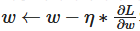

= 확률적 경사하강법(Stochastic Gradient Decent- SGD)

확률적 경사하강법(SGD)은 머신러닝에서 최적화 알고리즘 중 하나로, 주어진 손실 함수의 최소값(또는 최대값)을 찾기 위해 반복적으로 가중치를 업데이트하는 방법입니다. 확률적이라는 용어는 전체 데이터셋 대신 랜덤하게 선택된 데이터 포인트를 사용하여 경사를 계산한다는 것을 의미합니다.

일반적으로 인공지능은 손실 함수(loss function)을 사용하여 자신의 파라미터를 검증합니다. 손실 함수는 머신 러닝 모델의 파라미터를 통하여 나온 예측 값과 실제 값의 차이이며, 손실 함수 값을 가장 낮게 나오게 하는 최적의 파라미터를 선택하는 것이 좋은 모델을 만들 수 있도록 합니다.

손실 함수를 미분하여 최소, 최대 값을 찾을 수 있지만 손실 함수가 복잡하거나 비 선형적인 함수여서 미분이 어려운 경우가 많습니다. 따라서, 미분을 구현하는 과정보다 경사 하강법을 구현하여 최소값을 찾는 것이 실질적으로 효율적인 경우가 많습니다.

== 경사 하강법으로 근사값을 찾는 과정

image:../images/image15.gif[]

현재 위치의 기울기가 음수라면 파라미터를 증가시키면 최소값을 찾을 수 있고, 기울기가 양수라면 파라미터를 감소시키면 최소값을 찾을 수 있습니다.

따라서 해당 파라미터에서 학습률 * 기울기를 빼면 최소값이 되는 장소를 찾을 수 있습니다.

image:../images/image11.png[]

위 수식은 아래와 같이 표시되기도 합니다.

𝜂는 학습률이고, 는 손실 함수 위에서의 해당 가중치의 기울기입니다.

== 경사하강법의 종류

경사하강법에는 다음 세 가지 주요 변형이 있습니다:

1. 배치 경사하강법 (Batch Gradient Descent)
* 데이터셋 전체를 사용하여 경사를 계산.
* 한 번의 업데이트에 많은 계산 자원이 필요.
* 데이터셋이 클수록 느려질 수 있음.
2. 확률적 경사하강법 (SGD)
* 데이터셋에서 무작위로 하나의 데이터 포인트를 선택하여 경사를 계산.
* 더 빠르게 업데이트 가능하지만, 노이즈로 인해 수렴 과정이 불안정할 수 있음.
3. 미니배치 경사하강법 (Mini-batch Gradient Descent)
* 데이터셋을 작은 배치로 나누고 각 배치에 대해 경사를 계산.
* 배치 경사하강법과 확률적 경사하강법의 절충안.

== 특징

1. 작동 방식
* SGD는 매 반복(iteration)마다 하나의 데이터 포인트 (𝑥~𝑖~,𝑦~𝑖~))를 랜덤하게 선택하여 경사를 계산하고 가중치를 업데이트합니다. 
+
image:../images/image11.png[]
+
** 𝜃: 가중치 벡터(모델 파라미터)
** 𝜂: 학습률 (learning rate)
** ∇~𝜃~𝐿(𝜃;𝑥~𝑖~,𝑦~𝑖~): 선택된 데이터 포인트에 대한 손실 함수의 기울기
2. 장점
* 빠른 업데이트: 데이터셋 전체를 사용할 필요가 없으므로 업데이트 속도가 빠름.
* 온라인 학습 가능: 실시간으로 들어오는 데이터를 학습 가능.
* 지역 최적값 탈출 가능성: 경사가 매번 달라져 수렴 과정에서 노이즈가 발생하지만, 이는 복잡한 손실 함수에서 지역 최적값(local minima)을 탈출하는 데 도움이 될 수 있음.
3. 단점
* 수렴 불안정: 경사에 노이즈가 많아 최적점에 도달하지 못하거나 수렴 속도가 느릴 수 있음.
* 학습률 선택이 중요: 너무 큰 학습률은 발산을 초래하고, 너무 작은 학습률은 학습을 느리게 함.

== 활용

확률적 경사하강법은 머신러닝과 딥러닝 모델의 학습 과정에서 널리 사용됩니다:

* 선형 회귀 및 로지스틱 회귀 +
파라미터 최적화를 위한 간단한 SGD 적용.
* 신경망 학습 +
딥러닝에서 매우 큰 데이터셋을 처리할 때 필수적.
* 온라인 학습 +
데이터가 실시간으로 들어오는 환경에서 사용 (예: 추천 시스템, 실시간 광고).

== 요약

* 데이터셋에서 일부 데이터만 사용하여 계산량 감소.
* 빠른 업데이트로 대규모 데이터셋에 적합.
* 노이즈로 인해 수렴이 불안정하지만, 적절한 하이퍼파라미터 설정(학습률, 모멘텀 등)으로 극복 가능.
* 다양한 최적화 알고리즘(Adam, RMSprop 등)의 기반이 됨.

SGD는 경사하강법의 핵심 변형으로, 데이터 규모가 크거나 연산 효율성이 중요한 경우 널리 사용됩니다.