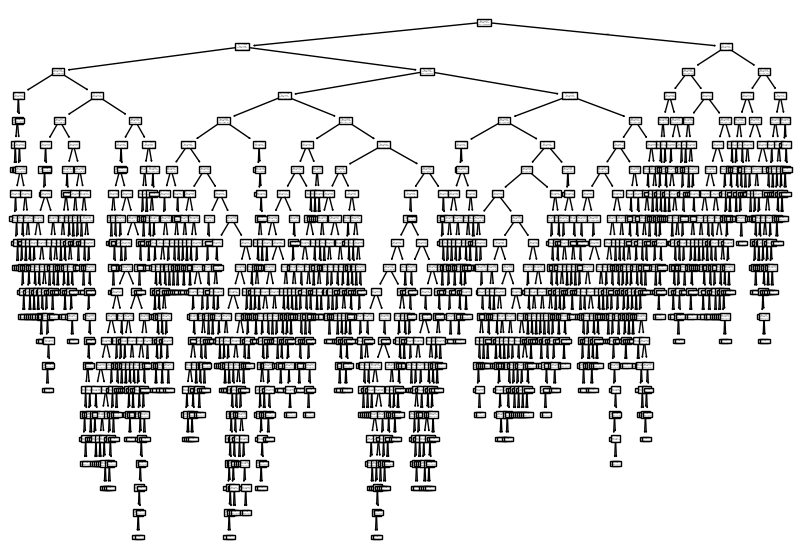
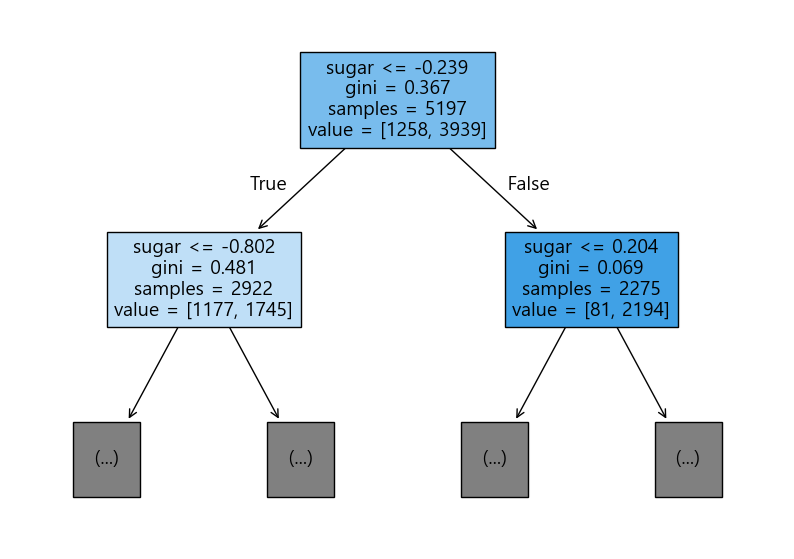

= Lab 7-2 결정 트리 모델로 와인 분류

이 연습에서는 와인의 알코올 도수, 당도, 산도 데이터를 사용하여 와인이 레드 와인인지 화이트 와인인지를 분류하는 머신러닝 프로그램을 작성합니다. 아래 절차에 따릅니다.

== 실습 환경 준비

여기에서는 Visual Studio Code의 Jupyter Notebook을 사용하여 연습을 수행합니다. 이 연습의 수행 환경은 Lab 1-1에서와 같습니다.

1. Visual Studio Code를 실행합니다.
2. 파일 메뉴에서 폴더 열기 를 클릭합니다.
3. 연습을 수행할 폴더를 선택하고 확인 버튼을 클릭합니다.
4. Visual Studio Code의 Explorer 에서 New Button을 클릭하여 새 파일을 만들고, 이름을 lab7-2.ipynb로 지정합니다.
5. 오른쪽 위의 Select Kernel 을 클릭하고 Anaconda Python 환경을 선택합니다.
6. + Code 버튼을 클릭하여 노트북을 시작합니다.

== 라이브러리 import

이 연습에서는 Pandas, Numpy, Matplotlib, Scikit Learn 라이브러리를 사용합니다. 아래 절차에 따라 필요한 라이브러리를 import 합니다.

1. 생성한 Code 노트에 아래 코드를 입력합니다.
+
[source, python]
----
import pandas as pd
import numpy as np
from sklearn.model_selection import train_test_split
from sklearn.preprocessing import StandardScaler
from sklearn.neighbors import KNeighborsClassifier
from sklearn.preprocessing import PolynomialFeatures
import matplotlib.pyplot as plt
----
+
2. Shift + Enter 를 클릭하여 작성한 코드를 실행합니다.

== 데이터 준비

이 연습에서는 kaggle에서 다운로드한 와인 데이터를 사용합니다. 데이터는 와인의 알코올 도수, 산도, 당도와 레드와인, 화이트 와인을 포함합니다. 아래 절차에 따릅니다.

1. https://github.com/gikpreet/class-machine_learning/blob/main/Module%2007%20Tree%20Algorithm/data/wine.csv 에서 데이터를 다운로드 합니다.
2. 아래와 유사한 코드를 실행하여 데이터를 DataFrame으로 로드하고 데이터를 확인합니다.
+
[source, python]
----
df_wine = pd.read_csv('../data/wine.csv')
df_wine.head()
----
+
[%header, cols=="4", width="500"]
|===
||alcohol|sugar|pH|class
|0|	9.4|1.9|3.51|	0.0
|1|	9.8|2.6|3.20|	0.0
|2|	9.8|2.3|3.26|	0.0
|3|	9.8|1.9|3.16|	0.0
|4|	9.4|1.9|3.51|	0.0
|===
+
3. 아래 코드를 실행하여 와인의 종류를 확인합니다.
+
[source, python]
----
df_wine['class'].unique()
## 0: red wine, 1: white wine
----
+
4. DataFrame의 alcohol, sugar, pH는 분류를 위한 데이터(독립 변수)에 해당되고, class는 분류 결과(종속 변수)에 해당됩니다. 아래 코드를 실행하여 독립 변수 데이터와 종속 변수 데이터를 분리하여 데이터 세트를 만듭니다.
+
[source, python]
----
data = df_wine[['alcohol','sugar','pH']].to_numpy()
target = df_wine['class'].to_numpy()
----
+
5. 아래 코드를 실행하여 훈련 세트, 훈련 타겟, 테스트 세트, 테스트 타겟 데이터를 나눕니다. 테스트 데이터는 전체 데이터의 20%로 지정합니다.
+
[source, python]
----
train_input, test_input, train_target, test_target = train_test_split(data, target, test_size=0.2, random_state=42)
----
+
6. 아래 코드를 실행하여 데이터의 개수와 차원을 확인합니다.
+
[source, python]
----
print(train_input.shape)
print(test_input.shape)
----
+
----
(5197, 3)
(1300, 3)
----

== 정규화

와인 데이터의 알코올 도수는 %를, 당도는 g/l를, 산도는 g을 사용합니다. 다른 스케일을 사용하는 데이터에 대해 정규화를 적용합니다. 아래 절차에 따릅니다.

1. 아래 코드를 실행하여 StandardScaler() 객체를 생성합니다.
+
[source, python]
----
ss = StandardScaler()
----
+
2. 아래 코드를 실행하여 데이터를 학습하고 정규화된 학습 세트와 테스트 세트를 만듭니다.
+
[source, python]
----
ss.fit(train_input)
train_scaled = ss.transform(train_input)
test_scaled = ss.transform(test_input)
----

== 모델 생성, 학습, 평가

여기에서는 생성한 DecicsionTreeClassifier 모델을 학습 데이터로 학습하고, 평가합니다. 아래 절차에 따릅니다.

1. 아래 코드를 실행하여 DecicsionTreeClassifier 객체를 import 합니다.
+
[source, python]
----
from sklearn.tree import DecisionTreeClassifier
----
+
2. DecicsionTreeClassifier 회귀 모델을 생성합니다.
+
[source, python]
----
dt = DecisionTreeClassifier(random_state=42)
----
+
3. 아래 코드를 실행하여 학습 세트와 테스트 세트로 학습합니다.
+
[source, python]
----
dt.fit(train_scaled, train_target)
----
4. 아래 코드를 실행하여 학습한 모델을 평가합니다.
+
[source, python]
----
print(dt.score(train_scaled, train_target))
print(dt.score(test_scaled, test_target))
----
+
----
0.996921300750433
0.8592307692307692
----

== 예측

1. 아래 코드를 실행하여 상위 5개의 테스트 세트 데이터를 확인합니다.
+
[source, python]
----
test_scaled[:5]
----
+
2. 아래 코드를 실행하여 상위 5개의 테스트 타겟 데이터를 확인합니다.
+
[source, python]
----
test_target[:5]
----
+
3. 아래 코드를 실행하여 상위 5개의 테스트 세트 데이터에 대한 분류를 실행합니다.
+
----
dt.predict(test_scaled[:5])
----
+
----
array([1., 0., 1., 1., 1.])
----
+
4. 아래 코드를 실행하여 테스트 데이터에 대한 분류 확률을 확인합니다.
+
[source, python]
----
dt.predict_proba(test_scaled[:5])
----

== 구조

Scikit Learn의 DecisionTree 객체는 모델을 트리 그림으로 출력하는 기능을 제공합니다. 아래 절차에 따라 모델을 그래픽화 합니다.

1. 아래 코드를 출력하여 전체 모델을 트리로 출력합니다.
+
[source, python]
----
from sklearn.tree import plot_tree
----
+
2. 아래 코드를 출력하여 전체 모델을 트리로 출력합니다.
+
[source, python]
----
plt.figure(figsize=(10,7))
plot_tree(dt)
plt.show()
----
+

+
3. 아래 코드를 출력하여 트리의 깊이를 1로 지정하여 트리를 출력합니다.
+
[source, python]
----
plt.figure(figsize=(10,7))
plot_tree(dt, max_depth=1, filled=True, feature_names=['alcohol','sugar','pH'])
plt.show()
----
+
