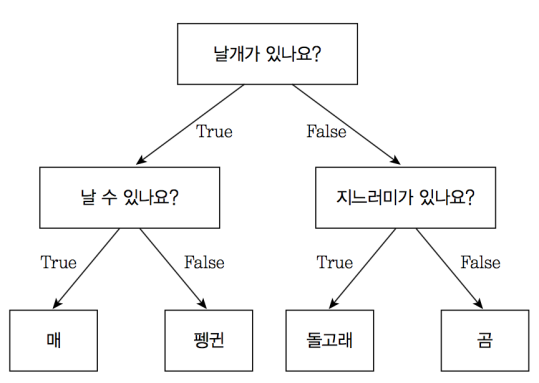
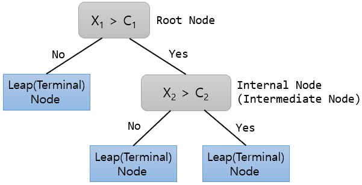
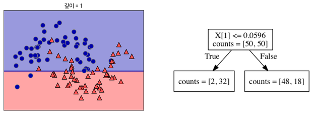
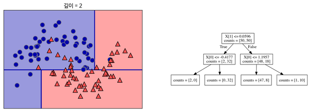
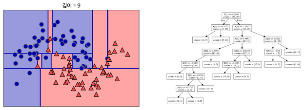
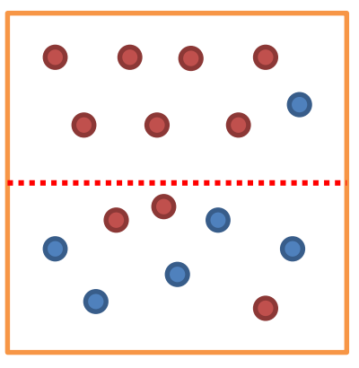
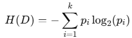
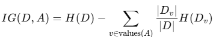
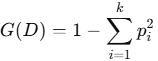

= 결정 트리(Decision Tree)

결정 트리는 데이터를 분할하여 결정을 내리는 규칙 기반의 트리 구조를 사용하여 예측하는 지도 학습 알고리즘입니다. 분류(Classification)와 회귀(Regression) 문제 모두에 사용될 수 있습니다.

매, 펭귄, 돌고래, 곰을 구분한다고 생각해봅시다. 매와 펭귄은 날개가 있고, 돌고래와 곰은 날개가 없습니다. 날개가 있는지에 대한 질문을 통해 매, 팽귄 / 돌고래, 곰을 나눌 수 있습니다. 돌고래와 곰은 지느러미가 있는지의 여부에 대한 질문으로 나눌 수 있습니다. 아래는 이런 질문을 도식화 한 것입니다.

이렇게 특정 기준(질문)에 따라 데이터를 구분하는 모델을 결정 트리 모델이라고 합니다. 한번의 분기 때마다 변수 영역을 두 개로 구분합니다. 결정 트리에서 질문이나 정답을 담은 네모 상자를 노드(Node)라고 합니다. 맨 처음 분류 기준 (즉, 첫 질문)을 Root Node라고 하고, 맨 마지막 노드를 Terminal Node 혹은 Leaf Node라고 합니다.

== 결정 트리의 구조

결정 트리는 다음과 같은 요소로 구성됩니다:

1. 루트 노드 (Root Node):
* 트리의 시작점으로, 전체 데이터를 기반으로 가장 중요한 특성을 기준으로 데이터를 분할합니다.
2. 내부 노드 (Internal Node):
* 데이터를 분할하는 규칙(조건)이 위치한 노드.
* 각 조건은 특성(feature)과 임계값(threshold)으로 구성됩니다.
3. 리프 노드 (Leaf Node):
* 최종적인 예측 값(클래스 레이블 또는 회귀값)을 반환하는 노드.
* 더 이상 데이터를 분할하지 않음.
4. 가지 (Branch):
* 분할된 경로로, 특정 조건에 따라 데이터를 이동시키는 경로.

== 작동 원리

1. 특성 선택:
* 데이터를 분할하기 위해 어떤 특성을 기준으로 할지 결정합니다.
* 목표: 각 분할에서 불순도를 최대한 줄이는 것.
2. 분할 기준:
* 분류 문제에서는 정보 이득(Information Gain) 또는 **지니 계수(Gini Index)**를 사용.
* 회귀 문제에서는 **평균 제곱 오차(Mean Squared Error, MSE)**를 사용.
3. 반복적인 분할:
* 루트 노드에서 시작해 데이터를 조건에 따라 분할하면서 트리를 확장합니다.
4. 종료 조건:
* 데이터가 충분히 순수(모든 샘플이 같은 클래스)하거나, 분할 후 데이터 수가 너무 작아지면 분할을 멈춥니다.

결정트리 알고리즘의 프로세스를 도식화 해 보면 아래와 같습니다.

처음으로, 데이터를 가장 잘 구분할 수 있는 질문으로 나눕니다.

각 범주에서 또 다시 데이터를 가장 잘 구분할 수 있는 범주로 나눕니다.

나뉜 범주에서 또 다시 데이터를 구분할 수 있는 기준으로 나눕니다. 이를 지나치게 많이하면 과대적합(Overfitting)이 됩니다. 

== 주요 분할 기준: 엔트로피(Entropy)와 불순도(Impurity)

불순도(Impurity)는 해당 범주안에 서로 다른 데이터가 얼마나 섞여 있는지를 뜻합니다. 아래 그림에서 위쪽 범주는 불순도가 낮고, 아래쪽 범주는 불순도가 높습니다. 

한 범주에 하나의 데이터만 있다면 불순도가 최소(혹은 순도가 최대)이고, 한 범주안에 데이터가 정확히 반씩 있다면 불순도가 최대(또는 순도가 최소)입니다. 결정 트리는 불순도를 최소화(또는 순도를 최대화)하는 방향으로 학습을 진행합니다.

앤트로피(Entropy)는 불순도를 수치적으로 나타낸 척도입니다. 엔트로피가 높다는 것은 불순도가 높다는 뜻이고, 엔트로피가 낮다는 것은 불순도가 낮다는 뜻입니다. 엔트로피가 1이면 불순도가 최대(한 범주에 다른 데이터가 반씩 있다는 의미), 엔트로피가 0이면 최소 불순도를 의미합니다.

엔트로피가 1인 상태에서 0.7인 상태로 바뀌었다면 정보 획득(Information gain)은 0.3입니다. 분기 이전의 엔트로피에서 분기 이후의 엔트로피를 뺀 수치를 정보획득이라고 합니다. 

1. 엔트로피와 정보 획득:
* 엔트로피(Entropy): 데이터의 불확실성을 측정.
+

+
** 𝑝~𝑖~: 클래스 𝑖의 비율.
* 정보 획득(Information Gain)
+

2. 지니 계수 (Gini Index):
* 데이터의 불순도를 측정
+

+
3. 분할 기준의 선택:
* 가장 높은 정보 이득(또는 가장 낮은 지니 계수)을 제공하는 특성으로 데이터를 분할.

== 장단점

=== 장점
1. 해석 용이성:
* 사람이 이해하기 쉬운 규칙 기반 구조.
* 트리를 시각화하면 모델의 작동 원리를 쉽게 설명할 수 있음.
2. 비선형 데이터 처리:
* 데이터의 선형성과 독립성 가정이 필요하지 않음.
3. 전처리 요구사항이 낮음:
* 정규화나 스케일링이 필요하지 않음.
4. 다목적 사용 가능:
* 분류와 회귀 모두에 적합.

=== 단점

1. 과적합 위험:
* 트리가 너무 깊어질 경우 학습 데이터에 과적합될 가능성이 큼.
* 이를 방지하기 위해 가지치기(Pruning) 또는 최대 깊이 제한을 사용.
2. 변동성:
* 데이터가 약간만 변경되어도 트리 구조가 크게 변할 수 있음.
3. 비효율성:
* 트리 학습 과정에서 각 분할 기준을 테스트해야 하므로 계산량이 많음.

== 과적합 방지 기법

과대 적합을 막기 위한 전략으로 가지치기(Pruing)이라는 기법을 사용합니다. 트리에 가지가 너무 많다면 과대 적합이 일어납니다. 가지치기는 트리의 최대 깊이나 단말 노드(Leap node)의 최대 개수, 혹은 한 노드가 분할하기 위한 최소 데이터 수를 제한하는 것입니다. 

Scikit Learn에서는 min_sample_split 파라미터를 조정하여 한 노드에 있는 최소 데이터 수를 지정해 줄 수 있습니다. min_sample_split = 10이면 한 노드에 10개의 데이터가 있다면 그 노드는 더 이상 분기를 하지 않습니다. 또한, max_depth를 통해서 최대 깊이를 지정해줄 수도 있습니다. max_depth = 4이면, 깊이가 4보다 크게 가지를 치지 않습니다. 가지치기는 사전 가지치기와 사후 가지치기가 있지만 sklearn에서는 사전 가지치기만 지원합니다.

1. 가지치기(Pruning):
* 트리의 불필요한 가지를 잘라내 과적합을 방지.
* 사전 가지치기: 트리의 최대 깊이, 최소 샘플 수 등을 설정.
* 사후 가지치기: 트리를 완전히 생성한 후, 가지를 제거.
2. 최대 깊이 제한
* 트리의 깊이를 제한해 복잡도를 줄임.
3. 최소 샘플 분할 수
* 노드 분할에 필요한 최소 샘플 수를 설정.
4. 앙상블 방법:
* 랜덤 포레스트(Random Forest) 또는 그래디언트 부스팅(Gradient Boosting) 같은 앙상블 기법을 사용하여 개별 결정 트리의 단점을 보완.

== 활용 사례

1. 분류 문제:
* 이메일 스팸 필터링, 의료 진단(암 여부 예측) 등.
2. 회귀 문제:
* 주택 가격 예측, 판매량 예측 등.
3. 의사결정 지원:
* 고객 세분화, 비즈니스 의사결정 지원.

결정 트리는 간단한 규칙으로 데이터를 분류하고 예측할 수 있는 강력한 도구입니다. 과적합 방지를 위한 규제 기법과 앙상블 방법을 활용하면 다양한 데이터 문제에 대해 높은 성능을 발휘할 수 있습니다.

////
https://bkshin.tistory.com/entry/%EB%A8%B8%EC%8B%A0%EB%9F%AC%EB%8B%9D-4-%EA%B2%B0%EC%A0%95-%ED%8A%B8%EB%A6%ACDecision-Tree
////