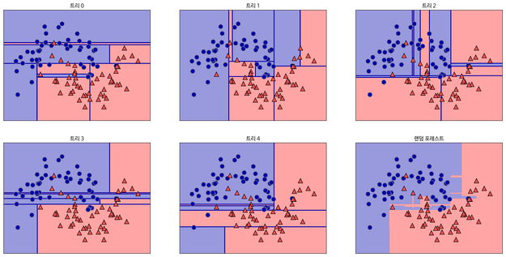

== 랜덤 포레스트(Random Forest)란?

**랜덤 포레스트(Random Forest)**는 앙상블 학습(Ensemble Learning) 기법 중 하나로, 여러 개의 **결정 트리(Decision Tree)**를 사용하여 예측의 정확성을 높이고 과적합을 방지하는 알고리즘입니다. 분류(Classification)와 회귀(Regression) 문제 모두에 사용됩니다.

랜덤 포레스트는 개별 결정 트리의 약점을 보완하며, 여러 트리의 결과를 투표(Voting) 또는 **평균(Averaging)**하여 최종 예측을 만듭니다.

랜덤 포레스트의 포레스트는 숲(Forest)입니다. 결정 트리는 트리는 나무(Tree)입니다. 나무가 모여 숲을 이룹니다. 즉, 결정 트리(Decision Tree)가 모여 랜덤 포레스트(Random Forest)를 구성합니다. 결정 트리 하나만으로도 머신러닝을 할 수 있습니다. 하지만 결정 트리의 단점은 훈련 데이터에 오버피팅이 되는 경향이 있다는 것입니다. 여러 개의 결정 트리를 통해 랜덤 포레스트를 만들면 오버피팅 되는 단점을 해결할 수 있습니다.

== 랜덤포레스트의 동작 방식

예를 들어, 건강의 위험도를 예측하기 위해서는 성별, 키, 몸무게, 지역, 운동량, 흡연 유무, 음주 여부, 혈당, 근육량 등 많은 요소를 고려햐야 합니다. 이렇게 수 많은 특성(Feature) 기반으로 건강의 위험도(Label)을 예측한다면 과대 적합이 일어날 수 있습니다. 30개의 Feature로 결정 트리를 만든다면 트리의 가지가 많아질 것이고, 이는 과대 적합의 결과를 가져옵니다. 

이 경우, 30개의 결과 중 랜덤으로 5개의 Feature만 선택해서 하나의 결정 트리를 만들고, 또 30개 중 랜덤으로 5개의 Feature를 선택해서 또 다른 결정 트리를 만들고 하는 방식으로 결정 트리를 만들 수 있습니다. 각 결정 트리는 각각의 예측 값을 내 놓을 것이고, 이렇게 결정 트리들이 내린 예측값들 중 가장 많이 나온 값을 다수결로 최종 예측 값으로 정합니다. 

이렇게 의견을 통합하거나 여러 가지 결과를 합치는 방식을 앙상블(Ensemble)이라고 합니다. 즉, 하나의 거대한 (깊이가 깊은) 결정 트리를 만드는 것이 아니라 여러 개의 작은 결정 트리를 만드는 것입니다. 여러 개의 작은 결정 트리가 예측한 값들 중 가장 많은 값(분류일 경우) 혹은 평균값(회귀일 경우)을 최종 예측 값으로 정하는 것입니다.

오른쪽 아래가 랜덤 포레스트의 Decision Boundary이고, 나머지는 결정 트리 각각의 Decision Boundary입니다. 보시면 아시겠지만 결정 트리의 경계는 다소 모호하고 오버피팅되어 있습니다. 5개의 결정 트리 경계를 평균 내어 만든 랜덤 포레스트의 경계는 보다 깔끔합니다. 

== 랜덤 포레스트의 주요 특징

1. 앙상블 학습:
* 여러 개의 결정 트리를 학습시키고, 이들의 결과를 결합하여 성능을 향상합니다.
2. 랜덤성 도입:
* 데이터 샘플링 +
부트스트랩 샘플링(중복 허용)을 통해 각 트리가 서로 다른 데이터 하위 집합을 사용해 학습합니다.
* 특성 샘플링 +
각 노드에서 최적의 분할을 찾을 때 전체 특성 중 일부만 고려합니다.
3. 다양성
* 트리 간의 상관성을 줄이고, 예측의 안정성과 일반화 성능을 높입니다.
4. 과적합 방지
*  랜덤성 도입과 다수결 또는 평균 계산을 통해 단일 결정 트리에 비해 과적합 가능성이 낮습니다.

== 랜덤 포레스트의 작동 원리

1. 데이터 샘플링:
* 주어진 학습 데이터를 부트스트랩 샘플링하여 여러 개의 데이터 하위 집합을 생성합니다.
2. 결정 트리 생성:
* 각 데이터 하위 집합에 대해 결정 트리를 학습시킵니다.
* 노드 분할 시, 전체 특성이 아닌 임의로 선택된 일부 특성만 사용하여 최적의 분할을 찾습니다.
3. 결과 결합:
* 분류 문제: 개별 트리의 예측 결과를 투표(Majority Voting)하여 최종 클래스를 예측합니다.
* 회귀 문제: 개별 트리의 예측 결과를 평균(Averaging)하여 최종 값을 예측합니다.

== 랜덤 포레스트의 하이퍼파라미터
1. 트리 수 (n_estimators):
* 생성할 트리의 개수. 일반적으로 트리 수가 많을수록 성능이 좋아지지만 계산 비용도 증가합니다.
2. 최대 깊이 (max_depth):
* 트리의 최대 깊이를 제한하여 과적합을 방지할 수 있습니다.
3. 최소 샘플 분할 (min_samples_split):
* 노드를 분할하기 위한 최소 샘플 수.
4. 최소 샘플 리프 (min_samples_leaf):
* 리프 노드에 있어야 할 최소 샘플 수.
5. 최대 특성 수 (max_features):
* 각 노드에서 분할에 사용할 특성의 최대 개수.
6. 부트스트랩 사용 여부 (bootstrap):
* 부트스트랩 샘플링을 사용할지 여부.

== 랜덤 포레스트의 장단점

=== 장점
1. 높은 정확도
* 앙상블 기법으로 인해 단일 결정 트리보다 예측 성능이 뛰어납니다.
2. 과적합 방지
* 랜덤성 도입으로 인해 과적합 가능성이 낮습니다.
3. 다양한 데이터 처리 가능:
* 분류와 회귀 모두에 사용할 수 있으며, 비선형 데이터에도 잘 작동합니다.
4. 특성 중요도 제공:
* 모델이 각 특성의 중요도를 계산하여 제공할 수 있습니다.

=== 단점

1. 계산 비용:
* 많은 트리를 생성하고 결합하기 때문에 계산 비용이 높습니다.
2. 설명력 부족:
* 결정 트리에 비해 모델의 결과를 해석하기 어렵습니다.
3. 메모리 사용량:
* 트리 수와 데이터 크기에 따라 메모리 사용량이 증가할 수 있습니다.

== 랜덤 포레스트의 주요 사용 사례
* 분류 문제
** 스팸 메일 분류, 질병 진단, 이미지 분류 등.
* 회귀 문제
** 주택 가격 예측, 주식 시장 분석 등.
* 특성 선택
** 특성 중요도를 기반으로 불필요한 특성을 제거하여 모델을 단순화.
* 결측치 처리
** 랜덤 포레스트는 결측치가 있는 데이터도 처리할 수 있습니다.

랜덤 포레스트는 강력한 성능과 범용성을 가진 알고리즘으로, 다양한 문제에 적용할 수 있습니다. 계산 비용이 높을 수 있지만, 적절한 하이퍼파라미터 튜닝과 병렬 처리를 통해 이를 완화할 수 있습니다. 높은 정확도와 과적합 방지 특성으로 인해 머신러닝에서 널리 사용됩니다.