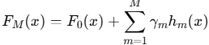

= Gradient Boosting

그래디언트 부스팅(Gradient Boosting)은 **앙상블 학습(Ensemble Learning)**의 한 방법으로, 약한 학습기(Weak Learner)를 결합해 강한 학습기(Strong Learner)를 만드는 기법입니다. 주로 **결정 트리(Decision Tree)**를 약한 학습기로 사용하며, 여러 모델을 순차적으로 학습시켜 각 모델이 이전 모델의 오류를 보완하도록 설계되었습니다.

== 그래디언트 부스팅의 기본 개념

그래디언트 부스팅은 다음과 같은 아이디어를 기반으로 합니다:

1. 점진적 학습
* 모델은 순차적으로 학습됩니다.
* 이전 모델의 예측 오류(Residual)를 다음 모델이 학습합니다.
2. 오류 최소화
* 손실 함수(Loss Function)를 정의하고, 이 손실을 최소화하는 방향으로 학습합니다.
* 모델이 **손실의 그래디언트(Gradient)**를 따라가며 최적화를 수행합니다.
3. 가중치 업데이트
* 각 단계에서 모델이 가중치를 업데이트하면서 더 나은 예측을 만듭니다.

== 작동 원리

1. 초기 모델 𝐹~0~(𝑥) +
데이터의 평균값 또는 간단한 모델로 시작합니다.
2. 순차적 모델 학습:
* 각 단계 𝑚에서 모델 𝐹~𝑚~(𝑥)는 이전 모델의 예측 𝐹~𝑚−1~(𝑥)에서 발생한 오류(잔차)를 보완하도록 학습됩니다.
* 구체적으로, 손실 함수의 그래디언트를 계산하여 이를 줄이는 방향으로 새 모델을 학습합니다.
3. 모델 결합:
* 최종 모델은 모든 약한 학습기를 결합한 형태로 나타납니다.
+

* ℎ~𝑚~(𝑥)는 𝑚-번째 약한 학습기
* 𝛾~𝑚~ 는 학습률(Learning Rate)

== 주요 요소

1. 손실 함수(Loss Function)
* 회귀 문제: 평균 제곱 오차(Mean Squared Error) 또는 평균 절대 오차(Mean Absolute Error).
* 분류 문제: 로지스틱 손실(Logistic Loss) 또는 지니 지수(Gini Index).
* 사용자가 직접 손실 함수를 정의할 수도 있습니다.
2. 약한 학습기(Weak Learner)
* 보통 결정 트리를 사용합니다(깊이가 얕은 트리, Stump).
* 다른 모델도 사용 가능하지만, 결정 트리가 가장 일반적입니다.
3. 학습률(Learning Rate)
* 각 단계에서 학습하는 비율을 조절합니다.
* 작은 학습률은 학습 속도를 늦추지만, 더 나은 성능을 제공합니다.
4. 트리의 개수(Number of Trees)
* 많은 트리를 사용할수록 더 복잡한 모델이 생성됩니다.
* 너무 많으면 과적합(overfitting)의 위험이 있습니다.

== 장점

1. 높은 예측 성능
* 복잡한 데이터셋에서 뛰어난 성능을 보여줍니다.
2. 유연성
* 다양한 손실 함수와 약한 학습기를 사용할 수 있습니다.
3. 과적합 방지
* 학습률과 정규화를 통해 과적합을 방지할 수 있습니다.
4. 특성 중요도 평가
* 학습 과정에서 각 특성이 예측에 얼마나 기여했는지 확인할 수 있습니다.

== 단점

1. 느린 학습 속도
* 모델이 순차적으로 학습되기 때문에, 학습 시간이 길어질 수 있습니다.
2. 많은 하이퍼파라미터
* 학습률, 트리의 개수, 트리 깊이 등 여러 매개변수를 조정해야 합니다.
3. 노이즈에 민감
* 노이즈가 많은 데이터에서는 과적합 위험이 높습니다.

== 그래디언트 부스팅의 확장

그래디언트 부스팅은 다양한 개선된 버전으로 확장되었습니다:

1. XGBoost
* 그래디언트 부스팅을 더욱 최적화하여 빠르고 성능이 뛰어난 버전.
* 정규화와 병렬 처리가 특징.
2. LightGBM
* 대규모 데이터셋에서 효율적인 그래디언트 부스팅 구현.
* 리프 중심 트리 성장 방식을 사용.
3. CatBoost
* 범주형 데이터 처리에 강점이 있는 그래디언트 부스팅.

== 예제

=== 분류

[source, python]
----
from sklearn.ensemble import GradientBoostingClassifier
from sklearn.datasets import make_classification
from sklearn.model_selection import train_test_split

# 데이터 생성
X, y = make_classification(n_samples=1000, n_features=20, random_state=42)
X_train, X_test, y_train, y_test = train_test_split(X, y, test_size=0.2, random_state=42)

# 그래디언트 부스팅 분류 모델
gbc = GradientBoostingClassifier(n_estimators=100, learning_rate=0.1, max_depth=3, random_state=42)
gbc.fit(X_train, y_train)

# 성능 평가
print(f"Accuracy: {gbc.score(X_test, y_test)}")
----

=== 회귀

[source, python]
----
from sklearn.ensemble import GradientBoostingClassifier
from sklearn.datasets import make_classification
from sklearn.model_selection import train_test_split

# 데이터 생성
X, y = make_classification(n_samples=1000, n_features=20, random_state=42)
X_train, X_test, y_train, y_test = train_test_split(X, y, test_size=0.2, random_state=42)

# 그래디언트 부스팅 분류 모델
gbc = GradientBoostingClassifier(n_estimators=100, learning_rate=0.1, max_depth=3, random_state=42)
gbc.fit(X_train, y_train)

# 성능 평가
print(f"Accuracy: {gbc.score(X_test, y_test)}")
----

그래디언트 부스팅은 뛰어난 성능과 유연성으로 머신러닝의 여러 분야에서 중요한 기법으로 자리 잡고 있습니다. XGBoost, LightGBM, CatBoost와 같은 라이브러리를 통해 실무에서 더욱 강력하게 활용됩니다.