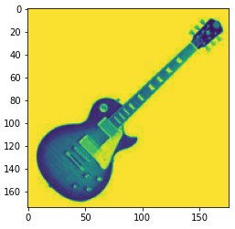

= Lab 8-1 Numpy 배열을 사용한 이미지 처리

이 연습에서는 Numpy 배열을 사용하여 이미지를 처리하는 방법을 학습합니다. 아래 절차에 따릅니다.

== 실습 환경 준비

여기에서는 Visual Studio Code의 Jupyter Notebook을 사용하여 연습을 수행합니다. 이 연습의 수행 환경은 Lab 1-1에서와 같습니다.

. Visual Studio Code를 실행합니다.
. 파일 메뉴에서 폴더 열기 를 클릭합니다.
. 연습을 수행할 폴더를 선택하고 확인 버튼을 클릭합니다.
. Visual Studio Code의 Explorer 에서 New Button을 클릭하여 새 파일을 만들고, 이름을 lab8-1.ipynb로 지정합니다.
. 오른쪽 위의 Select Kernel 을 클릭하고 Anaconda Python 환경을 선택합니다.
. + Code 버튼을 클릭하여 노트북을 시작합니다.

== 이미지 다운로드

여기에서는 준비된 이미지를 다운로드합니다. 아래 절차에 따릅니다.

1. https://github.com/gikpreet/class-machine_learning/tree/main/Module%2008%20Unsupervised%20Learning/data/images 로 이동하고, 세 파일을 다운로드 하여 lab8-1.ipynb 파일이 있는 위치와 같은 디렉토리에 저장합니다.
* lespaul.jpb
* strat1.jpg
* strat1_gray.jpg

== 라이브러리 import

이 연습에서는 이미지 처리를 위한 Pillow 라이브러리, Numpy, Matplotlib 라이브러리를 사용합니다. 아래 절차에 따라 연습에 필요한 라이브러리를 로드합니다.

1. 생성한 Code 노트에 아래 코드를 입력합니다.
+
[source, python]
----
import numpy as np
import matplotlib.pyplot as plt
from PIL import Image
----

2. Shift + Enter 를 클릭하여 작성한 코드를 실행합니다.

== Pillow를 사용한 이미지 로드

여기에서는 Pillow를 사용해 이미지를 로드하고 화면에 표시합니다. 아래 절차에 따릅니다.

1. 아래 코드를 실행하여 이미지를 로드합니다.
+
[source, python]
----
image1 = Image.open('lespaul1.png')
image2 = Image.open('strat1.jpg')
image3 = Image.open('strat1_gray.jpg')
----
+
2. 아래 코드를 실행하여 이미지를 출력합니다.
+
[source, python]
----
plt.imshow(image1)
plt.show()
----
+
[source, python]
----
plt.imshow(image2)
plt.show()
----
+
[source, python]
----
plt.imshow(image3)
plt.show()
----

== Numpy 배열을 사용하여 이미지를 조작하고 저장

여기에서는 이미지를 Numpy 배열로 저장하고 조작한 후 저장합니다. 아래 절차에 따릅니다.

1. 아래 코드를 셀행하여 로드한 세 이미지를 numpy 배열로 변환합니다.
+
[source, python]
----
img_array1 = np.array(image1)
img_array2 = np.array(image2)
img_array3 = np.array(image3)
----
+
2. 아래 코드를 실행하여 각 numpy 배열의 형태를 출력합니다.
+
[source, python]
----
print(img_array1.shape)
print(img_array2.shape)
print(img_array3.shape)
----
+
컬러 이미지(RGB)는 3차원, 흑백 이미지는 2차원 배열 형태로 출력됩니다.
+
----
(174, 176, 4)
(162, 162, 3)
(162, 162)
----
+
3. 아래 코드를 실행하여 이미지를 흑백(gray scale)로 변환한 후 저장합니다.
+
[source, python]
----
gray_array = np.mean(img_array1, axis=2)
gray = Image.fromarray(gray_array)
gray = gray.convert('L')
gray.save('lespaul_gray.jpg')
----
+
4. 생성된 lespaul_grau.jpg 이미지를 확인합니다.
+

== Numpy 배열 확인

여기에서는 변환된 numpy 배열을 확인합니다. 아래 절차에 따릅니다.

1. 아래 코드를 실행하여 이미지에서 변환된 numpy 배열을 확인합니다.
+
[source, python]
----
gray_array.shape
----
+
2. 아래 코드를 실행하여 numpy 배열의 80번째 배열을 확인합니다.
+
[source, python]
----
print(gray_array[80,:])
----
+
----
[249.   249.   249.   249.   249.   249.   249.   249.   249.   249.
 249.   249.   249.   249.   249.   249.   249.   249.   249.   249.
 249.   249.   249.   249.   249.   249.   249.   249.   249.   249.
 249.   249.   249.   249.   249.   249.   249.   249.   249.   249.
 249.   249.   249.   249.   249.   249.   249.   249.   248.   247.5
 248.   247.75 248.   247.5  247.5  247.75 248.   247.   244.5  242.5
 238.5  225.5  125.5   92.5   83.75  91.75  88.5   88.25  92.5   95.5
 103.   100.75  92.25  86.25  85.   104.   153.5  192.25 179.75 159.75
 187.   232.75 248.   247.75 247.25 245.75 243.   241.5  204.   143.75
 140.   106.25 129.   142.5  124.25 144.5  125.5  123.75 157.25 182.75
 219.25 203.75 160.   154.   217.   236.75 240.5  247.25 245.25 246.5
 247.75 244.75 241.5  243.   247.5  249.   249.   249.   249.   249.
 249.   249.   249.   249.   249.   249.   249.   249.   249.   249.
 249.   249.   249.   249.   249.   249.   249.   249.   249.   249.
 249.   249.   249.   249.   249.   249.   249.   249.   249.   249.
 249.   249.   249.   249.   249.   249.   249.   249.   249.   249.
 249.   249.   249.   249.   249.   249.   249.   249.   249.   249.
 249.   249.   249.   249.   249.   249.  ]
----
+
3. 아래 코드를 실행하여 이미지에서 변환된 numpy 배열을 matplotlib으로 출력합니다.
+
[source, python]
----
plt.imshow(gray_array)
----
+
