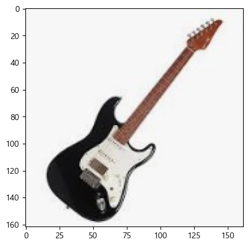

= Lab 7-1 Numpy 배열을 사용한 이미지 처리

이 연습에서는 이미지를 처리하기 위해 Numpy 배열을 사용하는 방법을 실습합니다. 아래 절차에 따릅니다.

== 라이브러리 import

Python에서 이미지를 처리하는데는 Pillow, OpenCV, imageio 라이브러리가 주로 사용됩니다. 이 연습에서는 pillow 라이브러리를 사용합니다. 아래 절차에 따릅니다.

1. 생성한 Code 노트에 아래 코드를 입력합니다.
+
[source, python]
----
import numpy as np
import matplotlib.pyplot as plt
from PIL import Image
----
+
2. Shift + Enter 를 클릭하여 작성한 코드를 실행합니다.

== 이미지 로드

여기에서는 Pillow 라이브러리를 사용하여 이미지를 로드합니다. 아래 절차에 따릅니다.

1. https://github.com/gikpreet/class-machine_learning/tree/main/Module%2008%20Unsupervised%20Learning/data/images 에서 lespaul1.png, strat1.jpg, strat1_gray.jpg 세 이미지를 다운로드합니다.
2. 아래와 유사한 코드로 이미지를 로드합니다.
+
[source, python]
----
image1 = Image.open('lespaul1.png')
image2 = Image.open('strat1.jpg')
image3 = Image.open('strat1_gray.jpg')
----

== 이미지 보기

matplotlib.pyplot 라이브러리의 imshow() 메소드를 사용하여 이미지를 출력합니다. 아래 절차에 따릅니다.

1. 아래 코드를 실행하여 로드한 첫 번째 이미지를 출력합니다.
+
[source, python]
----
plt.imshow(image1)
plt.show()
----
+

+
2. 아래 코드를 실행하여 로드한 두 번째 이미지를 출력합니다.
+
[source, python]
----
plt.imshow(image2)
plt.show()
----
+

+
3. 아래 코드를 실행하여 로드한 세 번째 이미지를 출력합니다.
+
[source, python]
----
plt.imshow(image3)
plt.show()
----
+

== 이미지를 numpy 배열로 변환

로드한 이미지는 numpy 배열로 변환할 수 있습니다. 아래 절차에 따릅니다.

1. 아래 코드를 실행하여 이미지를 numpy 배열로 저장합니다.
+
[source, python]
----
img_array1 = np.array(image1)
img_array2 = np.array(image2)
img_array3 = np.array(image3)
----
+
2. 아래 코드를 실행하여 배열의 차원과 크기를 확인합니다.
+
[source, python]
----
print(img_array1.shape)
print(img_array2.shape)
print(img_array3.shape)
----

== 이미지 조작 및 변환

1. 아래 코드를 실행하여 첫 번째로 로드한 이미지를 흑백 스케일로 변환합니다.
+
[source, python]
----
gray_array = np.mean(img_array1, axis=2)
gray = Image.fromarray(gray_array)
gray = gray.convert('L')
----
+
2. 아래 코드를 실행하여 이미지를 저장합니다.
+
[source, python]
----
gray.save('lespaul_gray.jpg')
----