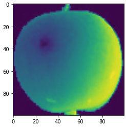
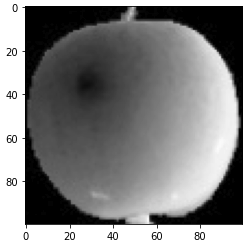

= lab 8-2 npy 파일에서 이미지 읽기

이 연습에서는 numpy 배열을 효율적으로 저장하고 불러오기 위해 설계된 바이너리 포맷인 npy 파일 형식으로 저장된 이미지를 읽어 표시하는 작업을 실행합니다. 아래 절차에 따릅니다.

== 실습 환경 준비

여기에서는 Visual Studio Code의 Jupyter Notebook을 사용하여 연습을 수행합니다. 이 연습의 수행 환경은 Lab 1-1에서와 같습니다.

. Visual Studio Code를 실행합니다.
. 파일 메뉴에서 폴더 열기 를 클릭합니다.
. 연습을 수행할 폴더를 선택하고 확인 버튼을 클릭합니다.
. Visual Studio Code의 Explorer 에서 New Button을 클릭하여 새 파일을 만들고, 이름을 lab8-2.ipynb로 지정합니다.
. 오른쪽 위의 Select Kernel 을 클릭하고 Anaconda Python 환경을 선택합니다.
. + Code 버튼을 클릭하여 노트북을 시작합니다.

== 라이브러리 import

이 연습에셔는 numpy과 matplotlit 라이브러리를 사용합니다. 아래 절차에 따라 연습에 필요한 라이브러리를 import 합니다.

1. 생성한 Code 노트에 아래 코드를 입력합니다.
+
[source, python]
----
import numpy as np
import matplotlib.pyplot as plt
----

2. Shift + Enter 를 클릭하여 작성한 코드를 실행합니다.

== 파일 로드 및 확인

여기에서는 .npy 형식으로 저장된 이미지 데이터를 읽어들입니다. 다음 절차에 따릅니다.

1. 아래 링크에서 fruits_300.npy 파일을 다운로드하여 lab8-2.ipynb 파일이 위치한 폴더로 복사합니다.
+
https://github.com/gikpreet/class-machine_learning/blob/main/Module%2008%20Unsupervised%20Learning/data/npy/fruits_300.npy

2. 아래와 유사한 코드를 실행하여 npy 파일을 로드합니다.
+
[source, python]
----
fruits = np.load('./fruits_300.npy')
----
+
3. 아래 코드를 실행하여 로드한 데이터의 타입과 형식을 확인합니다.
+
[source, python]
----
print(type(fruits))
print(fruits.shape)
----
+
----
<class 'numpy.ndarray'>
(300, 100, 100)
----
+
100 * 100의 2차원 배열이 100개 포함된 3차원 numpy 배열이며, 이는 100 * 100 pixel의 이미지가 300개 포함되어 있음을 의미합니다.
+
4. 아래 코드를 실행하여 배열에 포함된 첫 번째 2차원 배열의 데이터를 확인합니다.
+
[source, python]
----
print(fruits[0])
----
+
----
[[1 1 1 ... 1 1 1]
 [1 1 1 ... 1 1 1]
 [1 1 1 ... 1 1 1]
 ...
 [1 1 1 ... 1 1 1]
 [1 1 1 ... 1 1 1]
 [1 1 1 ... 1 1 1]]
----
+
5. 아래 코드를 실행하여 배열의 첫 번째 2차원 배열의 첫 번째 1차원 배열의 데이터를 확인합니다.
+
[source, python]
----
print(fruits[0][0])
----
+
----
[  1   1   1   1   1   1   1   1   1   1   1   1   1   1   1   1   2   1
   2   2   2   2   2   2   1   1   1   1   1   1   1   1   2   3   2   1
   2   1   1   1   1   2   1   3   2   1   3   1   4   1   2   5   5   5
  19 148 192 117  28   1   1   2   1   4   1   1   3   1   1   1   1   1
   2   2   1   1   1   1   1   1   1   1   1   1   1   1   1   1   1   1
   1   1   1   1   1   1   1   1   1   1]
----

== 이미지 읽기

여기에서는 numpy 배열 형태로 저장되어 있는 이미지를 출력합니다. 아래 절차에 따릅니다.

1. 아래 코드를 실행하여 numpy 3차원 배열에 포함된 첫 번쨰 2차원 데이터를 matplotlib 라이브러리의 imshow() 메소드를 사용하여 출력합니다.
+
[source, python]
----
plt.imshow(fruits[1])
----
+

+
2. 아래 코드를 실행하여 이미지를 흑백(gray scale)로 출력합니다.
+
[source, python]
----
plt.imshow(fruits[1], cmap='gray')
----
+

+
3. 아래 코드를 실행하여 모든 이미지를 출력합니다.
+
[source, python]
----
flg, axs = plt.subplots(30, 10, figsize=(20, 50))
image_idx = 0
for i in range(30):
    for j in range(10):
        axs[i, j].imshow(fruits[image_idx], cmap='gray_r')
        image_idx += 1
plt.show()
----
+
배열은 각 100개 씩의 사과, 파인애플, 바나나 이미지를 포함하고 있습니다.
