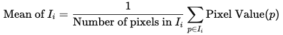
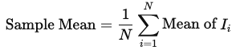
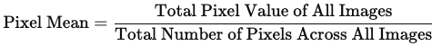

= 샘플 평균과 픽셀 평균

이미지 데이터에서 샘플 평균과 픽셀 평균은 데이터를 분석하는 두 가지 다른 방식입니다. 

== 샘플 평균 (Sample means)

샘플 평균은 여러 장의 이미지가 있는 경우, 각 이미지의 평균 값(즉, 한 이미지의 모든 픽셀 값의 평균)을 구한 후, 이러한 평균을 다시 평균화한 값입니다. 아래와 같은 계산 과정을 거칩니다.

1. 각 이미지 𝐼~𝑖~에 대해 평균을 계산합니다:
+

+
2. 모든 이미지의 평균 값을 모아서 최종 평균을 계산합니다:
+

+
* 𝑁은 이미지의 총 개수

샘플 평균은 이미지마다 다른 특성을 반영하므로, 이미지 간의 평균 값을 종합적으로 보여줍니다.

== 픽셀 평균 (Pixel means)

픽셀 평균은 여러 장의 이미지가 있을 때, 모든 이미지를 하나로 합쳐 모든 픽셀 값의 평균을 계산하는 방식입니다. 이는 모든 이미지의 픽셀 값을 단일 데이터로 취급하여 평균을 구합니다.

1. 모든 이미지의 픽셀 값을 합칩니다.
2. 합산한 픽셀 값을 전체 픽셀 개수로 나눕니다
+

특징: 픽셀 평균은 이미지의 개별적인 특성을 무시하고 전체 데이터를 평평하게 합쳐서 평균을 구합니다.

== 차이점과 비교

[%header, cols="1,3,3", width=600]
|===
|특성|샘플 평균|픽셀 평균
|기준|각 이미지의 평균 값|모든 픽셀 값
|계산 방식|각 이미지 평균 → 전체 평균 계산|전체 픽셀 값 합산 후 평균 계산
|장점|이미지 간 변화를 반영|데이터 전체의 전반적인 밝기나 색감 확인 가능
|단점|계산이 복잡할 수 있음|이미지 간 차이를 무시할 수 있음
|===

== 계산 예

두 장의 이미지 𝐼~1~과 𝐼~2~가 있으며, 각 이미지의 픽셀 값은 다음과 같습니다:

1. 샘플 평균 계산:
* 𝐼~1~의 평균: (10 + 20 + 30 + 40) / 4 = 25
* 𝐼~2~의 평균: (50 + 60 + 70 + 80) / 4 = 65
* 샘플 평균: (25 + 65) / 2 = 45
(25+65)/2=45
2. 픽셀 평균 계산:
* 모든 픽셀 값 합산: 10 + 20 + 30 + 40 + 50 + 60 + 70 + 80 = 360
* 픽셀 개수: 8
* 픽셀 평균: 360 / 8 = 45

이 예시에서는 샘플 평균과 픽셀 평균이 우연히 같아졌습니다. 하지만 일반적으로 이미지가 다양하면 두 값은 달라질 수 있습니다.